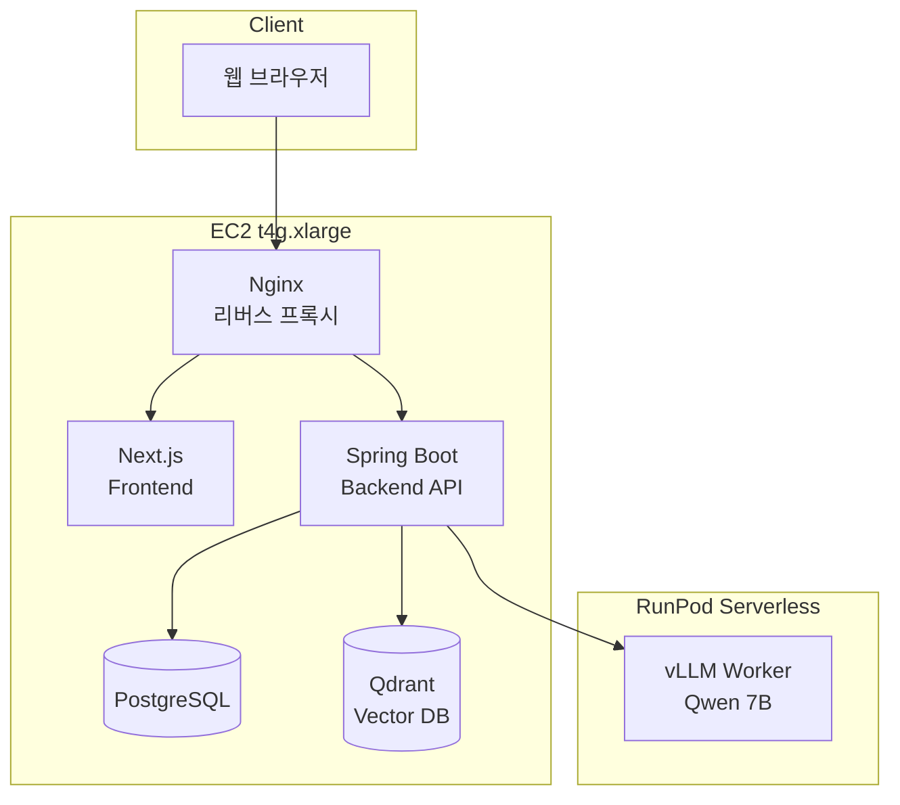
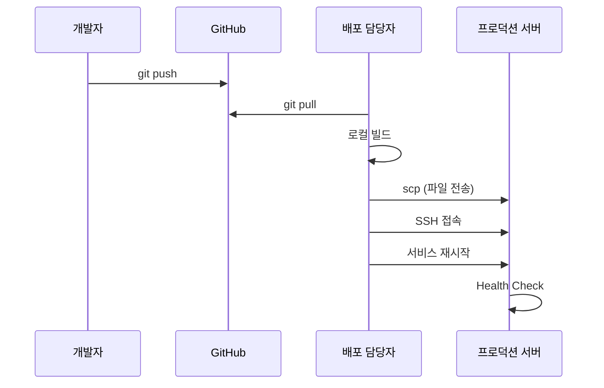

# 템플릿: 배포 다이어그램

> 이 문서는 배포 아키텍처 다이어그램 작성 시 참고할 수 있는 템플릿입니다.

---

## 예시 구조 (ASCII)

```
개발자 로컬 환경
    ↓ (Git Push)
GitHub Repository
    ↓ (수동 Pull/Clone)
배포 담당자 작업 PC
    ↓ (SSH/SCP)
프로덕션 서버
    ├─ Reverse Proxy Server (Nginx)
    ├─ Web Server (react, next.js)
    ├─ Application Server (Spring Boot)
    ├─ RDB (PostgreSQL)
    └─ Vector DB (Qdrant)
```

---

## 배포 전후 상태 비교도 작성 가이드

배포 문서 작성 시 다음 3가지 상태를 명시하면 좋습니다:

| 상태      | 설명                         | 예시                           |
| --------- | ---------------------------- | ------------------------------ |
| 배포 전   | 현재 운영 중인 버전 상태     | v1.2.0 운영 중                 |
| 배포 중   | 서비스 중단 또는 전환 상태   | 다운타임 발생 (약 8분)         |
| 배포 후   | 새 버전 적용 완료 상태       | v1.3.0 정상 운영               |

---

## Mermaid 다이어그램 예시

### 시스템 구성도



### 배포 흐름도



---

## draw.io 템플릿

[draw.io](https://app.diagrams.net/)에서 사용할 수 있는 구성요소:

| 구성요소        | draw.io Shape                    |
| --------------- | -------------------------------- |
| EC2 인스턴스    | AWS Architecture > Compute > EC2 |
| 데이터베이스    | AWS Architecture > Database      |
| 로드밸런서      | AWS Architecture > Networking    |
| 사용자/브라우저 | General > User                   |
| 외부 서비스     | General > Cloud                  |

---

## 참고

- 실제 다이어그램은 `.github/cloud/images/` 폴더에 PNG/SVG로 저장
- 본문에서는 `` 형식으로 참조
