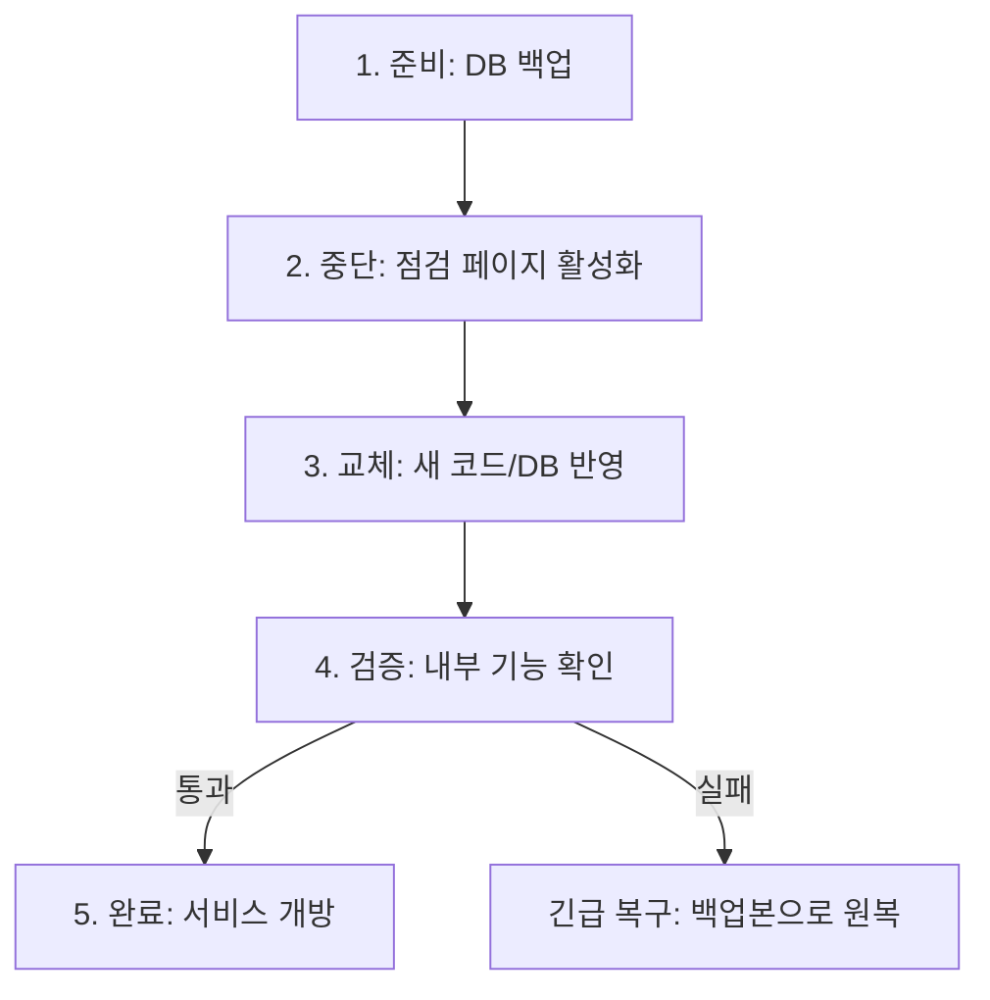

# 프로젝트 이름 Cloud Wiki

### [서비스 바로가기](https://example.com)

[Cloud 관련 문서/레포](https://github.com/100-hours-a-week/13-team-project-cloud)

## 단계별 확장 로드맵

### 1단계: 수작업 배포 기반 정리

#### 1. 수작업 배포 아키텍처 다이어그램


---

#### 2. 배포 절차 설명서

##### 2.1 상세 배포 절차

| 단계 | 작업 내용                  | 담당자    | 사용 도구/명령어                                                      | 예상 소요 시간 | 비고               |
| ---- | -------------------------- | --------- | --------------------------------------------------------------------- | -------------- | ------------------ |
| 1    | 서비스 공지 및 사용자 알림 | 운영팀    | 공지사항 게시                                                         | 5분            | 배포 10분 전 실시  |
| 2    | 데이터베이스 백업          | DevOps    | `pg_dump -U postgres -d {db_name} > backup_YYYYMMDD.sql`              | 3분            | 롤백용 데이터 백업 |
| 3    | Backend 로컬 빌드          | BE 개발자 | `./gradlew clean build -x test`                                       | 5분            | 로컬에서 실행      |
| 4    | Frontend 로컬 빌드         | FE 개발자 | `npm install && npm run build`                                        | 3분            | 로컬에서 실행      |
| 5    | Backend 서비스 중단        | DevOps    | `sudo systemctl stop spring-boot`                                     | 1분            | **다운타임 시작**  |
| 6    | Frontend 서비스 중단       | DevOps    | `pm2 stop nextjs`                                                     | 1분            |                    |
| 7    | Backend jar 전송           | BE 개발자 | `scp build/libs/app.jar user@server:/app/backend/`                    | 2분            |                    |
| 8    | Frontend 빌드 결과 전송    | FE 개발자 | `scp -r .next user@server:/app/frontend/`                             | 2분            |                    |
| 9    | DB 스키마 변경             | DevOps    | 수동 SQL 실행 (필요 시)                                               | 2분            | 스키마 변경 시     |
| 10   | Backend 서비스 시작        | DevOps    | `sudo systemctl start spring-boot`                                    | 1분            |                    |
| 11   | Frontend 서비스 시작       | DevOps    | `pm2 start nextjs`                                                    | 1분            | **다운타임 종료**  |
| 12   | Health Check 확인          | DevOps    | `curl http://localhost:8080/health` <br> `curl http://localhost:3000` | 2분            | 정상 응답 확인     |
| 13   | 로그 모니터링              | DevOps    | `tail -f /app/backend/logs/app.log` <br> `pm2 logs nextjs`            | 10분           | 초기 안정화 확인   |
| 14   | 서비스 정상화 공지         | 운영팀    | 공지사항 업데이트                                                     | 2분            |                    |

**예상 총 소요 시간:** 약 38분
**예상 서비스 중단 시간 (다운타임):** 약 8분 (5단계~11단계)

##### 2.2 배포 체크리스트

**배포 전**
- [ ] 배포할 Git 브랜치/커밋 해시 확인
- [ ] Backend 로컬 빌드 성공 (`./gradlew clean build -x test`)
- [ ] Frontend 로컬 빌드 성공 (`npm install && npm run build`)
- [ ] DB 스키마 변경 여부 확인 (변경 시 마이그레이션 SQL 준비)
- [ ] 서비스 공지 작성 완료

**배포 중**
- [ ] 데이터베이스 백업 완료
- [ ] 기존 파일 백업 완료 (`app.jar.bak`, `.next.bak`)
- [ ] Backend/Frontend 서비스 중단 확인
- [ ] 파일 전송 완료
- [ ] DB 스키마 변경 적용 (해당 시)
- [ ] Backend/Frontend 서비스 시작 확인

**배포 후**
- [ ] Health Check 통과 (Backend: 200 OK, Frontend: 200 OK)
- [ ] 주요 기능 동작 확인 (로그인, 메인 페이지)
- [ ] 에러 로그 없음 확인
- [ ] 서비스 정상화 공지 완료

##### 2.3 배포 스크립트

**배포 전 백업 스크립트** (`backup.sh`)

```bash
#!/bin/bash
set -e

BACKUP_DIR="/app/backup"
TIMESTAMP=$(date +%Y%m%d_%H%M%S)
DB_NAME="your_db_name"

echo "===== 배포 전 백업 시작: $TIMESTAMP ====="

mkdir -p $BACKUP_DIR

# 1. 데이터베이스 백업
echo "[1/3] DB 백업 중..."
pg_dump -U postgres -d $DB_NAME > "$BACKUP_DIR/db_backup_$TIMESTAMP.sql"
echo "✓ DB 백업 완료"

# 2. Backend jar 백업
echo "[2/3] Backend 백업 중..."
[ -f /app/backend/app.jar ] && cp /app/backend/app.jar "$BACKUP_DIR/app.jar.bak"
echo "✓ Backend 백업 완료"

# 3. Frontend 빌드 결과 백업
echo "[3/3] Frontend 백업 중..."
[ -d /app/frontend/.next ] && cp -r /app/frontend/.next "$BACKUP_DIR/.next.bak"
echo "✓ Frontend 백업 완료"

echo "===== 백업 완료! ====="
```

**배포 실행 스크립트** (`deploy.sh`)

```bash
#!/bin/bash
set -e

echo "===== 배포 시작: $(date) ====="

# 1. 서비스 중단
echo "[1/4] 서비스 중단 중..."
sudo systemctl stop spring-boot || true
pm2 stop nextjs || true
echo "✓ 서비스 중단 완료 - 다운타임 시작"

# 2. 파일 확인
echo "[2/4] 배포 파일 확인 중..."
[ ! -f /app/backend/app.jar ] && echo "✗ Backend jar 없음!" && exit 1
[ ! -d /app/frontend/.next ] && echo "✗ Frontend .next 없음!" && exit 1
echo "✓ 배포 파일 확인 완료"

# 3. 서비스 시작
echo "[3/4] 서비스 시작 중..."
sudo systemctl start spring-boot
sleep 10
pm2 start nextjs
sleep 5
echo "✓ 서비스 시작 완료 - 다운타임 종료"

# 4. Health Check
echo "[4/4] Health Check 중..."
BE_STATUS=$(curl -s -o /dev/null -w "%{http_code}" http://localhost:8080/health || echo "000")
FE_STATUS=$(curl -s -o /dev/null -w "%{http_code}" http://localhost:3000 || echo "000")

[ "$BE_STATUS" == "200" ] && echo "✓ Backend OK" || echo "✗ Backend 실패 ($BE_STATUS)"
[ "$FE_STATUS" == "200" ] && echo "✓ Frontend OK" || echo "✗ Frontend 실패 ($FE_STATUS)"

echo "===== 배포 완료: $(date) ====="
```

**롤백 스크립트** (`rollback.sh`)

```bash
#!/bin/bash
set -e

BACKUP_DIR="/app/backup"

echo "===== 롤백 시작: $(date) ====="

# 1. 서비스 중단
echo "[1/4] 서비스 중단 중..."
sudo systemctl stop spring-boot || true
pm2 stop nextjs || true

# 2. 백업본 복원
echo "[2/4] 백업본 복원 중..."
[ -f "$BACKUP_DIR/app.jar.bak" ] && cp "$BACKUP_DIR/app.jar.bak" /app/backend/app.jar
[ -d "$BACKUP_DIR/.next.bak" ] && rm -rf /app/frontend/.next && cp -r "$BACKUP_DIR/.next.bak" /app/frontend/.next
echo "✓ 복원 완료"

# 3. 서비스 재시작
echo "[3/4] 서비스 재시작 중..."
sudo systemctl start spring-boot
sleep 10
pm2 start nextjs
sleep 5

# 4. Health Check
echo "[4/4] Health Check 중..."
curl -s http://localhost:8080/health && echo " - Backend OK"
curl -s http://localhost:3000 > /dev/null && echo "Frontend OK"

echo "===== 롤백 완료: $(date) ====="
```

**로컬 빌드 및 전송 스크립트** (`local-deploy.sh`) - 로컬에서 실행

```bash
#!/bin/bash
set -e

# ===== 설정 (환경에 맞게 수정) =====
SERVER_USER="ubuntu"
SERVER_HOST="your-server-ip"
SERVER_KEY="~/.ssh/your-key.pem"

BACKEND_DIR="./backend"
FRONTEND_DIR="./frontend"
REMOTE_BACKEND="/app/backend"
REMOTE_FRONTEND="/app/frontend"
# ==================================

echo "===== 로컬 빌드 및 배포 시작: $(date) ====="

# 1. Backend 빌드
echo "[1/4] Backend 빌드 중..."
cd $BACKEND_DIR
./gradlew clean build -x test
cd ..
echo "✓ Backend 빌드 완료"

# 2. Frontend 빌드
echo "[2/4] Frontend 빌드 중..."
cd $FRONTEND_DIR
npm install && npm run build
cd ..
echo "✓ Frontend 빌드 완료"

# 3. Backend jar 전송
echo "[3/4] Backend jar 전송 중..."
scp -i $SERVER_KEY $BACKEND_DIR/build/libs/*.jar \
    $SERVER_USER@$SERVER_HOST:$REMOTE_BACKEND/app.jar
echo "✓ Backend 전송 완료"

# 4. Frontend 빌드 결과 전송
echo "[4/4] Frontend 빌드 결과 전송 중..."
scp -i $SERVER_KEY -r $FRONTEND_DIR/.next \
    $SERVER_USER@$SERVER_HOST:$REMOTE_FRONTEND/
echo "✓ Frontend 전송 완료"

echo "===== 전송 완료! ====="
echo "서버에서 deploy.sh를 실행하세요."
```

**스크립트 사용법**

```bash
# 실행 권한 부여
chmod +x backup.sh deploy.sh rollback.sh local-deploy.sh

# 전체 배포 순서
# 1. (서버) 백업 실행
ssh user@server './backup.sh'

# 2. (로컬) 빌드 및 전송
./local-deploy.sh

# 3. (서버) 배포 실행
ssh user@server './deploy.sh'

# 문제 발생 시 (서버)
ssh user@server './rollback.sh'
```

---

#### 3. 도입 배경 및 한계 분석

##### 3.1 Big Bang 수작업 배포 선택 배경

**현행 배포 방식 정의:**
본 서비스는 초기 단계에서 가장 단순한 형태의 수작업(Big Bang) 배포 방식을 채택한다.

- 단일 EC2 인스턴스에 Spring + Front + DB(PostgreSQL + pgvector)를 함께 배포
- GPU가 필요한 AI 기능은 별도의 GPU 서버(vLLM)로 분리
- 배포는 자동화 파이프라인 없이 직접 접속 후 수작업으로 일괄 반영
- 무중단 배포를 보장하지 않으며, 배포 시 일시적 서비스 중단을 허용

**서비스 현황 (MVP 초기 단계 가정):**
| 항목 | 가정치 | 비고 |
|------|--------|------|
| DAU | ~30명 | MVP 출시 직후 예상 |
| 동시접속 | 3~5명 | 피크 시간 기준 |
| 일평균 트래픽 | ~500 requests/day | 저트래픽 구간 |
| 배포 빈도 | 주 1회 이하 | 주요 기능 안정화 후 |
| 개발 팀 규모 | 5명 내외 | 인프라 엔지니어 포함 |

**선택 이유:**

1. **MVP 우선 출시 전략**

   - CI/CD 파이프라인 구축보다 서비스 출시가 우선
   - 인프라 자동화는 초기 안정화 후 순차적으로 전환 예정

2. **초기 단계의 비용 효율성**

   - CI/CD 파이프라인 구축에 필요한 시간과 인력을 서비스 배포에 집중
   - EC2 1대 + GPU Serverless로 비용 최소화

3. **배포 빈도가 낮음**

   - 현재 주 1회 이하 배포로 수작업 배포 소요 시간이 길어도 허용 가능
   - 배포 자동화 ROI가 낮은 단계

4. **시스템 구조의 단순성**

   - 단일 서버 구조로 복잡한 오케스트레이션 불필요
   - 문제 파악 속도가 빠름 (컴포넌트가 한 곳에 있어 트러블슈팅이 단순)

5. **빠른 실험/검증 가능**
   - 서비스 기능(모임 생성/투표/채팅/정산 등)을 빠르게 검증 가능
   - 아키텍처 변경, 기술 스택 변경, 서버 스펙 변경이 빈번한 초기 단계에 적합

---

##### 3.2 수작업 배포의 한계 및 위험 요소

##### 3.2.1 정량적 분석

| 항목                 | 현재 상태 | 문제점                                   |
| -------------------- | --------- | ---------------------------------------- |
| **배포 소요 시간**   | 약 38분   | 담당자의 수작업 의존으로 시간 변동 폭 큼 |
| **서비스 중단 시간** | 약 8분    | 사용자 경험 저하, 트래픽 손실            |
| **배포 실패율**      | 측정 중   | 수작업으로 인한 Human Error 가능성       |
| **롤백 소요 시간**   | 약 11분   | 장애 지속 시간 증가 위험                 |
| **배포 가능 인원**   | 1~2명     | 담당자 부재 시 배포 불가 (단일 장애점)   |

##### 3.2.2 관점별 한계 분석

**1) 네트워크/보안 관점**
| 문제 | 설명 |
|------|------|
| 퍼블릭 서브넷 DB 존재 | 인바운드 규칙 실수 시 즉시 공격 대상 노출 |
| 키/시크릿 관리 | .env 방식의 느슨한 관리로 유출 리스크, 휴먼 에러 가능성 |
| 보안 경계가 얇음 | 애플리케이션 계층에서만 방어, 네트워크 레벨 방어 약함 |
| TLS/인증서/도메인 운영 | 직접 인증서 갱신/리다이렉트 처리 시 실수 여지 |
| AI 서버 공격면 | 퍼블릭 노출 시 비용형 공격에 취약 → 비용 폭발 위험 |

> "기능 개발 속도는 빠르지만, 보안 사고는 한 번이면 서비스 신뢰가 끝날 수 있음"

**2) 가용성/장애 격리 관점**
| 문제 | 설명 |
|------|------|
| 단일 장애 지점 | EC2 한 대 장애 시 Back/Front/DB 동시 다운 |
| 연쇄 장애 | DB I/O 상승 → API 지연 → 벡터 검색 타임아웃 → 전체 장애 |
| 복구 시간 | 수동 대응으로 MTTR이 운에 좌우됨 |

> 문제 파악은 빠르지만, **장애 영향 범위가 전체**

**3) 성능/리소스 경쟁 관점**
| 문제 | 설명 |
|------|------|
| CPU/메모리/디스크/IO 경쟁 | DB(디스크+벡터 검색) + Spring(CPU) + Front 빌드가 한 머신에서 경쟁 |
| 벡터 검색 성능 | pgvector HNSW 인덱스 메모리 사용량 증가 시 일반 쿼리와 경쟁 |
| 간헐적 지연 | 가끔 5~10초 같은 디버깅 어려운 증상 증가 |
| 커넥션/파일 디스크립터 한계 | WebSocket/동시 접속 증가 시 OS 튜닝 없이는 한계 |

**4) 확장성 관점**
| 문제 | 설명 |
|------|------|
| 수평 확장 불가 | DB가 로컬이면 API 인스턴스 증설 불가 (데이터가 묶임) |
| 무중단 배포 불가 | 인스턴스가 하나면 배포 시 서비스 전체 영향 |

> 트래픽이 조금 늘 때는 버티지만, **확장은 구조 변경을 요구**

**5) 배포/운영(DevOps) 관점**
| 문제 | 설명 |
|------|------|
| 인적 오류 리스크 | 순서 실수, 환경변수 누락, 롤백 미흡 |
| 롤백 어려움 | 한 덩어리로 배포하면 일부만 되돌리기 어려움 |
| 관측 한계 | 트래픽 증가 시 요청 단위 병목(핸들러/DB/외부호출)을 빠르게 특정하기 어려움 |

> 초기엔 단순함이 장점이지만, **배포 빈도가 올라가면 곧 리스크가 됨**

**6) 데이터/백업/복구 관점**
| 문제 | 설명 |
|------|------|
| 백업/복구 | 자동 백업 없으면 사고 시 복구가 느림 |
| 데이터 손실 리스크 | 인스턴스 디스크 장애, 삭제 실수 시 치명적 |

**7) 비용 관점**
| 문제 | 설명 |
|------|------|
| 초기엔 저렴 | 인스턴스 1~2대로 종료 |
| 장애/공격 시 비용 폭발 | 퍼블릭 노출 + AI 추론 엔드포인트 = 요청 폭탄 → 비용 폭발 |
| 스케일업 단가 상승 | 어느 순간 큰 인스턴스로 점프 필요 |

**8) 컴플라이언스/신뢰 관점**

- 사용자 데이터/결제/정산이 들어가면 퍼블릭 DB는 설명이 어려움
- 보안 감사/평가에서 감점 포인트

> 기술이 문제가 아니라 **신뢰 문제**

---

#### 4. 추가 자료

##### 4.1 배포 프로세스 플로우차트



##### 4.2 수작업 배포 vs 자동화 배포 비교

| 비교 항목        | 수작업 배포 (현재) | 자동화 배포 (목표)    |
| ---------------- | ------------------ | --------------------- |
| 배포 소요 시간   | 약 38분            | 10분 이내             |
| 서비스 중단 시간 | 약 8분             | 0분 (무중단 배포)     |
| 인적 오류 가능성 | 높음               | 낮음                  |
| 담당자 의존도    | 높음 (1~2명)       | 낮음 (자동화)         |
| 초기 구축 비용   | 없음               | 구축 시간 필요        |
| 유지보수 비용    | 높음 (반복 작업)   | 낮음                  |
| 롤백 속도        | 약 11분            | 배포 전략에 따라 단축 |

---

#### 5. 참고 자료

본문에서 다루지 않은 상세 내용과 의사결정 배경은 아래 문서에서 확인할 수 있습니다.

| 문서                                                                                                   | 설명                                                                                 |
| ------------------------------------------------------------------------------------------------------ | ------------------------------------------------------------------------------------ |
| [인프라 의사결정 상세](./.github/cloud/docs/step1/reference-infrastructure-decisions.md)               | 온프레미스 제외 이유, AWS vs PaaS, GPU 인프라, EC2 아키텍처 대안, 인스턴스/비용 분석 |
| [배포 상세 절차](./.github/cloud/docs/step1/reference-deployment-details.md)                           | 배포 개요, 준비사항 체크리스트, 롤백 절차, GPU 서버 배포, Nginx 설정                 |
| [문제 시나리오 및 개선 계획](./.github/cloud/docs/step1/reference-improvement-plan.md)                 | 구체적 문제 시나리오, 임계점, 단계별 개선 로드맵                                     |
| [RunPod 배포 방식 상세](./.github/cloud/docs/step1/reference-runpod-deployment-methods.md)             | GPU Serverless 배포 방법, Endpoint 관리                                              |
| [벡터 DB 비교](./.github/cloud/docs/step1/reference-vector-db-comparison.md)                           | pgvector vs 전용 벡터 DB 비교 분석                                                   |

---

### 2단계: CI 파이프라인 정착

**Why (서비스 기준)**

- [작성 가이드] 통합 충돌, 테스트 누락 등 현재 경험한 문제를 근거로 씁니다.
- [예시] "PR 병합 후 장애를 막기 위해 자동 테스트와 품질 게이트가 필요."

**How (적용 방법)**

- [작성 가이드] CI 도구, 트리거 조건, 실행 스테이지를 명시합니다.
- [예시] "GitHub Actions 사용, PR 생성/업데이트마다 Lint+Test 실행."

**파이프라인 구성 (예시)**

```text
Lint → Unit Test → Build → Artifact 저장
```

**산출물**

- CI 다이어그램
- 워크플로우 설정 요약
- 테스트 통과 기준

**완료 조건**

- [작성 가이드] PR 기준으로 CI가 자동 실행되고 실패 시 머지가 막히는 상태
- [예시] "PR 생성 시 Lint/Test 자동 실행, 실패 시 머지 불가 확인"

<br />

### 3단계: CD 파이프라인 안정화

**Why (서비스 기준)**

- [작성 가이드] 배포 속도와 장애 리스크를 동시에 낮춰야 하는 이유를 적습니다.
- [예시] "버그 수정 반영 속도를 높이되, 장애 확산을 막기 위해 안전한 전환이 필요."

**How (적용 방법)**

- [작성 가이드] 승인형/완전자동 여부와 배포 전략(Blue-Green 등)을 기록합니다.
- [예시] "스테이징 자동, 프로덕션 승인형. Blue-Green으로 무중단 전환."

**배포 흐름 (예시)**

```text
CI 산출물 → 스테이징 자동 배포 → 승인 → 프로덕션 전환 → 모니터링
```

**산출물**

- CD 흐름도
- 배포 전략 선택 이유
- 롤백/모니터링 기준

**완료 조건**

- [작성 가이드] 스테이징 자동 배포가 안정적으로 동작하고, 프로덕션 승인 배포가 재현 가능함
- [예시] "스테이징 자동 배포 1회 이상 성공 + 프로덕션 전환/롤백 시나리오 검증"
