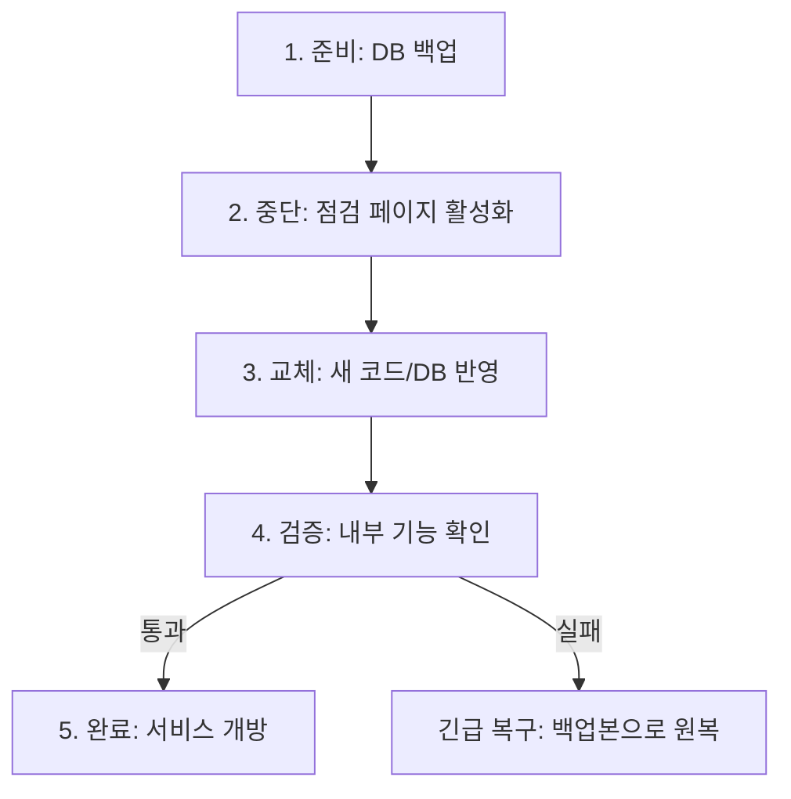

# 프로젝트 이름 Cloud Wiki

### [서비스 바로가기](https://example.com)

[Cloud 관련 문서/레포](https://github.com/100-hours-a-week/13-team-project-cloud)

## 단계별 확장 로드맵

- [작성 가이드] 아래는 과제 단계와 실제 운영 단계가 자연스럽게 이어지도록 정리하는 구역입니다.
- [예시]
  - 1단계: 수작업 배포로 시작해 흐름/리스크 파악
  - 2단계: CI 도입으로 통합 품질 자동화
  - 3단계: CD 도입으로 배포 안정화 및 속도 개선

<br />

### 1단계: 수작업 배포 기반 정리

#### 1. 수작업 배포 아키텍처 다이어그램


##### 인스턴스 선정 및 예상 비용

###### 예상 트래픽 규모

| 항목        | 예상치       |
| ----------- | ------------ |
| DAU         | ~30명        |
| 동시접속    | 3~5명        |
| 일일 요청량 | ~500 req/day |

###### 인스턴스 선정: t4g.xlarge

| 인스턴스 타입  | vCPU | RAM  | 서울 리전 시간당 가격 | 월간 비용 (730h) |
| -------------- | ---- | ---- | --------------------- | ---------------- |
| **t4g.xlarge** | 4    | 16GB | $0.1341               | **~$98**         |

**구성 요소별 예상 리소스 사용량:**

| 구성 요소   | 예상 RAM  | 예상 CPU | 비고                    |
| ----------- | --------- | -------- | ----------------------- |
| Nginx       | 100~200MB | < 1%     | 리버스 프록시, TLS 처리 |
| Next.js     | 500MB~1GB | 5~10%    |                         |
| Spring Boot | 1.5~2GB   | 10~20%   | 힙 1~1.5GB              |
| PostgreSQL  | 2~4GB     | 5~20%    | pgvector 확장 포함      |
| OS          | 1~1.5GB   | 5%       | 시스템 프로세스, 로깅   |
| **합계**    | **~7GB**  | **~45%** | 여유 9GB 확보           |

**선정 근거:**

1. **RAM 16GB 충분**

   - 예상 사용량 ~7GB, 여유분 ~9GB 확보
   - 스왑 미설정 (OOM 발생 시 프로세스 종료로 빠른 문제 인지)

2. **CPU 버스트 크레딧 유지 가능**

   - DAU 30명 기준 평균 CPU 사용률 ~50% 이하
   - t4g.xlarge 기준선: 40% (이하면 크레딧 축적)
   - 피크 시에만 버스트, 평상시 크레딧 회복

3. **Graviton2(ARM) 가성비**
   - 동일 스펙 x86 대비 약 20% 저렴
   - Node.js, Java, PostgreSQL 모두 ARM 호환

###### 스토리지 선정: gp3 100GB

| 항목     | 사양         | 월 비용 |
| -------- | ------------ | ------- |
| 스토리지 | 100GB        | ~$11.4  |
| IOPS     | 3,000 (기본) | $0      |

###### 총 예상 비용 (월간)

| 항목         | 사양            | 월 비용      |
| ------------ | --------------- | ------------ |
| EC2 인스턴스 | t4g.xlarge      | ~$98         |
| EBS 스토리지 | gp3 100GB       | ~$11         |
| 데이터 전송  | 10GB 아웃바운드 | ~$1          |
| **총계**     |                 | **~$110/월** |

###### 아키텍처 선택: 단일 EC2

- DAU 30명 수준에서 장애 격리/개별 스케일링 필요성 낮음
- 관리 포인트 최소화 (EC2 1대만 관리)
- 트래픽 증가 시 분리 아키텍처로 전환 고려

> 상세 비교 분석은 [참고: 인프라 의사결정 상세](./.github/cloud/docs/step1/reference-infrastructure-decisions.md#d-ec2-아키텍처-대안-비교) 참고

###### GPU 서버 (RunPod Serverless)

| 항목          | 값                       |
| ------------- | ------------------------ |
| 모델          | Qwen/Qwen2.5-7B-Instruct |
| 추론 엔진     | vLLM                     |
| GPU           | L4 24GB (Flex Worker)    |
| **월간 비용** | **~$0.9** (DAU 30 기준)  |

> 상세 가격 비교 및 선택 근거는 [참고: 인프라 의사결정 상세](./.github/cloud/docs/step1/reference-infrastructure-decisions.md#c-gpu-인프라-aws-gpu-vs-runpod-vs-외부-api) 참고
>
> RunPod 배포 방식 비교 (vLLM Worker, 커스텀 Handler, FastAPI)는 [참고: RunPod 배포 방식 상세](./.github/cloud/docs/step1/reference-runpod-deployment-methods.md) 참고

---

#### 2. 배포 절차 설명서

##### 2.1 배포 개요

| 항목                      | 내용                             |
| ------------------------- | -------------------------------- |
| **배포 방식**             | Big Bang - 전체 시스템 일괄 교체 |
| **배포 주기**             | 주 1회 이하                      |
| **평균 배포 소요 시간**   | 30분 이내                        |
| **예상 서비스 중단 시간** | 10분 이내                        |
| **배포 담당자**           | DevOps 담당자 2명                |
| **배포 수행 시간대**      | 매주 수요일 02:00~03:00 AM       |

##### 2.2 배포 전 준비사항 체크리스트

- [ ] 배포할 코드의 Git 브랜치/커밋 확인
- [ ] 로컬 빌드 성공 확인 (BE: `./gradlew build`, FE: `npm run build`)
- [ ] DB 스키마 변경 여부 확인 (변경 시 마이그레이션 SQL 준비)
- [ ] 기존 파일 백업 (`app.jar.bak`, `.next.bak`)

##### 2.3 상세 배포 절차

| 단계 | 작업 내용                  | 담당자    | 사용 도구/명령어                                                      | 예상 소요 시간 | 비고               |
| ---- | -------------------------- | --------- | --------------------------------------------------------------------- | -------------- | ------------------ |
| 1    | 서비스 공지 및 사용자 알림 | 운영팀    | 공지사항 게시                                                         | 5분            | 배포 10분 전 실시  |
| 2    | 데이터베이스 백업          | DevOps    | `pg_dump -U postgres -d {db_name} > backup_YYYYMMDD.sql`              | 3분            | 롤백용 데이터 백업 |
| 3    | Backend 로컬 빌드          | BE 개발자 | `./gradlew clean build -x test`                                       | 5분            | 로컬에서 실행      |
| 4    | Frontend 로컬 빌드         | FE 개발자 | `npm install && npm run build`                                        | 3분            | 로컬에서 실행      |
| 5    | Backend 서비스 중단        | DevOps    | `sudo systemctl stop spring-boot`                                     | 1분            | **다운타임 시작**  |
| 6    | Frontend 서비스 중단       | DevOps    | `pm2 stop nextjs`                                                     | 1분            |                    |
| 7    | Backend jar 전송           | BE 개발자 | `scp build/libs/app.jar user@server:/app/backend/`                    | 2분            |                    |
| 8    | Frontend 빌드 결과 전송    | FE 개발자 | `scp -r .next user@server:/app/frontend/`                             | 2분            |                    |
| 9    | DB 스키마 변경             | DevOps    | 수동 SQL 실행 (필요 시)                                               | 2분            | 스키마 변경 시     |
| 10   | Backend 서비스 시작        | DevOps    | `sudo systemctl start spring-boot`                                    | 1분            |                    |
| 11   | Frontend 서비스 시작       | DevOps    | `pm2 start nextjs`                                                    | 1분            | **다운타임 종료**  |
| 12   | Health Check 확인          | DevOps    | `curl http://localhost:8080/health` <br> `curl http://localhost:3000` | 2분            | 정상 응답 확인     |
| 13   | 로그 모니터링              | 전체팀    | `tail -f /app/backend/logs/app.log` <br> `pm2 logs nextjs`            | 10분           | 초기 안정화 확인   |
| 14   | 서비스 정상화 공지         | 운영팀    | 공지사항 업데이트                                                     | 2분            |                    |

**예상 총 소요 시간:** 약 38분
**예상 서비스 중단 시간 (다운타임):** 약 8분 (5단계~11단계)

> **Nginx 설정 변경 시 (config 변경 시에만):**
>
> ```bash
> sudo nginx -t                # 설정 문법 검사
> sudo nginx -s reload         # 무중단 설정 반영
> ```
>
> Nginx는 리버스 프록시 역할만 수행하므로 일반 코드 배포 시에는 재시작 불필요

##### 2.4 롤백 절차

배포 실패 시 이전 버전으로 되돌리는 절차:

| 단계 | 작업 내용            | 담당자 | 사용 도구/명령어                                                   | 예상 소요 시간 | 비고              |
| ---- | -------------------- | ------ | ------------------------------------------------------------------ | -------------- | ----------------- |
| 1    | Backend 서비스 중단  | DevOps | `sudo systemctl stop spring-boot`                                  | 1분            | **다운타임 시작** |
| 2    | Frontend 서비스 중단 | DevOps | `pm2 stop nextjs`                                                  | 1분            |                   |
| 3    | Backend 백업본 복원  | DevOps | `cp /app/backup/app.jar.bak /app/backend/app.jar`                  | 1분            |                   |
| 4    | Frontend 백업본 복원 | DevOps | `cp -r /app/backup/.next.bak /app/frontend/.next`                  | 1분            |                   |
| 5    | DB 데이터 복원       | DevOps | `psql -U postgres -d {db_name} < backup_YYYYMMDD.sql`              | 3분            | 스키마 변경 시    |
| 6    | Backend 서비스 시작  | DevOps | `sudo systemctl start spring-boot`                                 | 1분            |                   |
| 7    | Frontend 서비스 시작 | DevOps | `pm2 start nextjs`                                                 | 1분            | **다운타임 종료** |
| 8    | 정상 동작 확인       | DevOps | `curl http://localhost:8080/health` / `curl http://localhost:3000` | 2분            |                   |

**예상 총 롤백 소요 시간:** 약 11분
**예상 서비스 중단 시간 (다운타임):** 약 9분 (1단계~7단계)

> **참고:** 배포 전 기존 파일 백업 필요
>
> ```bash
> cp /app/backend/app.jar /app/backup/app.jar.bak
> cp -r /app/frontend/.next /app/backup/.next.bak
> ```

---

##### 2.5 GPU 서버 배포 (RunPod Serverless)

GPU 서버는 EC2와 별도로 RunPod Serverless에서 운영하며, 서비스 중단 없이 독립 배포 가능.

###### 2.5.1 배포 방식 비교

| 방식               | 설명                       | 모델 저장 위치                                    | Cold Start    | 권장 상황                     |
| ------------------ | -------------------------- | ------------------------------------------------- | ------------- | ----------------------------- |
| **vLLM Worker**    | RunPod 사전 빌드 워커 사용 | RunPod 캐시 (`/runpod-volume/huggingface-cache/`) | 빠름 (캐시됨) | MVP, 빠른 테스트              |
| **커스텀 Handler** | Docker 이미지에 모델 포함  | 이미지 내 경로 (예: `/models/`)                   | 빠름          | 프로덕션, 커스텀 로직 필요 시 |

###### 2.5.2 방식 1: vLLM Worker 배포 (권장)

RunPod에서 제공하는 사전 빌드된 vLLM Worker 사용. 설정만으로 바로 배포 가능.

| 단계 | 작업 내용             | 담당자             | 상세 절차                                            | 예상 소요 시간 | 비고                      |
| ---- | --------------------- | ------------------ | ---------------------------------------------------- | -------------- | ------------------------- |
| 1    | RunPod 콘솔 접속      | DevOps             | https://runpod.io → Serverless 메뉴                  | 1분            |                           |
| 2    | vLLM Worker 선택      | DevOps             | Quick Deploy → vLLM Worker 선택                      | 1분            |                           |
| 3    | 모델 설정             | DevOps + AI 개발자 | Model: `Qwen/Qwen2.5-7B-Instruct` 입력               | 1분            | AI 개발자가 모델명 결정   |
| 4    | 고급 설정             | DevOps + AI 개발자 | `MAX_MODEL_LEN`: 8192, `GPU_MEMORY_UTILIZATION`: 0.9 | 2분            | AI 개발자가 파라미터 결정 |
| 5    | GPU 선택              | DevOps             | L4 (24GB) 또는 RTX 4090 선택                         | 1분            | 7B 모델 기준              |
| 6    | Worker 설정           | DevOps             | Min Workers: 0, Max Workers: 2                       | 1분            | Flex 모드                 |
| 7    | Endpoint 생성         | DevOps             | Create Endpoint 클릭 → Endpoint ID 발급              | 2분            |                           |
| 8    | Backend 환경변수 설정 | DevOps + BE 개발자 | EC2에 Endpoint URL + API Key 환경변수 설정           | 3분            | BE 개발자가 변수명 확인   |
| 9    | Backend 재시작        | DevOps             | `sudo systemctl restart spring-boot`                 | 2분            |                           |
| 10   | 연동 테스트           | DevOps             | API 호출 테스트 (첫 요청은 Cold Start로 느림)        | 3분            |                           |

**예상 총 소요 시간:** 약 17분
**서비스 중단:** 없음

> **서비스 중단이 없는 이유:**
>
> - GPU 서버(RunPod)와 EC2는 독립적으로 운영됨
> - 새 Endpoint 생성 후 Backend 환경변수만 변경하면 전환 완료
> - 기존 Endpoint는 새 Endpoint 안정화 확인 후 삭제 (Blue-Green 방식)

> 커스텀 Handler 배포 방식 (Docker 이미지 직접 빌드)은 [참고: RunPod 배포 방식 상세](./.github/cloud/docs/step1/reference-runpod-deployment-methods.md#방식-2-커스텀-handler-직접-vllm-제어) 참고

###### 2.5.3 GPU 서버 롤백

| 단계 | 작업 내용             | 담당자 | 상세 절차                                 | 예상 소요 시간 | 비고              |
| ---- | --------------------- | ------ | ----------------------------------------- | -------------- | ----------------- |
| 1    | 이전 Endpoint 활성화  | DevOps | RunPod 콘솔에서 이전 버전 Endpoint 활성화 | 2분            |                   |
| 2    | Backend 환경변수 변경 | DevOps | Endpoint ID를 이전 버전으로 변경          | 3분            | .env 또는 systemd |
| 3    | Backend 재시작        | DevOps | `sudo systemctl restart spring-boot`      | 2분            |                   |
| 4    | 연동 테스트           | DevOps | API 호출 테스트                           | 2분            |                   |

**예상 총 롤백 소요 시간:** 약 9분

> **참고:** 이전 버전 Endpoint를 삭제하지 않고 유지하면 즉시 롤백 가능. 비용은 실행 시간에만 발생 (Flex Worker).

---

#### 3. 도입 배경 및 한계 분석

##### 3.1 Big Bang 수작업 배포 선택 배경

**현행 배포 방식 정의:**
본 서비스는 초기 단계에서 가장 단순한 형태의 수작업(Big Bang) 배포 방식을 채택한다.

- 단일 EC2 인스턴스에 Spring(API) + Front + DB(PostgreSQL + pgvector)를 함께 배포
- GPU가 필요한 AI 기능은 별도의 GPU 서버(vLLM)로 분리
- 배포는 자동화 파이프라인 없이 직접 접속 후 수작업으로 일괄 반영
- 무중단 배포를 보장하지 않으며, 배포 시 일시적 서비스 중단을 허용

> 이는 "완성된 운영 구조"가 아니라 **서비스 가설을 빠르게 검증하기 위한 임시적·의도된 선택**이다.

**서비스 현황 (MVP 초기 단계 가정):**
| 항목 | 가정치 | 비고 |
|------|--------|------|
| DAU | ~30명 | MVP 출시 직후 예상 |
| 동시접속 | 3~5명 | 피크 시간 기준 |
| 일평균 트래픽 | ~500 requests/day | 저트래픽 구간 |
| 배포 빈도 | 주 1회 이하 | 주요 기능 안정화 후 |
| 개발 팀 규모 | 5명 내외 | 인프라 엔지니어 포함 |

**선택 이유:**

1. **MVP 우선 출시 전략**

   - CI/CD 파이프라인 구축보다 서비스 출시가 우선
   - 인프라 자동화는 초기 안정화 후 순차적으로 전환 예정

2. **초기 단계의 비용 효율성**

   - CI/CD 파이프라인 구축에 필요한 시간과 인력을 서비스 배포에 집중
   - EC2 1대 + GPU Serverless로 비용 최소화

3. **배포 빈도가 낮음**

   - 현재 주 1회 이하 배포로 수작업 배포 소요 시간이 길어도 허용 가능
   - 배포 자동화 ROI가 낮은 단계

4. **시스템 구조의 단순성**

   - 단일 서버 구조로 복잡한 오케스트레이션 불필요
   - 문제 파악 속도가 빠름 (컴포넌트가 한 곳에 있어 트러블슈팅이 단순)

5. **빠른 실험/검증 가능**
   - 서비스 기능(모임 생성/투표/채팅/정산 등)을 빠르게 검증 가능
   - 아키텍처 변경, 기술 스택 변경, 서버 스펙 변경이 빈번한 초기 단계에 적합

**인프라 선택 요약:**

| 워크로드          | 선택              | 선택 이유                       |
| ----------------- | ----------------- | ------------------------------- |
| **Web/API**       | AWS EC2 직접 관리 | 팀 역량 활용, 비용 최적화       |
| **GPU (AI 추론)** | RunPod Serverless | 저트래픽에서 압도적 비용 효율성 |

> 상세 비교 분석 (온프레미스 제외 이유, AWS vs PaaS, AWS GPU vs RunPod 등)은
> [참고: 인프라 의사결정 상세](./.github/cloud/docs/step1/reference-infrastructure-decisions.md) 참고

---

##### 3.2 수작업 배포의 한계 및 위험 요소

##### 3.2.1 정량적 분석

| 항목                 | 현재 상태 | 문제점                                   |
| -------------------- | --------- | ---------------------------------------- |
| **배포 소요 시간**   | 평균 30분 | 담당자의 수작업 의존으로 시간 변동 폭 큼 |
| **서비스 중단 시간** | 약 8분    | 사용자 경험 저하, 트래픽 손실            |
| **배포 실패율**      | 측정 중   | 수작업으로 인한 Human Error 가능성       |
| **롤백 소요 시간**   | 약 11분   | 장애 지속 시간 증가 위험                 |
| **배포 가능 인원**   | 1~2명     | 담당자 부재 시 배포 불가 (단일 장애점)   |

##### 3.2.2 관점별 한계 분석

**1) 네트워크/보안 관점**
| 문제 | 설명 |
|------|------|
| 퍼블릭 서브넷 DB 존재 | 인바운드 규칙 실수 시 즉시 공격 대상 노출 |
| 키/시크릿 관리 | .env 방식의 느슨한 관리로 유출 리스크, 휴먼 에러 가능성 |
| 보안 경계가 얇음 | 애플리케이션 계층에서만 방어, 네트워크 레벨 방어 약함 |
| TLS/인증서/도메인 운영 | 직접 인증서 갱신/리다이렉트 처리 시 실수 여지 |
| AI 서버 공격면 | 퍼블릭 노출 시 비용형 공격에 취약 → 비용 폭발 위험 |

> "기능 개발 속도는 빠르지만, 보안 사고는 한 번이면 서비스 신뢰가 끝날 수 있음"

**2) 가용성/장애 격리 관점**
| 문제 | 설명 |
|------|------|
| 단일 장애 지점 | EC2 한 대 장애 시 API/Front/DB 동시 다운 |
| 연쇄 장애 | DB I/O 상승 → API 지연 → 벡터 검색 타임아웃 → 전체 장애 |
| 복구 시간 | 수동 대응으로 MTTR이 운에 좌우됨 |

> 문제 파악은 빠르지만, **장애 영향 범위가 전체**

**3) 성능/리소스 경쟁 관점**
| 문제 | 설명 |
|------|------|
| CPU/메모리/디스크/IO 경쟁 | DB(디스크+벡터 검색) + Spring(CPU) + Front 빌드가 한 머신에서 경쟁 |
| 벡터 검색 성능 | pgvector HNSW 인덱스 메모리 사용량 증가 시 일반 쿼리와 경쟁 |
| 간헐적 지연 | 가끔 5~10초 같은 디버깅 어려운 증상 증가 |
| 커넥션/파일 디스크립터 한계 | WebSocket/동시 접속 증가 시 OS 튜닝 없이는 한계 |

**4) 확장성 관점**
| 문제 | 설명 |
|------|------|
| 수평 확장 불가 | DB가 로컬이면 API 인스턴스 증설 불가 (데이터가 묶임) |
| 무중단 배포 불가 | 인스턴스가 하나면 배포 시 서비스 전체 영향 |

> 트래픽이 조금 늘 때는 버티지만, **확장은 구조 변경을 요구**

**5) 배포/운영(DevOps) 관점**
| 문제 | 설명 |
|------|------|
| 인적 오류 리스크 | 순서 실수, 환경변수 누락, 롤백 미흡 |
| 롤백 어려움 | 한 덩어리로 배포하면 일부만 되돌리기 어려움 |
| 관측 한계 | 트래픽이 늘면 어떤 요청이 문제인지 트레이싱 없어 한계 |

> 초기엔 단순함이 장점이지만, **배포 빈도가 올라가면 곧 리스크가 됨**

**6) 데이터/백업/복구 관점**
| 문제 | 설명 |
|------|------|
| 백업/복구 | 자동 백업 없으면 사고 시 복구가 느림 |
| 데이터 손실 리스크 | 인스턴스 디스크 장애, 삭제 실수 시 치명적 |

**7) 비용 관점**
| 문제 | 설명 |
|------|------|
| 초기엔 저렴 | 인스턴스 1~2대로 종료 |
| 장애/공격 시 비용 폭발 | 퍼블릭 노출 + AI 추론 엔드포인트 = 요청 폭탄 → 비용 폭발 |
| 스케일업 단가 상승 | 어느 순간 큰 인스턴스로 점프 필요 |

**8) 컴플라이언스/신뢰 관점**

- 사용자 데이터/결제/정산이 들어가면 퍼블릭 DB는 설명이 어려움
- 보안 감사/평가에서 감점 포인트

> 기술이 문제가 아니라 **신뢰 문제**

##### 3.2.3 구체적 문제 시나리오

1. **인적 오류 (Human Error)**

   - 명령어 오타로 인한 잘못된 서버 접속
   - 배포 순서 착오로 인한 데이터베이스 마이그레이션 누락
   - 환경 변수 설정 누락으로 인한 서비스 장애

2. **서비스 중단 (Downtime)**

   - 배포 중 약 8분간 전체 서비스 이용 불가
   - 예상 사용자 영향: 8분 × 10 requests/min = 80건의 요청 실패

3. **확장성 문제**

   - 서버가 증가할 경우 각 서버마다 수작업 반복 필요
   - 마이크로서비스 구조 전환 시 배포 복잡도 기하급수적 증가

4. **추적성 부족**

   - 배포 이력 관리의 어려움
   - 어떤 버전이 언제 배포되었는지 수동 기록 필요
   - 문제 발생 시 원인 추적 곤란

5. **협업의 어려움**
   - 특정 담당자만 배포 가능
   - 신규 팀원의 배포 절차 학습 부담
   - 긴급 배포 시 담당자 연락 필요

---

#### 3.3 개선 필요성 및 향후 계획

**종합 평가:**

> 본 구조는 초기 실험 속도와 비용 최소화를 위해 의도적으로 단순화한 형태이나, 퍼블릭 네트워크 노출, 단일 장애 지점, 리소스 경쟁, 수평 확장 불가, 수작업 배포에 따른 인적 오류 등 다면적 제약을 가진다.

**임계점 (Threshold) - 다음 조건 중 하나라도 충족 시 자동화 도입 검토 필요:**

- [ ] 주 2회 이상 배포 빈도
- [ ] 월간 활성 사용자 1,000명 이상 도달
- [ ] 서버 대수 2대 이상 증가
- [ ] 배포 실패 또는 롤백 발생 횟수 월 2회 이상
- [ ] 다운타임으로 인한 사용자 불만 접수

**다음 단계 전략:**
| 단계 | 전략 | 예상 효과 |
|------|------|-----------|
| 단기 | 배포 스크립트 작성으로 반복 작업 자동화 | 인적 오류 감소, 배포 시간 단축 |
| 중기 | CI/CD 파이프라인 구축 | 자동 테스트, 품질 게이트 확보 |
| 장기 | Blue-Green 또는 Rolling 배포 전략 도입 | 무중단 배포, 안전한 롤백 |

**필수 개선 항목 (일정 규모 도달 시):**

- DB 분리
- 프라이빗 서브넷 전환
- 배포 자동화
- 관측/보안 체계 강화

---

#### 4. 추가 자료

##### 4.1 배포 프로세스 플로우차트



##### 4.2 수작업 배포 vs 자동화 배포 비교

| 비교 항목        | 수작업 배포 (현재) | 자동화 배포 (목표)    |
| ---------------- | ------------------ | --------------------- |
| 배포 소요 시간   | 30분               | 10분 이내             |
| 서비스 중단 시간 | 8분                | 0분 (무중단 배포)     |
| 인적 오류 가능성 | 높음               | 낮음                  |
| 담당자 의존도    | 높음 (1~2명)       | 낮음 (자동화)         |
| 초기 구축 비용   | 없음               | 구축 시간 필요        |
| 유지보수 비용    | 높음 (반복 작업)   | 낮음                  |
| 롤백 속도        | 11분               | 배포 전략에 따라 단축 |

##### 4.3 참고 자료

- [참고: 인프라 의사결정 상세](./.github/cloud/docs/step1/reference-infrastructure-decisions.md)
- [참고: RunPod 배포 방식 상세](./.github/cloud/docs/step1/reference-runpod-deployment-methods.md)

---

### 2단계: CI 파이프라인 정착

**Why (서비스 기준)**

- [작성 가이드] 통합 충돌, 테스트 누락 등 현재 경험한 문제를 근거로 씁니다.
- [예시] “PR 병합 후 장애를 막기 위해 자동 테스트와 품질 게이트가 필요.”

**How (적용 방법)**

- [작성 가이드] CI 도구, 트리거 조건, 실행 스테이지를 명시합니다.
- [예시] “GitHub Actions 사용, PR 생성/업데이트마다 Lint+Test 실행.”

**파이프라인 구성 (예시)**

```text
Lint → Unit Test → Build → Artifact 저장
```

**산출물**

- CI 다이어그램
- 워크플로우 설정 요약
- 테스트 통과 기준

**완료 조건**

- [작성 가이드] PR 기준으로 CI가 자동 실행되고 실패 시 머지가 막히는 상태
- [예시] “PR 생성 시 Lint/Test 자동 실행, 실패 시 머지 불가 확인”

<br />

### 3단계: CD 파이프라인 안정화

**Why (서비스 기준)**

- [작성 가이드] 배포 속도와 장애 리스크를 동시에 낮춰야 하는 이유를 적습니다.
- [예시] “버그 수정 반영 속도를 높이되, 장애 확산을 막기 위해 안전한 전환이 필요.”

**How (적용 방법)**

- [작성 가이드] 승인형/완전자동 여부와 배포 전략(Blue-Green 등)을 기록합니다.
- [예시] “스테이징 자동, 프로덕션 승인형. Blue-Green으로 무중단 전환.”

**배포 흐름 (예시)**

```text
CI 산출물 → 스테이징 자동 배포 → 승인 → 프로덕션 전환 → 모니터링
```

**산출물**

- CD 흐름도
- 배포 전략 선택 이유
- 롤백/모니터링 기준

**완료 조건**

- [작성 가이드] 스테이징 자동 배포가 안정적으로 동작하고, 프로덕션 승인 배포가 재현 가능함
- [예시] “스테이징 자동 배포 1회 이상 성공 + 프로덕션 전환/롤백 시나리오 검증”
