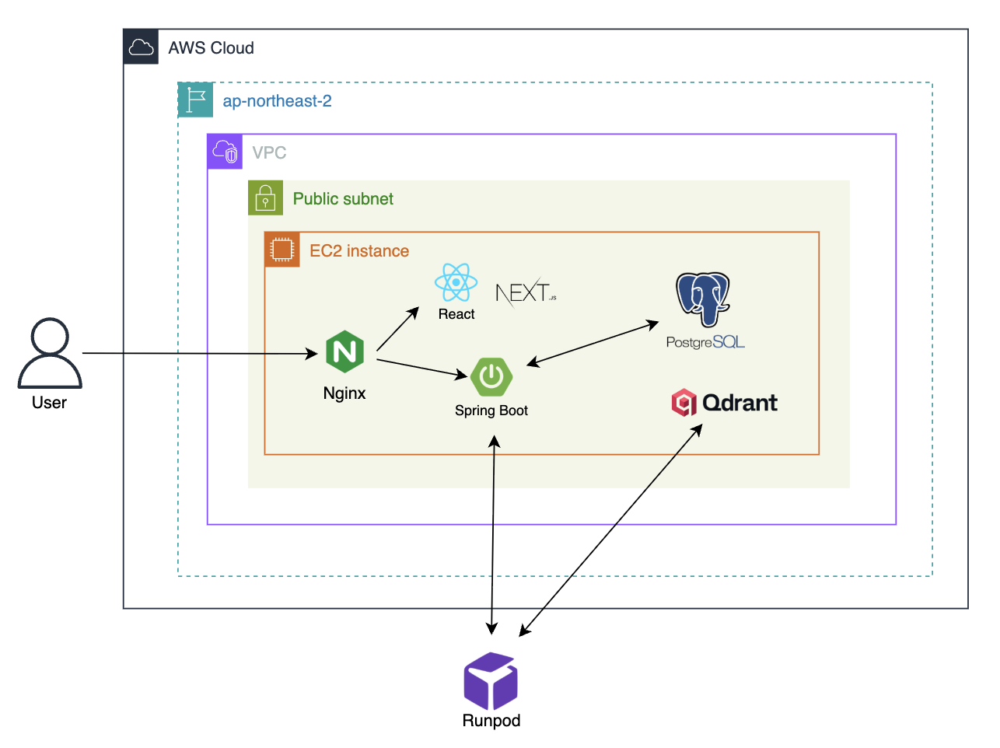
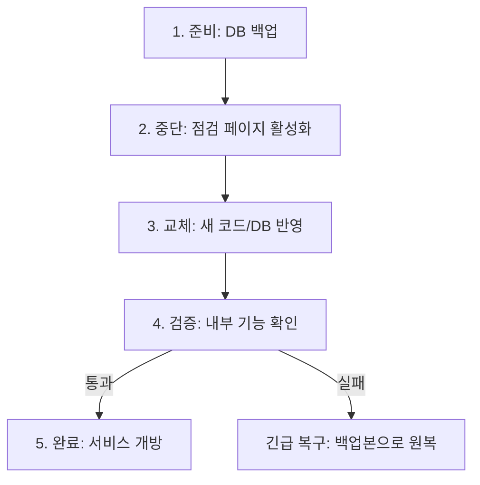

# 프로젝트 이름 Cloud Wiki

### [서비스 바로가기](여기에_서비스_URL_삽입)

[Cloud 관련 문서/레포](https://github.com/100-hours-a-week/13-team-project-cloud)

<br />

## 클라우드 인프라 목표

- 서비스 이해를 바탕으로 서비스에 맞는 인프라를 설계·구성한다.
- 비용·운영·보안·관리형 서비스 선택 이유 등 핵심 고려 요소를 근거 있게 반영한다.
- 모니터링/알림을 구현해 운영 상태를 빠르게 파악하고 대응한다.
- 테스트를 통해 병목을 확인하고, 결과를 근거로 개선 방향을 도출한다.
- DevOps 문화를 정착시켜 개발 흐름과 배포 과정에 병목이 없도록 한다.

<br />

## 목차

> - [문서 운영 원칙](#문서-운영-원칙)
> - [현재 아키텍처 개요](#현재-아키텍처-개요)
> - [배포 환경 개요](#배포-환경-개요)
> - [배포 전략과 운영 흐름](#배포-전략과-운영-흐름)
> - [CI 파이프라인 설계](#ci-파이프라인-설계)
> - [CD 파이프라인 설계](#cd-파이프라인-설계)
> - [모니터링 및 알림](#모니터링-및-알림)
> - [롤백 및 장애 대응](#롤백-및-장애-대응)
> - [보안 및 시크릿 관리](#보안-및-시크릿-관리)
> - [단계별 확장 로드맵](#단계별-확장-로드맵)

<br />

## 문서 운영 원칙

- Cloud 설계 문서는 **Cloud-Wiki 한 페이지**에서만 관리합니다.
- 각 단계는 **Why(서비스 기준)** → **How(적용 방법)** 순서로 작성합니다.
- 예시는 참고용입니다. **우리 서비스 상황에 맞게 수정**해 주세요.

<br />

## 현재 아키텍처 개요

- [작성 가이드] 현재 서비스 구성 요소와 배치를 한 문단으로 설명하고, 다이어그램을 첨부합니다.
- [예시] “API 서버 1대, 관리형 DB 1대, 프론트는 정적 호스팅으로 운영. 내부 통신은 VPC로 제한.”

<br />

## 배포 환경 개요

- [작성 가이드] 개발/스테이징/프로덕션 환경 구분과 접근 방식(도메인, 권한)을 정리합니다.
- [예시] “스테이징은 내부 QA용, 프로덕션은 승인 후 배포. 도메인은 stage/app로 분리.”

<br />

## 배포 전략과 운영 흐름

- [작성 가이드] 현재 배포 방식과 승인 흐름을 요약합니다.
- [예시] “초기에는 수작업 배포로 시작하고, 품질 안정화 후 CI/CD로 전환.”

<br />

## CI 파이프라인 설계

### Why (서비스 기준)

- [작성 가이드] 지금 단계에서 수작업 배포가 가능한 이유와, 어떤 리스크가 있는지 적습니다.
- [예시] “현재는 사용자 수가 적고 배포 빈도가 낮아 수작업으로도 대응 가능하다. 하지만 배포 시 다운타임과 인적 오류 위험이 있어 다음 단계에서 자동화가 필요하다.”

### How (적용 방법)

- [작성 가이드] 현재 배포 흐름과 담당 역할을 간단히 씁니다.
- [예시] “API 서버 1대 + 관리형 DB 구조. 배포는 PM 승인 후 백엔드 담당이 SSH로 배포.”

### 배포 체크리스트 (예시)

```text
1) 배포 공지
2) 코드 반영
3) DB 마이그레이션
4) 서비스 재시작
5) 헬스 체크
```

### 산출물

- 구조 다이어그램
- 체크리스트
- 롤백 계획

<br />

### Why (서비스 기준)

- [작성 가이드] 협업 중 충돌/버그를 빠르게 잡아야 하는 이유를 적습니다.
- [예시] “추천 로직 변경이 프론트와 동시에 영향을 주므로, PR 단계에서 자동 테스트가 필요하다.”

### How (적용 방법)

- [작성 가이드] 사용하는 CI 도구와 트리거 정책을 씁니다.
- [예시] “GitHub Actions 사용, PR 생성 시 테스트 + Lint 자동 실행.”

### 파이프라인 요약 (예시)

```text
Lint/Format → Test → Build → Artifact 저장
```

<br />

## CD 파이프라인 설계

### Why (서비스 기준)

- [작성 가이드] 배포 속도와 안정성이 왜 중요한지 설명합니다.
- [예시] “배포가 늦어지면 추천/정산 오류 수정이 지연되므로, 자동 배포와 안전한 전환 전략이 필요하다.”

### How (적용 방법)

- [작성 가이드] 배포 방식(승인형/완전자동)과 전략(Blue-Green 등)을 적습니다.
- [예시] “스테이징은 자동, 프로덕션은 승인 후 배포. Blue-Green으로 무중단 전환.”

### 배포 흐름 (예시)

```text
CI 산출물 → 스테이징 배포 → 승인 → 프로덕션 전환 → 모니터링
```

<br />

## 모니터링 및 알림

- [작성 가이드] 핵심 지표, 알림 채널, 알림 기준을 정리합니다.
- [예시] “에러율 1% 초과 시 알림, 응답 시간 p95 1초 초과 시 경고.”

<br />

## 롤백 및 장애 대응

- [작성 가이드] 롤백 조건, 책임자, 복구 절차를 간단히 씁니다.
- [예시] “배포 직후 오류율 급증 시 이전 버전으로 즉시 전환.”

<br />

## 보안 및 시크릿 관리

- [작성 가이드] 시크릿 저장 위치와 접근 정책을 기술합니다.
- [예시] “배포 키는 GitHub Actions Secrets에 저장, 운영 서버 접근은 IP 제한.”

<br />

## 단계별 확장 로드맵

- [작성 가이드] 아래는 과제 단계와 실제 운영 단계가 자연스럽게 이어지도록 정리하는 구역입니다.
- [예시]
  - 1단계: 수작업 배포로 시작해 흐름/리스크 파악
  - 2단계: CI 도입으로 통합 품질 자동화
  - 3단계: CD 도입으로 배포 안정화 및 속도 개선

<br />

# Big Bang 방식 수작업 배포 설계 템플릿

## 1. 수작업 배포 아키텍처 다이어그램

### 1.1 현재 시스템 구성도



**예시 구조:**
```
개발자 로컬 환경
    ↓ (Git Push)
GitHub Repository
    ↓ (수동 Pull/Clone)
배포 담당자 작업 PC
    ↓ (SSH/SCP)
프로덕션 서버
    ├─ Reverse Proxy Server (Nginx)
    ├─ Web Server (react, next.js)
    ├─ Application Server (Spring Boot)
    ├─ RDB (PostgreSQL)
    └─ Vector DB (Qdrant)
  
```

### 1.2 배포 전후 상태 비교도
```
[작성 가이드]
- 배포 전: 현재 운영 중인 버전 상태
- 배포 중: 서비스 중단 또는 전환 상태
- 배포 후: 새 버전 적용 완료 상태
```

---

## 2. 배포 절차 설명서

### 2.1 배포 개요
| 항목 | 내용 |
|------|------|
| **배포 방식** | Big Bang - 전체 시스템 일괄 교체 |
| **배포 주기** | 1회성 |
| **평균 배포 소요 시간** | 30분 이내 |
| **예상 서비스 중단 시간** | 10분 이내 |
| **배포 담당자** | DevOps 담당자 2명 |
| **배포 수행 시간대** | (예: 매주 수요일 02:00~03:00 AM) |

### 2.2 배포 전 준비사항 체크리스트
- [ ] 배포할 코드의 Git 브랜치 확인 (브랜치명: _________)
- [ ] 로컬 환경에서 빌드 테스트 완료
- [ ] 데이터베이스 마이그레이션 스크립트 준비 (필요 시)
- [ ] 현재 운영 중인 버전 백업 완료
- [ ] 데이터베이스 백업 완료
- [ ] 롤백 계획 수립 및 확인
- [ ] 배포 공지 게시 (사용자 대상)
- [ ] 모니터링 도구 준비 (로그 확인 환경)

### 2.3 상세 배포 절차

| 단계 | 작업 내용 | 담당자 | 사용 도구/명령어 | 소요 시간 | 비고 |
|------|-----------|--------|------------------|-----------|------|
| 1 | 서비스 공지 및 사용자 알림 | 운영팀 | (예: 공지사항 게시) | 5분 | 배포 10분 전 실시 |
| 2 | 현재 서비스 중단 | DevOps | `sudo systemctl stop application` | 1분 | **다운타임 시작** |
| 3 | 기존 애플리케이션 백업 | DevOps | `cp -r /app /backup/app_YYYYMMDD` | 2분 | 롤백용 |
| 4 | 최신 코드 가져오기 | 개발자 | `git pull origin main` | 1분 | |
| 5 | 의존성 설치 및 빌드 | 개발자 | (예: `./gradlew build`) | 5분 | |
| 6 | 빌드 결과물 서버 전송 | 개발자 | `scp build/libs/app.jar user@server:/app/` | 2분 | |
| 7 | 데이터베이스 마이그레이션 | DevOps | (예: Flyway/Liquibase 스크립트 실행) | 3분 | 필요 시 수행 |
| 8 | 애플리케이션 재시작 | DevOps | `sudo systemctl start application` | 2분 | **다운타임 종료** |
| 9 | Health Check 확인 | DevOps | `curl http://localhost:8080/health` | 1분 | 정상 응답 확인 |
| 10 | 로그 모니터링 및 이상 확인 | 전체팀 | `tail -f /var/log/application.log` | 10분 | 초기 안정화 확인 |
| 11 | 서비스 정상화 공지 | 운영팀 | (예: 공지사항 업데이트) | 2분 | |

**총 소요 시간:** 약 34분  
**실제 서비스 중단 시간 (다운타임):** 약 8분 (2단계~8단계)

### 2.4 롤백 절차
```
[작성 가이드]
배포 실패 시 이전 버전으로 되돌리는 절차를 명시
```

| 단계 | 작업 내용 | 명령어 예시 |
|------|-----------|-------------|
| 1 | 서비스 중단 | `sudo systemctl stop application` |
| 2 | 백업본 복구 | `cp -r /backup/app_YYYYMMDD/* /app/` |
| 3 | DB 롤백 (필요 시) | (예: 백업 DB 복원 스크립트 실행) |
| 4 | 서비스 재시작 | `sudo systemctl start application` |
| 5 | 정상 동작 확인 | Health check 수행 |

---

## 3. 도입 배경 및 한계 분석

### 3.1 Big Bang 수작업 배포 선택 배경

**서비스 현황:**
- 현재 월간 활성 사용자: _______ 명
- 일평균 트래픽: _______ requests/day
- 서비스 운영 기간: _______ 개월
- 개발 팀 규모: _______ 명

**선택 이유:**
1. **초기 단계의 비용 효율성**
   - (예: CI/CD 파이프라인 구축에 필요한 시간과 인력 부족)
   - (예: Jenkins, GitHub Actions 등 자동화 도구 학습 비용)

2. **배포 빈도가 낮음**
   - (예: 현재 주 1회 배포로 수작업으로도 충분히 관리 가능한 수준)

3. **시스템 구조의 단순성**
   - (예: 단일 서버 구조로 복잡한 오케스트레이션 불필요)

4. **기타**
   - (프로젝트별 특수 상황 기재)

### 3.2 수작업 배포의 한계 및 위험 요소

#### 3.2.1 정량적 분석
| 항목 | 현재 상태 | 문제점 |
|------|-----------|--------|
| **배포 소요 시간** | 평균 30분 | 담당자의 수작업 의존으로 시간 변동 폭 큼 |
| **서비스 중단 시간** | 8분 | 사용자 경험 저하, 트래픽 손실 |
| **배포 실패율** | ___% (추정) | 수작업으로 인한 human error 가능성 |
| **롤백 소요 시간** | 약 15분 | 장애 지속 시간 증가 위험 |
| **배포 가능 인원** | 1~2명 | 담당자 부재 시 배포 불가 (단일 장애점) |

#### 3.2.2 구체적 문제 시나리오
1. **인적 오류 (Human Error)**
   - 명령어 오타로 인한 잘못된 서버 접속
   - 배포 순서 착오로 인한 데이터베이스 마이그레이션 누락
   - 환경 변수 설정 누락으로 인한 서비스 장애
   
2. **서비스 중단 (Downtime)**
   - 배포 중 8분간 전체 서비스 이용 불가
   - 예상 사용자 영향: (예: 8분 × 10 requests/min = 80건의 요청 실패)
   
3. **확장성 문제**
   - 서버가 증가할 경우 각 서버마다 수작업 반복 필요
   - 마이크로서비스 구조 전환 시 배포 복잡도 기하급수적 증가
   
4. **추적성 부족**
   - 배포 이력 관리의 어려움
   - 어떤 버전이 언제 배포되었는지 수동 기록 필요
   - 문제 발생 시 원인 추적 곤란

5. **협업의 어려움**
   - 특정 담당자만 배포 가능 (지식 사일로)
   - 신규 팀원의 배포 절차 학습 부담
   - 긴급 배포 시 담당자 연락 필요

### 3.3 개선 필요성 및 향후 계획

**임계점 (Threshold):**
다음 조건 중 하나라도 충족 시 자동화 도입 검토 필요
- [ ] 주 2회 이상 배포 빈도 (현재: ___ 회/주)
- [ ] 월간 활성 사용자 ___명 이상 도달
- [ ] 서버 대수 2대 이상 증가
- [ ] 배포 실패 또는 롤백 발생 횟수 월 ___회 이상
- [ ] 다운타임으로 인한 사용자 불만 접수

**다음 단계 전략:**
1. 단기: (예: 배포 스크립트 작성으로 반복 작업 자동화)
2. 중기: (예: CI/CD 파이프라인 구축)
3. 장기: (예: Blue-Green 또는 Rolling 배포 전략 도입)

---

## 4. 추가 자료 (선택)

### 4.1 배포 프로세스 플로우차트


### 4.2 수작업 배포 vs 자동화 배포 비교

| 비교 항목 | 수작업 배포 (현재) | 자동화 배포 (목표) |
|-----------|-------------------|-------------------|
| 배포 소요 시간 | 30분 | 10분 이내 |
| 서비스 중단 시간 | 8분 | 0분(무중단 배포) |
| 인적 오류 가능성 | 높음 | 낮음 |
| 배포 가능 인원 | 1~2명 | 전체 개발팀 |
| 초기 구축 비용 | 낮음 | 높음 |
| 유지보수 비용 | 높음 (반복 작업) | 낮음 |
| 롤백 속도 | 15분 | 3분 이내 |

### 4.3 참고 자료 및 레퍼런스
- 사용 중인 배포 도구 공식 문서 링크
- 팀 내부 배포 가이드 문서
- 기타 관련 자료

---

#### 3.1 Big Bang 수작업 배포 선택 배경

**현행 배포 방식 정의:**
본 서비스는 초기 단계에서 가장 단순한 형태의 수작업(Big Bang) 배포 방식을 채택한다.
- 단일 EC2 인스턴스에 Spring(API) + Front + DB + Redis를 함께 배포
- GPU가 필요한 AI 기능은 별도의 GPU 서버(vLLM)로 분리
- 배포는 자동화 파이프라인 없이 직접 접속 후 수작업으로 일괄 반영
- 무중단 배포를 보장하지 않으며, 배포 시 일시적 서비스 중단을 허용

> 이는 "완성된 운영 구조"가 아니라 **서비스 가설을 빠르게 검증하기 위한 임시적·의도된 선택**이다.

**서비스 현황 (MVP 초기 단계 가정):**
| 항목 | 가정치 | 비고 |
|------|--------|------|
| 월간 활성 사용자 | 100~500명 | MVP 출시 직후 예상 |
| 일평균 트래픽 | 1,000 requests/day 이하 | 저트래픽 구간 |
| 배포 빈도 | 주 1회 이하 | 주요 기능 안정화 후 |
| 개발 팀 규모 | 5명 내외 | 인프라 엔지니어 포함 |

**선택 이유:**

1. **초기 단계의 비용 효율성**
   - CI/CD 파이프라인 구축에 필요한 시간과 인력을 서비스 개발에 집중
   - 인스턴스 1~2대로 비용 최소화

2. **배포 빈도가 낮음**
   - 현재 주 1회 이하 배포로 수작업으로도 충분히 관리 가능한 수준

3. **시스템 구조의 단순성**
   - 단일 서버 구조로 복잡한 오케스트레이션 불필요
   - 문제 파악 속도가 빠름 (컴포넌트가 한 곳에 있어 트러블슈팅이 단순)

4. **빠른 실험/검증 가능**
   - 서비스 기능(모임 생성/투표/채팅/정산 등)을 빠르게 검증 가능
   - 아키텍처 변경, 기술 스택 변경, 서버 스펙 변경이 빈번한 초기 단계에 적합

**온프레미스 환경 제외 이유:**
| 관점 | 제외 사유 |
|------|-----------|
| 선투자 비용 | 서비스 가치 검증 전 회수 불가능한 비용 발생 |
| 실험 실패 비용 | 잘못 선택한 장비/구성이 자산으로 남아 폐기+유지 비용 동시 발생 |
| 조달 속도 | 서버 증설/교체에 수일~수주 소요, 서비스 개발 속도의 병목 |
| 운영 부담 | 하드웨어 장애, 네트워크 장애, 물리 보안 등 소규모 팀에 과도한 책임 |
| 확장성 | 초기부터 최대 부하를 가정한 설계 필요, 확장 시 구조 변경 비용이 큼 |

**PaaS(Vercel 등) 대신 AWS 선택 이유:**
- **팀에 인프라 엔지니어가 존재** → PaaS 사용 시 운영 대행료를 중복 지불하는 셈
- 서비스가 복잡해질 때(WebSocket, Redis, GPU 워크로드 등) 커스텀 가능
- AWS + 인프라 엔지니어 조합으로 인프라 비용 최적화 가능
- AWS는 레퍼런스와 검증 사례가 압도적으로 많아 막힐 확률이 가장 낮음

---

#### 3.2 수작업 배포의 한계 및 위험 요소

##### 3.2.1 정량적 분석
| 항목 | 현재 상태 | 문제점 |
|------|-----------|--------|
| **배포 소요 시간** | 평균 30분 | 담당자의 수작업 의존으로 시간 변동 폭 큼 |
| **서비스 중단 시간** | 약 8분 | 사용자 경험 저하, 트래픽 손실 |
| **배포 실패율** | 측정 중 | 수작업으로 인한 Human Error 가능성 |
| **롤백 소요 시간** | 약 15분 | 장애 지속 시간 증가 위험 |
| **배포 가능 인원** | 1~2명 | 담당자 부재 시 배포 불가 (단일 장애점) |

##### 3.2.2 관점별 한계 분석

**1) 네트워크/보안 관점**
| 문제 | 설명 |
|------|------|
| 퍼블릭 서브넷 DB/Redis 존재 | 인바운드 규칙 실수 시 즉시 공격 대상 노출 |
| 키/시크릿 관리 | .env 방식의 느슨한 관리로 유출 리스크, 휴먼 에러 가능성 |
| 보안 경계가 얇음 | 애플리케이션 계층에서만 방어, 네트워크 레벨 방어 약함 |
| TLS/인증서/도메인 운영 | 직접 인증서 갱신/리다이렉트 처리 시 실수 여지 |
| AI 서버 공격면 | 퍼블릭 노출 시 비용형 공격에 취약 → 비용 폭발 위험 |

> ⚠️ "기능 개발 속도는 빠르지만, 보안 사고는 한 번이면 서비스 신뢰가 끝날 수 있음"

**2) 가용성/장애 격리 관점**
| 문제 | 설명 |
|------|------|
| 단일 장애 지점 | EC2 한 대 장애 시 API/Front/DB/Redis 동시 다운 |
| 연쇄 장애 | DB I/O 상승 → API 지연 → Redis 타임아웃 → 전체 장애 |
| 복구 시간 | 수동 대응으로 MTTR이 운에 좌우됨 |

> 문제 파악은 빠르지만, **장애 영향 범위가 전체**

**3) 성능/리소스 경쟁 관점**
| 문제 | 설명 |
|------|------|
| CPU/메모리/디스크/IO 경쟁 | DB(디스크) + Redis(메모리) + Spring(CPU) + Front 빌드가 한 머신에서 경쟁 |
| Redis 성능 문제 | 스왑 메모리 사용 시 Redis 성능에 큰 문제 발생 → 큰 인스턴스 필요 |
| 간헐적 지연 | 가끔 5~10초 같은 디버깅 어려운 증상 증가 |
| 커넥션/파일 디스크립터 한계 | WebSocket/동시 접속 증가 시 OS 튜닝 없이는 한계 |

**4) 확장성 관점**
| 문제 | 설명 |
|------|------|
| 수평 확장 불가 | DB/Redis가 로컬이면 API 인스턴스 증설 불가 (세션/캐시/데이터가 묶임) |
| 무중단 배포 불가 | 인스턴스가 하나면 배포 시 서비스 전체 영향 |

> 트래픽이 조금 늘 때는 버티지만, **확장은 구조 변경을 요구**

**5) 배포/운영(DevOps) 관점**
| 문제 | 설명 |
|------|------|
| 인적 오류 리스크 | 순서 실수, 환경변수 누락, 롤백 미흡 |
| 롤백 어려움 | 한 덩어리로 배포하면 일부만 되돌리기 어려움 |
| 관측 한계 | 트래픽이 늘면 어떤 요청이 문제인지 트레이싱 없어 한계 |

> 초기엔 단순함이 장점이지만, **배포 빈도가 올라가면 곧 리스크가 됨**

**6) 데이터/백업/복구 관점**
| 문제 | 설명 |
|------|------|
| 백업/복구 | 자동 백업 없으면 사고 시 복구가 느림 |
| 데이터 손실 리스크 | 인스턴스 디스크 장애, 삭제 실수 시 치명적 |

**7) 비용 관점**
| 문제 | 설명 |
|------|------|
| 초기엔 저렴 | 인스턴스 1~2대로 종료 |
| 장애/공격 시 비용 폭발 | 퍼블릭 노출 + AI 추론 엔드포인트 = 요청 폭탄 → 비용 폭발 |
| 스케일업 단가 상승 | 어느 순간 큰 인스턴스로 점프 필요 |

**8) 컴플라이언스/신뢰 관점**
- 사용자 데이터/결제/정산이 들어가면 퍼블릭 DB는 설명이 어려움
- 보안 감사/평가에서 감점 포인트

> 기술이 문제가 아니라 **신뢰 문제**

##### 3.2.3 구체적 문제 시나리오

1. **인적 오류 (Human Error)**
   - 명령어 오타로 인한 잘못된 서버 접속
   - 배포 순서 착오로 인한 데이터베이스 마이그레이션 누락
   - 환경 변수 설정 누락으로 인한 서비스 장애

2. **서비스 중단 (Downtime)**
   - 배포 중 약 8분간 전체 서비스 이용 불가
   - 예상 사용자 영향: 8분 × 10 requests/min = 80건의 요청 실패

3. **확장성 문제**
   - 서버가 증가할 경우 각 서버마다 수작업 반복 필요
   - 마이크로서비스 구조 전환 시 배포 복잡도 기하급수적 증가

4. **추적성 부족**
   - 배포 이력 관리의 어려움
   - 어떤 버전이 언제 배포되었는지 수동 기록 필요
   - 문제 발생 시 원인 추적 곤란

5. **협업의 어려움**
   - 특정 담당자만 배포 가능 (지식 사일로)
   - 신규 팀원의 배포 절차 학습 부담
   - 긴급 배포 시 담당자 연락 필요

---

#### 3.3 개선 필요성 및 향후 계획

**종합 평가:**
> 본 구조는 초기 실험 속도와 비용 최소화를 위해 의도적으로 단순화한 형태이나, 퍼블릭 네트워크 노출, 단일 장애 지점, 리소스 경쟁, 수평 확장 불가, 수작업 배포에 따른 인적 오류 등 다면적 제약을 가진다.

**임계점 (Threshold) - 다음 조건 중 하나라도 충족 시 자동화 도입 검토 필요:**
- [ ] 주 2회 이상 배포 빈도
- [ ] 월간 활성 사용자 1,000명 이상 도달
- [ ] 서버 대수 2대 이상 증가
- [ ] 배포 실패 또는 롤백 발생 횟수 월 2회 이상
- [ ] 다운타임으로 인한 사용자 불만 접수

**다음 단계 전략:**
| 단계 | 전략 | 예상 효과 |
|------|------|-----------|
| 단기 | 배포 스크립트 작성으로 반복 작업 자동화 | 인적 오류 감소, 배포 시간 단축 |
| 중기 | CI/CD 파이프라인 구축 | 자동 테스트, 품질 게이트 확보 |
| 장기 | Blue-Green 또는 Rolling 배포 전략 도입 | 무중단 배포, 안전한 롤백 |

**필수 개선 항목 (일정 규모 도달 시):**
- DB/Redis 분리 (관리형 서비스 전환)
- 프라이빗 서브넷 전환
- 배포 자동화
- 관측/보안 체계 강화

4. 추가 자료(선택)

### 2단계: CI 파이프라인 정착

**Why (서비스 기준)**

- [작성 가이드] 통합 충돌, 테스트 누락 등 현재 경험한 문제를 근거로 씁니다.
- [예시] “PR 병합 후 장애를 막기 위해 자동 테스트와 품질 게이트가 필요.”

**How (적용 방법)**

- [작성 가이드] CI 도구, 트리거 조건, 실행 스테이지를 명시합니다.
- [예시] “GitHub Actions 사용, PR 생성/업데이트마다 Lint+Test 실행.”

**파이프라인 구성 (예시)**

```text
Lint → Unit Test → Build → Artifact 저장
```

**산출물**

- CI 다이어그램
- 워크플로우 설정 요약
- 테스트 통과 기준

**완료 조건**

- [작성 가이드] PR 기준으로 CI가 자동 실행되고 실패 시 머지가 막히는 상태
- [예시] “PR 생성 시 Lint/Test 자동 실행, 실패 시 머지 불가 확인”

<br />

### 3단계: CD 파이프라인 안정화

**Why (서비스 기준)**

- [작성 가이드] 배포 속도와 장애 리스크를 동시에 낮춰야 하는 이유를 적습니다.
- [예시] “버그 수정 반영 속도를 높이되, 장애 확산을 막기 위해 안전한 전환이 필요.”

**How (적용 방법)**

- [작성 가이드] 승인형/완전자동 여부와 배포 전략(Blue-Green 등)을 기록합니다.
- [예시] “스테이징 자동, 프로덕션 승인형. Blue-Green으로 무중단 전환.”

**배포 흐름 (예시)**

```text
CI 산출물 → 스테이징 자동 배포 → 승인 → 프로덕션 전환 → 모니터링
```

**산출물**

- CD 흐름도
- 배포 전략 선택 이유
- 롤백/모니터링 기준

**완료 조건**

- [작성 가이드] 스테이징 자동 배포가 안정적으로 동작하고, 프로덕션 승인 배포가 재현 가능함
- [예시] “스테이징 자동 배포 1회 이상 성공 + 프로덕션 전환/롤백 시나리오 검증”
