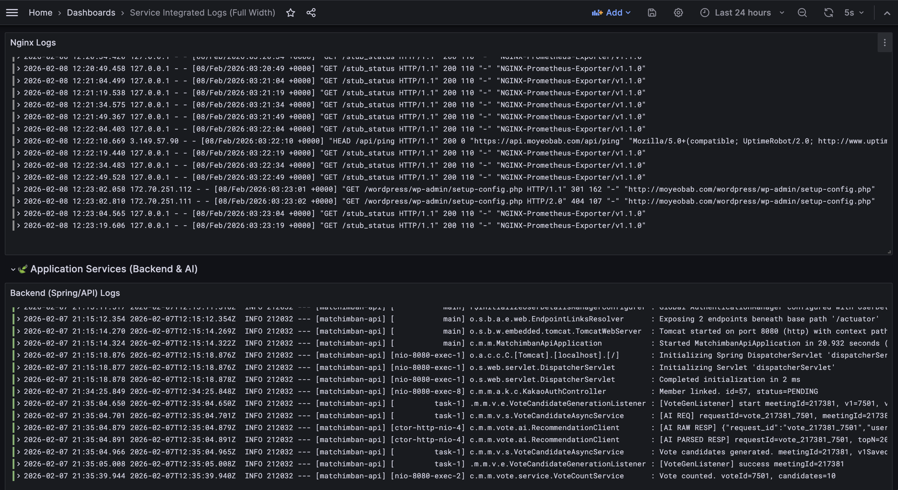
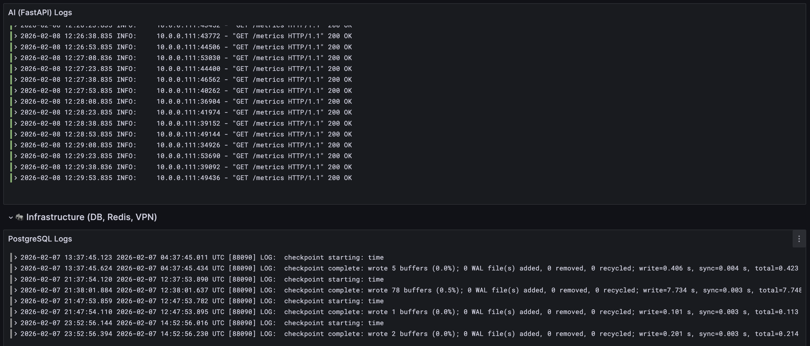

# 로그 모니터링 도입: PLG Stack 선정 및 구축

| 항목 | 내용 |
|------|------|
| 날짜 | 2026-01-30 |
| 적용 단계 | v1 (Big Bang) |
| 관련 문서 | [SEC-001 (DB 유출)](../incidents/SEC-001-db-credential-leak.md), [SEC-002 (DoS 대응)](../incidents/SEC-002-dos-attack-and-security-hardening.md) |
| 주요 목표 | 단일 서버 환경에서 리소스 효율적인 로그 모니터링 체계 구축 |

---

## 1) 도입 배경

[SEC-001(DB 크레덴셜 유출)](../incidents/SEC-001-db-credential-leak.md) 사고 이후, 유출 경로를 추적하기 위해 WireGuard, Spring Boot, PostgreSQL, Nginx 로그를 전부 뒤져야 했다. 단일 EC2 인스턴스에 모든 서비스가 올라가 있는 구조라 서버 하나에서 작업하는 건 맞지만, `journalctl -u backend`, `tail -f /var/log/nginx/access.log`, PostgreSQL 로그 확인 등 명령어를 계속 바꿔가며 이 로그 저 로그를 뒤져야 하는 게 문제였다. 시간대별로 교차 확인하려면 터미널을 여러 개 띄워놓고 왔다 갔다 해야 하고, 특정 시간대의 요청 흐름을 Nginx → Backend → DB 순서로 추적하는 게 수작업으로는 한계가 있었다.

이 경험이 직접적인 계기가 되어 "로그를 한 화면에서 통합해서 보는 시스템"을 구축하기로 했다.

---

## 2) 도구 선정

후보 3개를 비교했다:

| 기준 | CloudWatch | ELK | PLG |
|------|---|---|---|
| 리소스 사용 | AWS 관리형 (서버 불필요) | Elasticsearch만 최소 2GB+ | Loki Single Binary 수백 MB |
| 비용 | 수집량 비례 과금, 예측 어려움 | t3.medium 이상 필요 | t3.micro로도 운영 가능 |
| 커스터마이징 | 제한적 (AWS 대시보드) | 높음 (Kibana) | 높음 (Grafana) |

CloudWatch는 별도 서버 없이 바로 쓸 수 있지만, 수집량에 비례하는 과금 구조라 비용 예측이 어렵고 대시보드 커스터마이징이 제한적이었다. ELK는 기능은 강력하지만 현재 t3.small 단일 서버 환경에서 Elasticsearch의 메모리 요구량을 감당할 수 없었다.

PLG Stack(Promtail + Loki + Grafana)을 선택했다. Loki가 로그 전문이 아닌 레이블만 인덱싱하기 때문에 경량이고, Grafana가 메트릭(Prometheus)과 로그(Loki)를 단일 대시보드에서 통합할 수 있다.

---

## 3) 아키텍처 구성

```
[앱 서버]                          [모니터링 서버]
├── Promtail → ──── push ────→ Loki
├── Node Exporter ─── scrape ←── Prometheus
├── Nginx Exporter ─── scrape ←── Prometheus
├── Redis Exporter ─── scrape ←── Prometheus
└── PG Exporter ──── scrape ←── Prometheus → Grafana
```

- 메트릭: Prometheus가 각 Exporter를 scrape (pull 방식)
- 로그: Promtail이 Loki로 push (push 방식)
- 시각화: Grafana가 Prometheus + Loki를 데이터 소스로 통합

---

## 4) 로그 수집 전략

하이브리드 방식 채택:

Systemd Journal 수집 (애플리케이션):
- Spring Boot, AI Service 등 systemd로 관리되는 서비스
- Journal이 로그 로테이션을 자동 관리하므로 별도 설정 불필요

파일 기반 수집 (미들웨어):
- Nginx access/error log, PostgreSQL log
- 자체 로그 파일을 생성하는 서비스는 파일 경로를 직접 지정

---

## 5) 운영 중 겪은 문제

Grafana 무한 재시작 (GitHub Issue #100):
- 원인: Loki와 Prometheus 두 데이터 소스에 모두 `isDefault=true` 설정
- 해결: Loki에서 `isDefault` 플래그 제거 (1줄 수정)

Nginx Exporter ARM64 호환 실패 (GitHub Issue #99):
- 원인: 설치 스크립트의 아키텍처 감지 로직이 ARM64를 인식하지 못함
- 해결: `uname -m` 기반 POSIX 표준 감지로 스크립트 재작성

VPN 경유 Private Subnet 접속 불가 (GitHub Issue #98):
- 원인: WireGuard 클라이언트의 AllowedIPs에 AWS VPC CIDR 누락, IP Forwarding 미활성화
- 해결: AllowedIPs 추가, sysctl IP Forwarding 활성화, iptables NAT 설정
- 참고: AWS 신규 인스턴스는 eth0이 아닌 ens5 인터페이스 사용

---

## 6) 대시보드 구성

Grafana 대시보드를 JSON 파일로 IaC 관리하여 재현 가능하게 구성





---

## 7) 보안

Grafana(포트 3000)를 퍼블릭 인터넷에서 접근 불가로 전환:

- WireGuard VPN을 통해서만 접속 가능
- 보안 그룹에서 CIDR(0.0.0.0/0) 대신 VPN이 경유하는 앱 서버의 SG를 참조
- VPN을 거치지 않은 요청은 네트워크 레벨에서 차단

---

## 8) 효과

[SEC-002(DoS 공격)](../incidents/SEC-002-dos-attack-and-security-hardening.md)에서 이 모니터링 시스템이 공격을 실시간으로 감지했다. 당시에는 Rate Limiting 등 방어 수단이 없어 즉각 대응은 못했지만, [SEC-001](../incidents/SEC-001-db-credential-leak.md)에서 7시간 동안 장애를 몰랐던 것에 비하면 감지 속도의 개선만으로도 이 시스템의 투자 가치를 증명했다.
