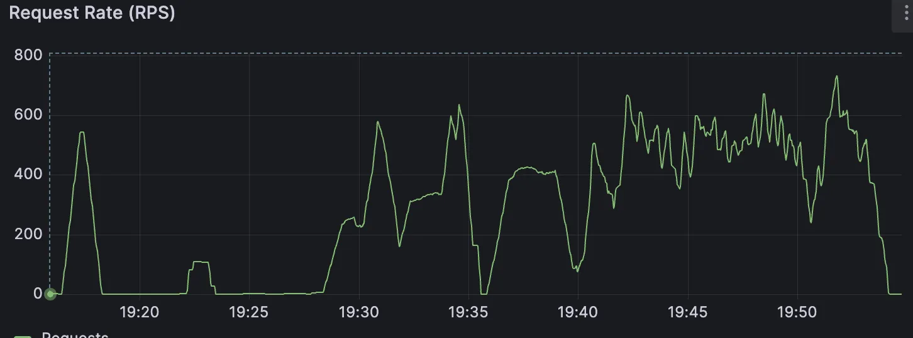
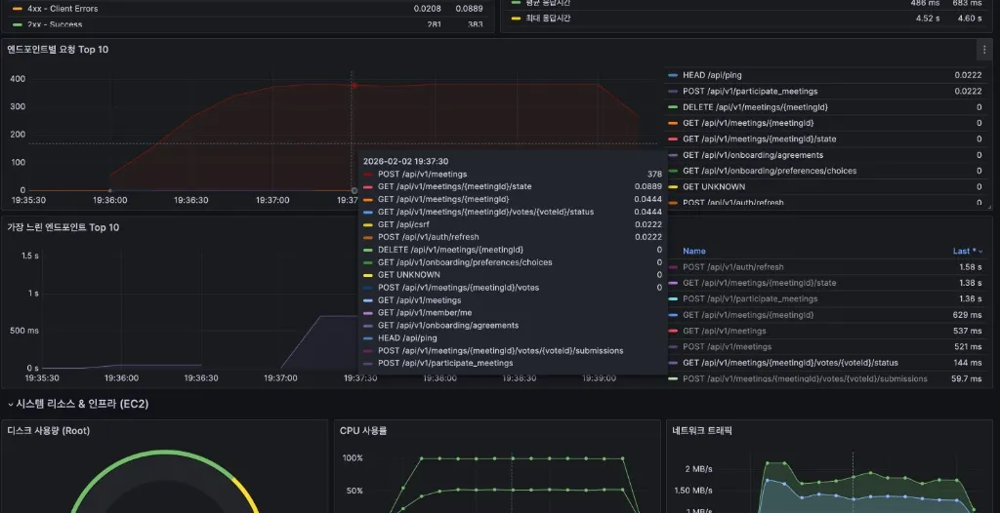
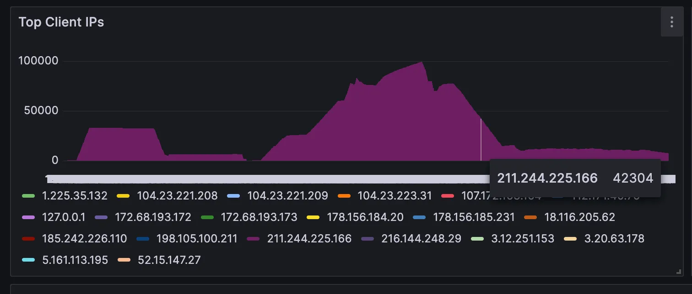
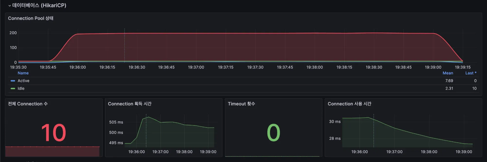
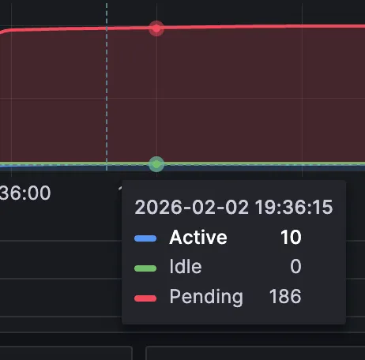
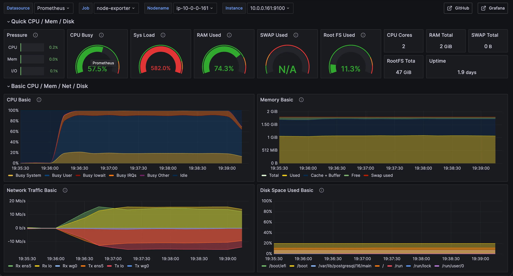
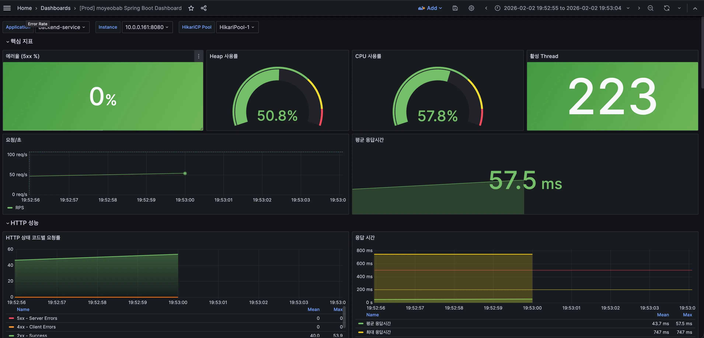

# SEC-002 상세 분석: L7 DoS 트래픽 분석 및 개선 전략

| 항목 | 내용 |
|------|------|
| 분석 일자 | 2026-02-03 |
| 분석 대상 | 2026-02-02 19:15 ~ 19:55 대규모 트래픽 유입 장애 |
| 적용 단계 | v1 (Big Bang) |
| 관련 문서 | [SEC-002 대응](SEC-002-dos-attack-and-security-hardening.md), [DR-003 모니터링](../architecture/DR-003-monitoring-setup.md) |

---

## 1) 개요



2026년 2월 2일 19시 15분부터 19시 55분까지 약 40분간, 특정 IP 대역에서 주기적으로 반복되는 대규모 트래픽이 유입됨에 따라 서비스 접속 불가 및 응답 지연 장애가 발생했다.

본 장애는 단순한 일시적 트래픽 급증이 아닌, 반복적인 트래픽 파동으로 인해 시스템 리소스가 단계적으로 고갈되며 발생한 복합 장애다. 시간대별로 백엔드 리소스 고갈(1차)과 Nginx 수용 한계 초과(2차)라는 상이한 병목 현상이 순차적으로 관측되었다.

본 보고서에서는 현재의 하드웨어 리소스 범위 내에서 서비스 안정성을 확보하기 위해, 공격성 트래픽을 소프트웨어적으로 차단하고 시스템 설정을 최적화하는 단계별 개선 전략을 도출하였다.

---

## 2) 트래픽 패턴 및 타겟 분석

### 2.1. 주기적 파동형 트래픽 (Traffic Wave)

전체 트래픽 로그를 분석한 결과, 1회성 급증이 아닌 19:15분경부터 약 40분간 총 5~6회 이상의 반복적인 트래픽 파동이 확인되었다.


- 19:15부터 시작된 트래픽이 주기적으로 등락을 반복하며, 19:35분(1차 장애)과 19:51분(2차 장애) 구간에서 시스템 처리 한계를 넘어서는 패턴을 시각적으로 확인.

### 2.2. 특정 엔드포인트 집중 타격 (Targeted Attack)

트래픽의 상세 내용을 분석한 결과, 일반적인 조회(GET) 요청이 아닌 데이터 생성(Write)을 유발하는 특정 API에 트래픽이 집중되었다.
특히 `POST /api/v1/meetings` (모임 생성) 엔드포인트가 전체 요청의 압도적인 비중을 차지했다. 이는 단순 접속 시도가 아닌 DB 트랜잭션을 유발하여 시스템 부하를 가중시키려는 의도된 패턴으로 분석된다.



- '엔드포인트별 요청 Top 10' 차트에서 `POST /api/v1/meetings` 요청이 다른 API 대비 비정상적으로 높게 나타남을 확인.

### 2.3. 단일 IP 기반의 과도한 요청

해당 트래픽은 분산된 IP가 아닌 특정 단일 IP에서 집중적으로 발생했다.



- 특정 단일 IP가 전체 요청의 대다수를 점유하고 있음.

---

## 3) 상세 장애 분석

### 3.1. 1차 장애 구간: 백엔드 리소스 고갈 및 OS 마비

- 발생 시각: 19:35 ~ 19:40 (중간 파동 구간)
- 핵심 원인: DB Connection Pool 고갈 및 스레드 폭증으로 인한 CPU 스레싱

트래픽 파동이 약 400~600 req/s 수준에 도달했을 때, 백엔드 서버의 DB 커넥션 풀(Max 10)이 즉시 소진되었다. 이후 유입된 요청들은 DB 연결을 획득하기 위해 대기 상태로 전환되었으며, 이를 처리하기 위해 톰캣의 활성 스레드가 222개까지 급증했다.

2 vCPU 사양의 서버는 수백 개의 스레드를 동시에 관리하는 과정에서 시스템 부하(System Load)가 582%까지 치솟으며 OS 레벨에서 프로세스 처리가 불가능한 상태에 빠졌다.





- Active Connection이 10개(Max)를 유지하는 동안, Pending Connection이 188개까지 치솟아 백엔드 처리 용량이 포화 상태임을 보여줌.



- Node Exporter 지표. System Load 582%, CPU Busy 100%(System 영역)를 기록하여 물리적 리소스 한계에 도달했음을 증명.

### 3.2. 2차 장애 구간: 스레드 포화 및 Nginx 수용 한계 초과

- 발생 시각: 19:51 ~ 19:53 (최대 파동 구간)
- 핵심 원인: 백엔드 스레드 적체(Backlog)로 인한 Nginx 커넥션 고갈

1차 장애 이후 해소되지 않은 대기 요청들이 누적되면서, 19:53분경 톰캣(Tomcat)의 활성 스레드(Active Threads)는 223개까지 치솟았다.
이는 별도의 스레드 제한을 설정하지 않아 Spring Boot의 기본 임계치(Default Max 200)까지 스레드가 생성된 상태로, 2 vCPU 환경이 감당할 수 있는 물리적 한계를 초과한 수치다.

이로 인해 백엔드의 요청 처리가 지연(Hang)되는 동안 Nginx가 유지해야 할 연결(Open Connections)이 급증했고, 결국 worker_connections 설정 한계(768개)에 도달하여 신규 트래픽 유입이 Nginx 단계에서 거부되었을 가능성이 매우 높다. Nginx의 alert 로그는 이러한 추론을 뒷받침한다.


- 19:51분에 RPS가 722까지 치솟았으나, Nginx 수용 한계 초과로 인해 유효 처리량이 급격히 0으로 수렴하는 모습을 보임.



- 장애 시점(19:53), 활성 스레드가 223개로 관측됨. Default 설정(200개)이 포화 상태에 도달했음을 의미하며, 높은 CPU 부하(57.8%)로 인해 요청 처리가 지연되고 있음을 시사함.

```
2026-02-02 19:53:10.204  [alert] 719#719: 768 worker_connections are not enough
2026-02-02 19:53:10.204  [alert] 719#719: 768 worker_connections are not enough
2026-02-02 19:53:10.204  [alert] 719#719: 768 worker_connections are not enough
```

- 누적된 연결과 신규 급증 트래픽을 합산한 수치가 Nginx 허용 범위를 초과하여 발생한 시스템 경고 로그.

---

## 4) 개선 전략 및 실행 계획

현재의 인프라 환경(2 vCPU)을 유지하면서 서비스 안정성을 확보하기 위해, 비정상적인 트래픽 폭주를 차단하고 미들웨어와 데이터베이스의 처리 용량을 최적화하는 3단계 실행 계획을 도출했다.

### 4.1. Nginx Rate Limiting 적용

특정 클라이언트가 시스템이 감당할 수 없는 수준(초당 수십 회 이상)의 요청을 보내는 행위가 장애의 주원인이다. 이를 방어하기 위해 Nginx에서 초당 요청 횟수를 제한하는 Rate Limiting을 최우선으로 적용해야 한다.

- 목적: 비정상적인 과도한 트래픽을 게이트웨이 단계에서 즉시 차단하여 백엔드 서버를 보호

### 4.2. Nginx Worker Connections 확장

1차 장애(백엔드 지연) 발생 시 연결이 누적되거나, 2차 장애(트래픽 재급증) 시 유입량이 몰릴 경우 Nginx가 요청 수립 자체를 거부하는 현상이 확인되었다.

- 제안: worker_connections를 768 → 4096 이상으로 상향
- 전제: 4.1 Rate Limiting이 선행되어야 백엔드 과부하를 방지할 수 있음

### 4.3. DB Connection Pool 최적화

트래픽 유입 시 DB 커넥션이 즉시 고갈되어 대기열이 발생하는 병목이 확인되었다. Rate Limiting으로 불필요한 트래픽이 걷어진다는 전제하에, 정상 요청 처리 속도를 높이기 위해 커넥션 풀을 증설한다.

- 제안: HikariCP maximum-pool-size를 10 → 30 수준으로 상향

---

## 5) 개선안 검증 및 테스트 계획

장애에서 집중 타격을 받은 `POST /api/v1/meetings` 엔드포인트를 대상으로 테스트를 진행한다.

### 5.1. Rate Limiting 방어 테스트

- 목적: 요청 제한 임계치가 비정상 트래픽을 효과적으로 차단하는지 검증
- 방법: 단일 IP에서 초당 50회 이상의 요청을 지속 발송
- 성공 기준: 허용 범위 내 요청만 200 OK, 초과 요청은 429 Too Many Requests 반환

### 5.2. Worker Connections 수용 테스트

- 목적: 상향 조정 후 동시 접속 몰림에도 Nginx 에러가 발생하지 않는지 확인
- 방법: Dev 환경에서 Rate Limit 비활성화 후 다수 VUser 동시 연결
- 성공 기준: `worker_connections are not enough` 에러 미발생

### 5.3. DB Connection Pool 임계치 테스트

- 목적: 2 vCPU 환경에서 CPU 스레싱 없이 감당 가능한 최적 커넥션 수 산정
- 방법: 커넥션 풀을 단계적 상향(10 → 20 → 30)하며 점진적 부하 주입
- 관측 지표: System Load, CPU 사용률
- 성공 기준: 풀 포화 상태에서도 System Load 3.0 이하를 유지하는 Sweet Spot 도출

---

## 6) 결론

금번 장애는 특정 IP에 의한 대규모 트래픽 유입이 1차적으로 백엔드 리소스를 고갈시키고, 2차적으로 Nginx의 수용 한계를 초과하며 발생했다. `POST /api/v1/meetings` 엔드포인트에 대한 집중적인 요청이 확인됨에 따라, 일반적인 사용 패턴이 아닌 것으로 판단된다.

하드웨어 증설 없이 대처하기 위해, Rate Limiting을 통한 트래픽 차단을 최우선 과제로 실행한다. 이후 검증 테스트를 통해 Nginx 수용 한계 확장 및 DB 커넥션 최적화를 순차적으로 수행한다.