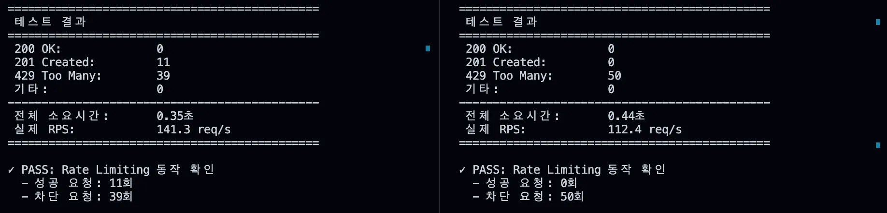
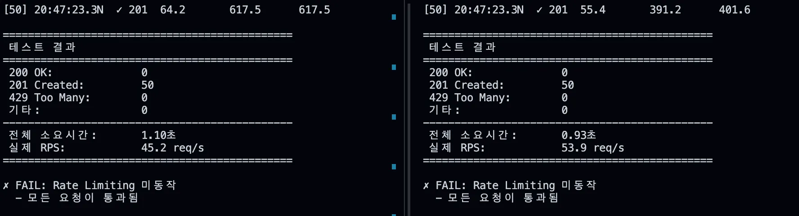

# SEC-002: L7 DoS 공격 대응 및 Nginx 보안 강화

| 항목 | 내용 |
|------|------|
| 날짜 | 2026-02-04 |
| 심각도 | High |
| 적용 단계 | v1 (Big Bang) |
| 관련 문서 | [SEC-002 상세 분석](SEC-002-dos-analysis.md), [SEC-001 (DB 유출)](SEC-001-db-credential-leak.md), [DR-003 로그 모니터링 구축](../architecture/DR-003-monitoring-setup.md) |
| GitHub Issue | [#92](https://github.com/100-hours-a-week/13-team-project-cloud/issues/92) |
| 주요 목표 | 단일 IP 대량 POST 요청 차단 및 Nginx 레벨 보안 체계 수립 |

---

## 1) 사고 개요

특정 IP에서 초당 54회의 POST 요청이 유입되었다. 단일 EC2 인스턴스에 Nginx + Spring Boot + PostgreSQL이 모두 올라가 있는 구조에서, 대량 요청이 DB 커넥션 풀을 고갈시키고 OS 레벨의 스레싱을 유발했다.

[SEC-001](SEC-001-db-credential-leak.md) 이후 구축한 [로그 모니터링 시스템](../architecture/DR-003-monitoring-setup.md)이 이 공격을 실시간으로 감지하는 데 결정적 역할을 했다. 모니터링이 없었던 SEC-001 때는 7시간 동안 장애를 몰랐지만, 이번에는 즉시 인지할 수 있었다. 다만 당시에는 Rate Limiting 등 방어 수단이 없어 공격을 즉시 차단하지는 못했고, 감지 이후 사후적으로 방어 체계를 구축했다.

장애의 상세 원인 분석(트래픽 패턴, 1차/2차 장애 구간)은 [SEC-002 상세 분석](SEC-002-dos-analysis.md)에 기록되어 있다.

---

## 2) 방어 설계

### 설계 원칙

관리 포인트 최소화를 위해 엔드포인트별 설정이 아닌, 요청 행위(Method) 기반의 전역 차단 정책을 적용했다.

- Write(POST/PUT/DELETE): IP당 초당 2회 제한 — 공격 트래픽 무력화
- Read(GET/OPTIONS): 제한 없음 — 정상 페이지 로딩 보장
- Burst 10회: 순간적인 동시 요청 수용 (NAT/공유기 환경의 오탐 방지)

### Rate Limiting (L7 DoS 방어)

`nginx.conf` http 블록:

```nginx
# 메서드 판별: POST/PUT/DELETE만 키값 부여, GET 등은 빈 문자열로 제한 제외
map $request_method $write_limit_key {
    POST    $binary_remote_addr;
    PUT     $binary_remote_addr;
    DELETE  $binary_remote_addr;
    default "";
}

# 제한 구역: 10MB, 초당 2회
limit_req_zone $write_limit_key zone=global_write_limit:10m rate=2r/s;

# 차단 시 429 반환 (기본 503 대신)
limit_req_status 429;
```

server/location 블록:

```nginx
location / {
    limit_req zone=global_write_limit burst=10 nodelay;
    proxy_pass http://backend_upstream;
}
```

### 경로 차단

WordPress 스캐너, Swagger UI 등 알려진 공격 경로를 Nginx에서 즉시 404 반환:

- `/wp-admin`, `/wp-login.php` 등 WordPress 경로
- `/v3/api-docs`, `/swagger-ui` 등 API 문서 경로
- `/actuator` 등 Spring Boot 관리 경로

이 경로 차단은 후에 [SEC-003(Google Safe Browsing)](SEC-003-google-safe-browsing.md) 이슈 해결에도 연결되었다.

---

## 3) 검증

### Rate Limiting 테스트

동일 IP에서 `POST /api/v1/meetings`에 50개 동시 요청 전송:

- Production (Rate Limiting 적용): 11개 201 Created, 39개 429 Too Many Requests
- 2차 요청(거의 동시): 50개 전부 429 — Burst 소진 후 전면 차단 확인
- Dev (미적용): 50개 전부 201 Created — 모든 요청이 백엔드까지 도달





테스트 코드: `v1-bigbang/tests/security/`

---

## 4) 롤아웃 전략

1. Phase 1: Write Limit 우선 적용 (POST/PUT/DELETE만)
2. Phase 2: 429 에러 로그 모니터링 (배포 직후 24시간)
3. Phase 3: 정상 사용자 차단 리포트 시 Burst 값 단계적 상향 (10 → 20 → 30)

GET 요청 제한은 보류. 공격 징후 포착 시 별도 Read Limit 정책 수립.

---

## 5) SEC-001과의 연결

| | SEC-001 (DB 유출) | SEC-002 (DoS 공격) |
|---|---|---|
| 감지 | 모니터링 없음, 7시간 후 수동 발견 | PLG Stack이 실시간 감지 |
| 대응 | 사후 크레덴셜 교체 | 감지는 즉시, 방어는 사후 구축 |
| 결과 | 모니터링 구축의 계기 | 모니터링이 감지 역할을 증명 |

[SEC-001](SEC-001-db-credential-leak.md)에서 "모니터링이 없어서 몰랐다"는 교훈이 [로그 모니터링 구축](../architecture/DR-003-monitoring-setup.md)으로 이어졌고, SEC-002에서 그 투자가 정확히 의도한 대로 동작했다.

이 사고를 계기로 추가 보안 강화를 진행했다:

- [OPS-002 Slowloris 방어](../operations/OPS-002-slowloris-defense.md): Connection Timeout 단축(60s → 10s)으로 커넥션 누적 방지 (Dev 1,260개 누적 vs Prod 600~700대 유지)
- DB Connection Pool 최적화, Worker Connections 확장 등은 추후 부하테스트와 함께 진행 예정
