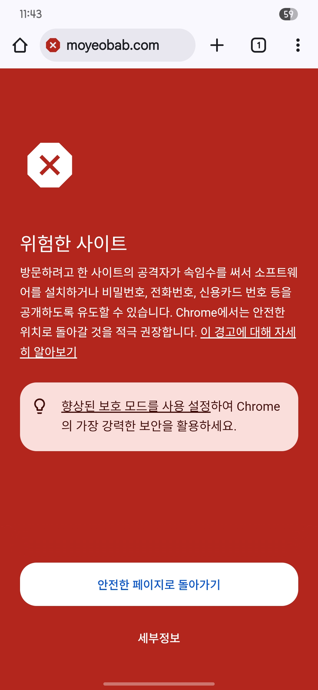
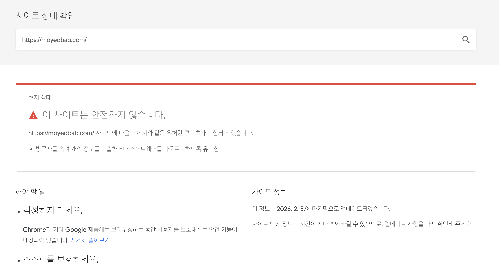
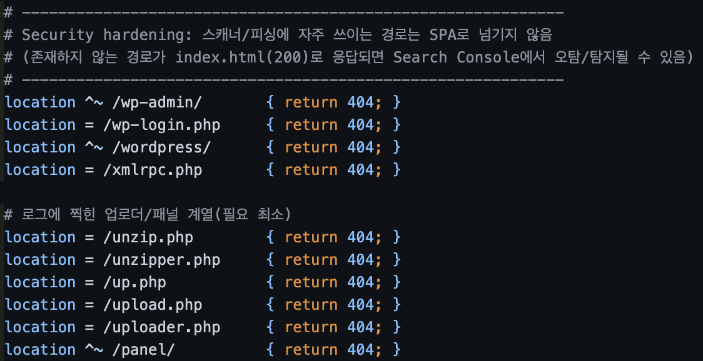
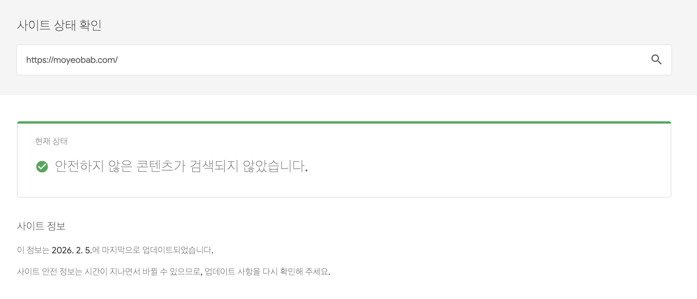

# SEC-003: Google Safe Browsing 피싱 사이트 오탐 대응

| 항목 | 내용 |
|------|------|
| 날짜 | 2026-02-05 |
| 해결일 | 2026-02-05 (재검토 요청 후 약 2.5시간) |
| 심각도 | Medium |
| 상태 | 해결됨 |
| 적용 단계 | v1 (Big Bang) |
| 관련 문서 | [SEC-002 (경로 차단이 이 문제 해결에 기여)](SEC-002-dos-attack-and-security-hardening.md) |
| 주요 목표 | SPA 라우팅이 보안 스캐너에 미치는 영향 파악 및 대응 |

---

## 1) 현상

접속 시 Chrome에서 빨간 경고("위험한 사이트") 화면이 표시되어 사용자가 서비스에 접근할 수 없었다.



Google Safe Browsing 사이트 상태 확인에서도 "이 사이트는 안전하지 않습니다"로 분류되었다 (2026.2.5 기준).



추가로 Nginx access log에 다음과 같은 공격/스캐닝성 경로 요청이 다수 존재했다:
- `/wp-admin/setup-config.php`
- `/.git/HEAD`
- `/upload.php`, `/unzipper.php`
- `TRACE /` 등

---

## 2) 원인

### 자동 스캐너/봇 트래픽 유입

WordPress, Git 노출, 웹셸 업로더 파일 등을 찾는 전형적인 스캐닝 패턴이 지속적으로 유입되고 있었다. 정상 사용자/구글봇이 아니라 전 세계에서 흔하게 들어오는 인터넷 노출 서버의 기본 현상이다.

### SPA fallback으로 인한 200 OK 응답

React SPA의 Nginx 설정에서 `try_files $uri $uri/ /index.html`을 사용하고 있어, 존재하지 않는 경로에 대해서도 항상 200 OK와 함께 index.html을 반환했다.

```
GET /wp-admin/setup-config.php → 200 OK (index.html)
GET /.git/HEAD                 → 200 OK (index.html)
GET /upload.php                → 200 OK (index.html)
```

이것이 보안 관점에서 문제가 된 이유:
- 스캐너 입장에서 "뭔가 응답이 200이네?" → 탐색 계속
- 외부 평판 시스템(Safe Browsing)이 "WordPress 로그인 페이지를 호스팅하고 있다 → 피싱"으로 판단
- SPA catch-all 라우팅이 의도치 않게 피싱 탐지 시그니처를 만든 것

### 브라우저 경고 메커니즘

Chrome이 Google Safe Browsing의 평판/차단 정보를 기반으로 로컬에서 경고를 표시한다. 구글봇이 직접 띄우는 것이 아니라, 평판 DB가 업데이트되면 모든 사용자에게 동일한 경고가 노출된다.

---

## 3) 조치

### Nginx 보안 경로 차단 설정

[SEC-002](SEC-002-dos-attack-and-security-hardening.md)에서 추가한 경로 차단 설정을 확장 적용했다. 의심/불필요 경로를 SPA fallback으로 보내지 않고 즉시 404를 반환하도록 변경했다.



차단 대상 경로:

| 카테고리 | 경로 | 응답 |
|----------|------|------|
| WordPress | `/wp-admin/`, `/wp-login.php`, `/wordpress/`, `/xmlrpc.php` | 404 |
| 업로더/패널 | `/unzip.php`, `/unzipper.php`, `/up.php`, `/upload.php`, `/uploader.php`, `/panel/` | 404 |
| 기타 탐색 | `/.git`, `/v3/api-docs`, `/swagger-ui`, `/actuator` | 404 |

핵심: "없는 건 없는 대로 404"가 나가게 만들어서, 스캐너/평판 시스템 관점에서 정상 웹앱 형태로 보이게 함.

### Google Search Console 재검토

Nginx 설정 적용 후 Google Search Console에서 재검토 요청을 제출했다.

---

## 4) 결과

재검토 요청 후 약 2.5시간 만에 피싱 경고가 해제되었고, 이후 정상적으로 서비스 접속이 가능해졌다.



- Chrome 빨간 경고 화면 사라짐
- Google Safe Browsing 사이트 상태: "안전하지 않은 콘텐츠가 검색되지 않았습니다"
- 스캐너 봇 요청에 대해 일관된 404 반환 확인

---

## 5) 교훈

- SPA의 catch-all 라우팅은 개발 편의를 위한 설정이지만, 보안 스캐너 관점에서는 "모든 경로에 콘텐츠가 있다"는 시그널을 보낸다. 특히 WordPress 관련 경로에 200을 반환하면 피싱으로 오탐될 수 있다.
- FE 라우팅 구간(`/`, `/main` 등)만 SPA fallback을 적용하고, 나머지(특히 `/.git`, `*.php`, `/wp-*` 등)는 우선 차단하는 것이 베스트 프랙티스다.
- 프론트엔드와 인프라가 독립적으로 보이는 설정이 결합하여 예상치 못한 보안 이슈를 만든 사례.
