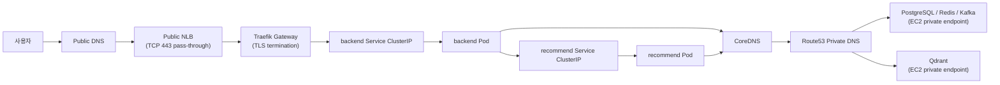
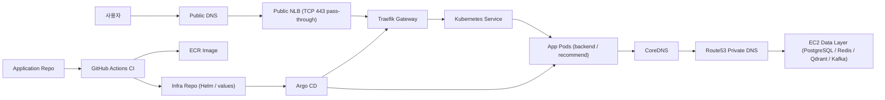

# K8S-001: Kubernetes 최종 설계서

| 항목 | 내용 |
|------|------|
| 날짜 | 2026-03-08 |
| 상태 | 작성 중 |
| 문서 역할 | v3 Kubernetes 최종 설계 기준선 |
| 관련 DR | [DR-004 Kubernetes 배포 방식 선정](../architecture/DR-004-kubernetes-distribution-selection.md), [DR-005 컨트롤 플레인 구조 선정](../architecture/DR-005-kubernetes-control-plane-topology.md), [DR-006 Kubernetes CNI 선정](../architecture/DR-006-kubernetes-cni-selection.md), [DR-007 트래픽 진입점 API 선정](../architecture/DR-007-kubernetes-gateway-api-selection.md), [DR-008 Kubernetes Gateway Controller 선정](../architecture/DR-008-kubernetes-gateway-controller-selection.md), [DR-009 도메인 및 인증서 관리 방식 선정](../architecture/DR-009-domain-and-certificate-management.md), [DR-010 Service 데이터플레인 전략 선정](../architecture/DR-010-kube-proxy-and-service-dataplane-strategy.md), [DR-011 데이터 계층 배치 전략 선정](../architecture/DR-011-stateful-workload-placement-strategy.md) |

---

## 1) 문서 목적

이 문서는 v3 Kubernetes 전환의 **최종 설계 기준선**을 기록한다.

본 문서의 역할은 아래와 같다.

- 현재 채택한 구조를 한 문서에서 읽히게 정리한다.
- 세부 대안 비교는 DR에서 참조한다.
- 구현 전후에 설계 의도와 운영 경계를 유지하는 기준 문서로 사용한다.

---

## 2) 핵심 관련 결정

| DR | 결정 |
|------|------|
| [DR-004 Kubernetes 배포 방식 선정](../architecture/DR-004-kubernetes-distribution-selection.md) | self-managed Kubernetes 배포 기준선으로 `kubeadm` 채택 |
| [DR-005 컨트롤 플레인 구조 선정](../architecture/DR-005-kubernetes-control-plane-topology.md) | 초기 컨트롤 플레인 구조로 `single control plane` 채택 |
| [DR-006 Kubernetes CNI 선정](../architecture/DR-006-kubernetes-cni-selection.md) | 초기 CNI로 `Flannel` 채택 |
| [DR-007 트래픽 진입점 API 선정](../architecture/DR-007-kubernetes-gateway-api-selection.md) | 외부 진입 API 모델로 `Gateway API` 채택 |
| [DR-008 Kubernetes Gateway Controller 선정](../architecture/DR-008-kubernetes-gateway-controller-selection.md) | Gateway 컨트롤러로 `Traefik` 채택 |
| [DR-009 도메인 및 인증서 관리 방식 선정](../architecture/DR-009-domain-and-certificate-management.md) | `Traefik`에서 TLS 종료, `cert-manager`가 인증서 lifecycle 담당 |
| [DR-010 Service 데이터플레인 전략 선정](../architecture/DR-010-kube-proxy-and-service-dataplane-strategy.md) | `kube-proxy` 유지, 초기 모드는 `iptables` 채택 |
| [DR-011 데이터 계층 배치 전략 선정](../architecture/DR-011-stateful-workload-placement-strategy.md) | Kubernetes 적용 범위를 app layer로 제한하고 stateful data workload는 클러스터 밖에 유지 |

### 2.1. 최종 네트워크 흐름 요약

아래 그림은 설계 기준에서 통신이 어떻게 흐르는지 한 번에 보여준다.

이 흐름을 설계 기준으로 해석하면 아래와 같다.

- 외부 요청은 `public NLB`를 거쳐 `Traefik`으로 들어온다.
- HTTPS 세션 종료와 L7 라우팅은 `Traefik`이 담당한다.
- `Service ClusterIP -> Pod endpoint` 전달은 `kube-proxy`가 담당한다.
- 노드 간 Pod 연결이 필요하면 Pod 네트워크는 `Flannel`이 담당한다.
- 외부 데이터 계층 연결은 `CoreDNS -> Route53 private DNS -> EC2 private endpoint` 경로를 사용한다.

---

## 3) 현재 상황과 설계 범위

이번 Kubernetes 설계의 목표는 **application workload와 운영에 필요한 monitoring workload를 클러스터에 올리고, 그 범위에서 운영 가능한 기준선을 확정하는 것**이다.

설계 전제는 다음과 같다.

- 운영 인원은 소수다.
- 외부 진입은 `public NLB -> Traefik` 단일 경로를 기준으로 둔다.
- 내부 서비스 분산은 Kubernetes `Service`와 `kube-proxy`/CNI 데이터플레인이 담당한다.
- Kubernetes 기본 대상은 application workload와 monitoring workload다.
- stateful data workload는 Kubernetes 대상이 아니다.
- 운영 복잡도는 의도적으로 제한한다.

이번 문서가 직접 다루는 범위는 아래다.

- 클러스터 배포/운영 기준선
- 네트워크와 외부 진입 구조
- 환경 분리와 서비스 디스커버리
- 모니터링 워크로드 배치 원칙
- 외부 데이터 계층 연동 방식
- Secret/Config 관리 원칙
- CI/CD와 GitOps 운영 기준

이번 문서에서 직접 다루지 않는 항목은 아래다.

- 데이터 워크로드 자체의 배치 및 운영 세부
- 고가용성 컨트롤 플레인 상세 구현
- eBPF 기반 통합 데이터플레인
- ExternalDNS 자동화 도입

---

## 4) 설계 원칙

이번 설계는 아래 원칙을 따른다.

1. **기준선 우선**
   먼저 운영 가능한 기본 구조를 고정하고, 이후 확장 축은 분리한다.

2. **역할 분리**
   Pod 네트워크, Service 데이터플레인, Gateway, 인증서 lifecycle, 배포 실행자를 서로 다른 책임으로 둔다.

3. **Git 기준 운영**
   원하는 상태는 Git에서 관리하고, 클러스터는 이를 반영하는 대상이 된다.

4. **과도한 결합 회피**
   특정 배포판의 번들 기본값에 과하게 종속되지 않는다.

5. **현재 범위 우선**
application/monitoring 기준선을 먼저 고정하고, stateful data workload는 Kubernetes 설계 범위에 포함하지 않는다.

---

## 5) 전체 구조

설계 기준의 전체 구조는 아래와 같다.

이 설계에서 중요한 경계는 아래와 같다.

- 외부 L4 진입은 `public NLB`
- 외부 L7 진입과 TLS 종료는 `Traefik`
- 내부 서비스 분산은 `kube-proxy`
- Pod 네트워크는 `Flannel`
- 데이터 영역은 현재 EC2 private endpoint 유지
- 배포 상태의 소스 오브 트루스는 `infra repo`

---

## 6) 클러스터/운영 모델

### 6.1. 배포 기준선

클러스터는 self-managed Kubernetes를 기준으로 하며, 배포 방식은 `kubeadm`을 사용한다. 이 선택의 근거는 [DR-004 Kubernetes 배포 방식 선정 - `kubeadm` 채택](../architecture/DR-004-kubernetes-distribution-selection.md)에서 관리한다.

핵심은 배포판 번들에 기대기보다, CNI, Gateway, 인증서, Service 데이터플레인을 독립 설계 축으로 유지하는 것이다.

### 6.2. 컨트롤 플레인 구조

초기 컨트롤 플레인 구조는 `single control plane`으로 둔다. 이 선택은 현재 워크로드 단계와 운영 인력을 기준으로 한 것이며, HA를 부정하는 판단은 아니다. 자세한 근거는 [DR-005 컨트롤 플레인 구조 선정 - `single control plane` 채택](../architecture/DR-005-kubernetes-control-plane-topology.md)를 따른다.

현재 운영 원칙은 다음과 같다.

- control plane node에는 사용자 워크로드를 배치하지 않는다.
- worker node는 애플리케이션과 플랫폼 Pod의 실행 노드로 사용한다.
- HA 전환은 후속 운영 요구가 생길 때 재검토한다.

### 6.3. 컨테이너 런타임

컨테이너 런타임 기준선은 `containerd`다. 현재 `kubeadm` 기반 업스트림 Kubernetes에서 가장 일반적인 CRI 경로이며, 별도 Docker Engine 의존을 기준선으로 두지 않는다.

### 6.4. 노드 프로비저닝

노드 프로비저닝은 기존 IaC 기준선을 따른다. 이 문서는 IaC 도구 선정 자체를 다시 다루지 않고, 인프라 생성과 클러스터 조인 절차의 책임 경계만 정의한다.

즉 운영 흐름은 아래를 전제로 한다.

- 기존 IaC 기준선으로 네트워크/노드 인프라 생성
- 부트스트랩 스크립트 또는 운영 절차로 `kubeadm init` / `kubeadm join`
- 클러스터 이후 구성은 Git 기반으로 반영

즉 이 문서의 관심사는 "어떤 IaC 도구를 쓰는가"가 아니라, **프로비저닝된 노드 위에 Kubernetes 기준선을 어떻게 올리고 운영할 것인가**다.

### 6.5. 업그레이드 정책

업그레이드는 `kubeadm` 공식 절차 기반의 순차 업그레이드를 원칙으로 한다.

- control plane 먼저
- worker는 drain 후 순차 갱신
- kubelet/kubectl/container runtime 호환 범위를 Kubernetes 공식 가이드에 맞춘다

이번 문서는 업그레이드 명령 절차까지 상세화하지 않고, 운영 원칙만 고정한다.

---

## 7) 환경 분리와 네임스페이스 구조

### 7.1. 환경 분리 기준선

현재 환경 분리는 멀티클러스터보다 **단일 클러스터 내 네임스페이스 분리**를 기준선으로 둔다.

핵심 이유는 다음과 같다.

- 초기 운영 복잡도를 낮춘다.
- dev/prod 배포 경계를 분리할 수 있다.
- 클러스터 수를 늘리지 않고도 권한, 배포, 값, 릴리스를 환경별로 분리할 수 있다.

### 7.2. 초기 네임스페이스 구조

초기 네임스페이스는 아래 구조를 기준으로 한다.

- `infra-system`
  CNI, Traefik, cert-manager 같은 공용 인프라 컴포넌트
- `monitoring-system`
  Prometheus, Grafana, Loki, exporter 등 모니터링 워크로드
- `dev-app`
  개발 환경 애플리케이션 워크로드
- `prod-app`
  운영 환경 애플리케이션 워크로드

데이터 워크로드용 네임스페이스는 설계 기준에 포함하지 않는다.

### 7.3. 환경별 운영 원칙

- 서비스 릴리스는 환경별로 분리한다.
- 환경별 Helm values와 Secret/ConfigMap 참조 경로를 분리한다.
- `prod`는 `dev`보다 더 엄격한 승인 흐름을 둔다.
- 수동 명령은 대상 namespace를 명시한 경우만 허용한다.

---

## 8) 네트워크와 서비스 디스커버리

### 8.1. Pod 네트워크

Pod 네트워크 기준선은 `Flannel`이다. 설계 기준은 overlay(VXLAN) 기반 구성이며, 선택 근거는 [DR-006 Kubernetes CNI 선정 - `Flannel` 채택](../architecture/DR-006-kubernetes-cni-selection.md)를 따른다.

이 선택은 “가장 쉬운 CNI”를 고른 것이 아니라, 설계 기준에서 Pod 네트워크 책임 범위를 명확히 두고, Service 데이터플레인과 정책 축을 분리하기 위한 기준선이다.

### 8.2. Service 데이터플레인

Service 데이터플레인은 `kube-proxy`를 유지하고, 초기 모드는 `iptables`를 채택한다. 관련 근거는 [DR-010 Service 데이터플레인 전략 선정 - `kube-proxy + iptables` 채택](../architecture/DR-010-kube-proxy-and-service-dataplane-strategy.md)를 따른다.

이 설계에서 역할은 아래처럼 분리된다.

- `Flannel`
  Pod-to-Pod 네트워크
- `kube-proxy`
  `Service ClusterIP -> Pod endpoint` 전달 계층
- `Traefik`
  외부 L7 라우팅과 TLS 종료

`ipvs`는 채택하지 않으며, eBPF replacement는 현재 제외한다.

### 8.3. NetworkPolicy

설계 기준에서는 NetworkPolicy를 필수 기준으로 두지 않는다.

현재 격리 방식은 아래를 우선 사용한다.

- Security Group
- 노드 역할 분리
- 워크로드 배치 제약

세밀한 east-west 정책은 후속 운영 요구가 생길 때 다시 강화한다.

### 8.4. DNS 구조

현재 DNS 구조는 아래처럼 역할을 나눈다.

- `CoreDNS`
  클러스터 내부 서비스 이름 해석
  예: `*.svc.cluster.local`
- `Route53 public DNS`
  외부 공개 도메인
- `Route53 private DNS`
  외부 데이터 계층 private endpoint 이름 해석

즉 애플리케이션은 아래 원칙을 따른다.

- 클러스터 내부 서비스는 Kubernetes DNS와 `Service ClusterIP`를 사용한다.
- 클러스터 밖 데이터 계층은 `Route53 private DNS`를 공식 엔드포인트로 사용한다.
- IP 직접 참조는 기준선으로 두지 않는다.

`Local DNS`는 운영자 PC나 사내/VPN 환경의 별도 이름 해석 계층일 뿐, Kubernetes 설계 기준선은 아니다.

<!-- ### 8.5. ExternalDNS

`ExternalDNS`는 설계 기준에 포함하지 않는다.

설계 기준에서는 public/private DNS 레코드를 기존 IaC 기준선과 명시적 운영 절차로 관리한다. Route53 레코드 자동화가 운영상 필요한 시점에 `ExternalDNS` 도입을 검토한다. -->

### 8.6. 트래픽 경계

이 설계는 아래 세 경계를 분리해서 본다.

- 외부 inbound
  인터넷에서 클러스터로 들어오는 트래픽
- 내부 east-west
  클러스터 내부 서비스 간 통신
- 외부 data egress
  Pod에서 외부 데이터 계층으로 나가는 트래픽

이 분리는 운영 설명과 보안 책임 구분을 위한 기준선이다.

---

## 9) 외부 진입 구조

### 9.1. 외부 LB

외부 진입점은 `public NLB`를 사용한다. 설계 기준에서 NLB는 L4 전달 계층이고, TLS는 종료하지 않는다. `443/TCP` pass-through로 Gateway 계층인 `Traefik`에 전달한다.

즉 설계상 외부 진입 흐름은 아래와 같다.

`사용자 -> Public DNS -> public NLB -> Traefik -> Kubernetes Service -> Pod`

### 9.2. Gateway API와 Gateway Controller

트래픽 진입점 API는 `Gateway API`, 구현체는 `Traefik`을 채택한다. 각각의 근거는 [DR-007 트래픽 진입점 API 선정 - `Gateway API` 채택](../architecture/DR-007-kubernetes-gateway-api-selection.md), [DR-008 Kubernetes Gateway Controller 선정 - `Traefik` 채택](../architecture/DR-008-kubernetes-gateway-controller-selection.md)를 따른다.

현재 이 계층의 역할은 아래와 같다.

- 도메인별 listener 관리
- HTTP(S) 라우팅
- TLS 종료
- backend Service 선택

### 9.3. 인증서와 TLS

TLS 종료는 `Traefik`에서 수행한다. 인증서 lifecycle은 `cert-manager`가 담당한다. 기준선은 [DR-009 도메인 및 인증서 관리 방식 선정 - `Traefik TLS 종료 + cert-manager` 채택](../architecture/DR-009-domain-and-certificate-management.md)를 따른다.

설계 원칙은 아래와 같다.

- HTTPS 세션 종료는 Gateway 계층에서 처리한다.
- 인증서 발급/갱신은 `cert-manager`가 수행한다.
- 초기 ACME 검증은 `HTTP-01`을 우선 기준으로 둔다.
- wildcard 또는 DNS 자동화 요구가 생기면 `DNS-01`을 후속 검토한다.

### 9.4. 외부 노출 정책

외부 노출은 최소 범위만 허용한다.

- 공개 대상 서비스만 Gateway에 연결한다.
- 내부 서비스는 기본 비공개다.
- 운영/관리용 엔드포인트는 필요 시 internal 경계로 별도 설계한다.

---

## 10) 데이터 영역 연동

### 10.1. 설계 기준

설계 기준에서는 application workload와 필요한 monitoring workload를 Kubernetes에 올리고, 데이터 영역은 클러스터 밖 EC2 기반 private endpoint를 유지한다. 이 경계의 근거는 [DR-011 데이터 계층 배치 전략 선정](../architecture/DR-011-stateful-workload-placement-strategy.md)에서 관리한다.

설계상 외부 데이터 대상은 아래를 기준으로 본다.

- `PostgreSQL`
- `Redis`
- `Qdrant`
- `Kafka`(세부 네트워킹은 후속)

### 10.2. 이름 체계와 접속 방식

Pod는 외부 데이터 영역을 Kubernetes `Service` 이름으로 감싸지 않고, 설계 기준에서는 **Route53 private DNS**를 공식 엔드포인트로 사용한다.

즉 설계상 흐름은 아래와 같다.

`Pod -> CoreDNS -> Route53 private DNS -> EC2 private endpoint`

이 원칙은 다음 이유에 맞는다.

- 현재 data layer는 클러스터 밖에 고정되어 있다.
- 이미 private DNS 체계가 있다.
- 지금 필요한 것은 외부 데이터의 Kubernetes 추상화보다, 안정적인 연결 기준선이다.

### 10.3. 보안 경계

외부 데이터 영역은 해당 클러스터의 worker node 보안 주체를 기준으로 허용한다.

즉 설계 기준에서는 아래 원칙을 따른다.

- 데이터 계층 Security Group은 worker node SG를 허용 기준으로 둔다.
- 세밀한 Pod 단위 제어는 현재 필수 기준으로 두지 않는다.

## 11) Secret / Config 관리

### 11.1. 원천과 런타임 주입

비밀과 설정의 원천은 AWS `SSM Parameter Store`로 유지한다. Kubernetes는 런타임 주입 계층으로 사용한다.

즉 기준선은 아래와 같다.

- SSM: 원천(Source of Truth)
- Kubernetes `Secret`: 민감값 주입
- Kubernetes `ConfigMap`: 비민감값 주입

애플리케이션은 SSM을 직접 읽지 않고, Kubernetes 리소스를 통해 값을 주입받는다.

### 11.2. 분리 원칙

- 민감값은 `Secret`
- 비민감 설정은 `ConfigMap`
- 값의 의미가 민감하면 타입이 `String`이어도 `Secret`으로 승격
- URL에 credential이 포함되면 `Secret`으로 승격
- `IMAGE_TAG` 같은 배포 제어값은 런타임 주입 대상에서 제외

### 11.3. 운영 원칙

- 클러스터 내 `kubectl edit secret`를 기준 운영 경로로 사용하지 않는다.
- 값 변경의 기준점은 SSM으로 둔다.
- 환경별 경로와 권한은 분리한다.
- 서비스는 필요한 Secret/ConfigMap만 참조한다.

이번 문서는 Secret sync 구현체를 확정하지 않는다. 다만 **원천은 SSM, 런타임 주입은 Kubernetes**라는 경계는 설계 기준으로 고정한다.

---

## 12) CI/CD와 GitOps 운영 기준

### 12.1. 기본 원칙

CI/CD 기준선은 **Git을 원하는 상태의 단일 소스 오브 트루스로 유지하고, Argo CD가 이를 클러스터에 반영하는 구조**다.

현재 판단은 다음과 같다.

- GitHub Actions는 CI를 담당한다.
- Argo CD는 CD 실행자이자 GitOps controller로 사용한다.
- 실제 배포 상태는 `infra repo` Git 상태로 정의한다.
- 클러스터에서의 수동 변경은 표준 경로로 보지 않는다.

### 12.2. 레포지토리 책임

- `application repo`
  코드, 테스트, 이미지 빌드, 이미지 푸시
- `infra repo`
  Helm chart, values, 환경별 desired state
- `Argo CD`
  `infra repo`를 감시하고 클러스터를 desired state로 reconcile

### 12.3. 배포 흐름

설계 기준의 배포 흐름은 아래와 같다.

1. 앱 변경
2. GitHub Actions가 테스트/빌드 수행
3. 이미지 ECR 푸시
4. immutable tag 또는 digest 확정
5. `infra repo` values 변경 PR 생성
6. PR 머지
7. Argo CD가 변경을 감지하고 sync

즉 앱 CI는 아티팩트 생산까지, 실제 클러스터 상태 반영은 Argo CD가 담당한다.

### 12.4. 왜 Argo CD를 기준선으로 두는가

이번 결정의 핵심은 도구 선호가 아니라 **drift 통제와 워크플로우 단순화**다.

현재 판단 근거는 아래와 같다.

- GitHub Actions만으로 GitOps를 억지로 구현하면 환경별/서비스별 CD workflow가 다시 늘어난다.
- `kubectl`이나 `helm`을 CI에서 명령형으로 실행하는 방식은 클러스터 상태와 Git 상태가 어긋나기 쉽다.
- 수동 변경이 섞이면 “지금 클러스터에 적용된 내용이 Git과 같은가”를 계속 확인해야 한다.
- Argo CD는 Git 상태를 기준으로 지속적으로 reconcile하므로, desired state와 runtime state의 차이를 줄이기 쉽다.

즉 이 설계에서는 **Git만 보고도 원하는 배포 상태를 설명할 수 있어야 한다**는 것이 핵심이다.

### 12.5. 수동 변경과 롤백 원칙

- 표준 경로는 Git 변경 후 Argo CD sync다.
- 긴급 대응으로 클러스터를 수동 수정한 경우, 즉시 Git 정합화 커밋/PR을 남긴다.
- 롤백은 Git `revert PR`을 기준으로 수행한다.
- Git을 갱신하지 않은 채 클러스터 상태만 바꾸는 운영은 금지한다.

### 12.6. Helm 위치

Helm은 여전히 배포 단위 표준으로 사용한다. 다만 Helm을 사람이 직접 실행하는 것이 아니라, **Argo CD가 infra repo의 Helm chart와 values를 기준으로 반영하는 구조**를 기준선으로 둔다.

---

## 13) 운영 관측 범위

설계 기준에는 애플리케이션 운영에 필요한 monitoring workload를 포함할 수 있다. 다만 monitoring stack의 저장/시각화 계층 세부 구성과 retention 정책은 별도 운영 문서에서 관리한다.

이 문서는 아래 경계만 고정한다.

- application workload와 monitoring workload는 Kubernetes 대상이 될 수 있다.
- stateful data workload는 Kubernetes 대상이 아니다.
- monitoring stack의 세부 배치 방식은 운영 요구에 따라 별도로 정한다.

---

## 14) 최종 판단 문장

v3 Kubernetes 설계 기준은 `kubeadm + single control plane + containerd + Flannel + kube-proxy(iptables) + Gateway API(Traefik) + cert-manager + public NLB` 조합이다. 환경은 단일 클러스터 내 namespace로 분리하고, application workload와 monitoring workload를 Kubernetes 대상으로 둔다. 외부 데이터 영역은 Route53 private DNS와 worker node 보안 경계를 기준으로 연동하며, stateful data workload는 클러스터 밖에서 운영한다. Secret과 Config는 SSM Parameter Store를 원천으로 두고 Kubernetes 런타임 리소스로 주입한다. 배포 상태의 소스 오브 트루스는 `infra repo` Git 상태이며, GitHub Actions는 CI를, Argo CD는 CD와 GitOps 동기화를 담당한다. 이 문서는 설계 기준을 고정하고, 세부 대안 비교와 운영 경계는 관련 DR에서 관리한다.
