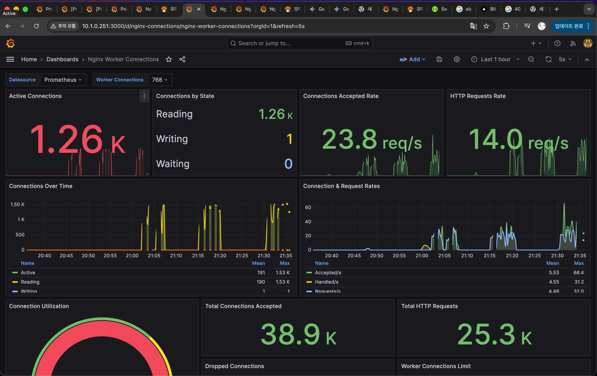
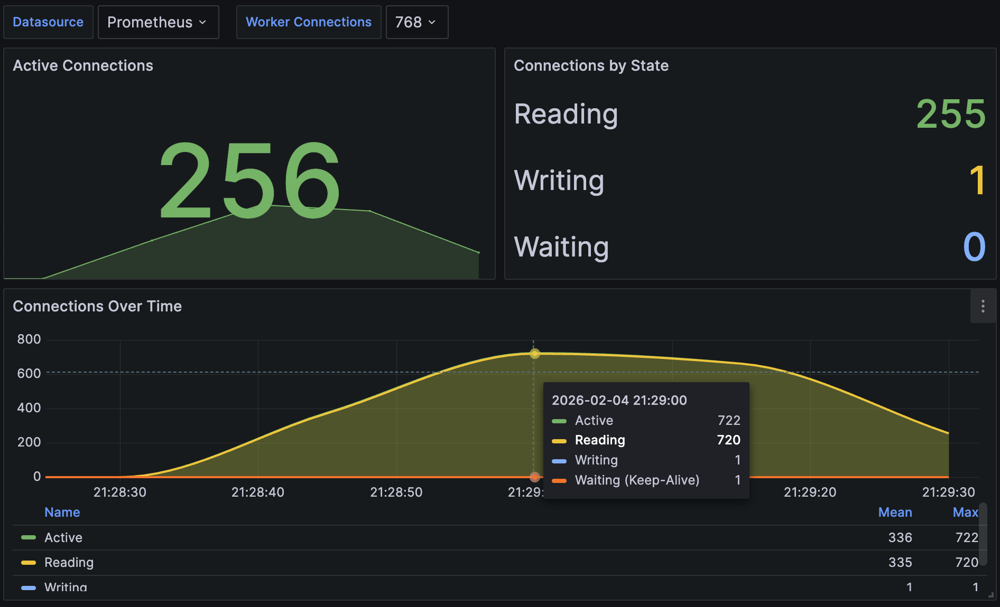
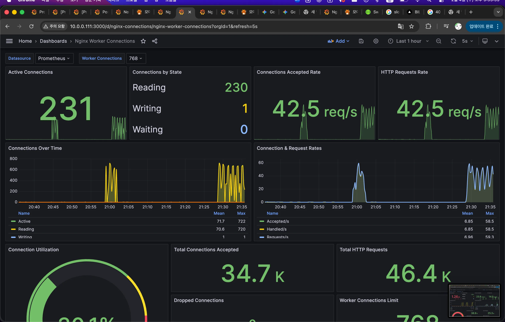
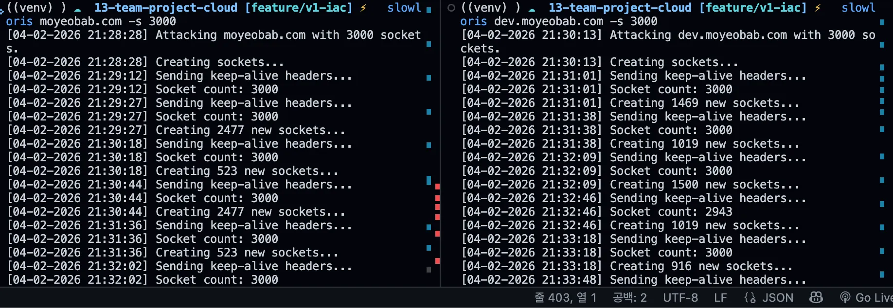
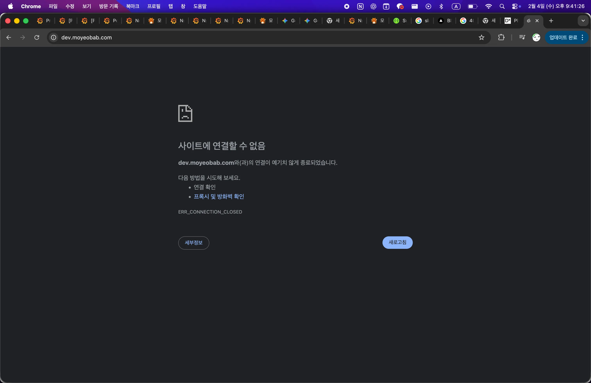

# OPS-002: Slowloris 공격 방어 — Connection Timeout 최적화

| 항목 | 내용 |
|------|------|
| 날짜 | 2026-02-04 |
| 적용 단계 | v1 (Big Bang) |
| 관련 문서 | [SEC-002 (DoS 대응)](../incidents/SEC-002-dos-attack-and-security-hardening.md) |
| 주요 목표 | Slowloris 유형 공격 방어를 위한 Nginx Timeout 최적화 |

---

## 1) 배경

[SEC-002](../incidents/SEC-002-dos-attack-and-security-hardening.md)에서 HTTP Flood 공격을 경험한 후, "다른 유형의 공격도 대비해야 하지 않은가?"를 고민했다. 특히 Slowloris 공격은 대량 트래픽 없이도 커넥션을 점유하여 서비스를 마비시킬 수 있어, 단일 인스턴스 환경에서 위험도가 높다고 판단했다.

Slowloris는 HTTP 헤더를 의도적으로 느리게 전송하여 서버의 연결 슬롯을 장시간 점유하는 공격이다. Nginx의 기본 Timeout(60s)에서는 공격자가 하나의 연결을 최대 60초간 유지할 수 있어, 소수의 연결만으로도 서비스 가용성을 위협할 수 있다.

---

## 2) 설정

Nginx Timeout을 단축하여 불완전한 연결을 빠르게 종료시킨다.

```nginx
# Slowloris 방어: 10초 동안 패킷 전송 없으면 연결 해제
client_header_timeout 10s;   # 헤더 전송 제한 (기존 60s)
client_body_timeout 10s;     # 바디 전송 제한 (기존 60s)

# 리소스 효율화: 유휴 커넥션 유지 시간 단축
keepalive_timeout 15s;       # 유휴 연결 종료 (기존 75s)
send_timeout 10s;            # 응답 전송 제한
```

일반적인 모바일 환경에서 HTTP 헤더/바디 전송에 10초면 충분하므로, 정상 사용자에게 영향을 주지 않는 수준이다.

---

## 3) 검증

### 테스트 환경

- 공격 도구: Python `slowloris` 패키지
- 명령어: `slowloris [TARGET] -s 3000`
- 비교 대상: Dev(Timeout 미적용) vs Production(Timeout 적용)

### Active Connections 비교

| 환경 | Active Connections | 결과 |
|------|-------------------|------|
| Dev (Timeout 미적용) | 1,260개까지 누적, 해소 안 됨 | 페이지 로드 실패, 서비스 불가 |
| Production (Timeout 적용) | 600~700대 유지, worker_connections(768) 이하로 관리 | 정상 서비스 유지 |

Dev는 연결이 누적만 되고 해소되지 않아 서비스가 마비된 반면, Production은 Timeout이 불완전한 연결을 지속적으로 만료시켜 worker_connections 한계 이하로 유지했다.







### Dev 서버 장애 현상

Timeout 미적용 상태에서 Slowloris 공격 시 커넥션 고갈로 인해 페이지 로드 실패(흰 화면), 새로고침 시 "사이트에 연결할 수 없음" 오류가 발생했다.





---

## 4) 트레이드오프

- Timeout을 너무 짧게 설정하면 느린 네트워크 환경의 정상 사용자도 연결이 끊길 수 있음
- 10초는 일반적인 모바일/WiFi 환경에서 충분하지만, 해외 접속이나 극단적으로 느린 환경에서는 모니터링 필요
- 현재 서비스 대상이 판교 테크노밸리 주변이므로 네트워크 품질이 보장되어 10초 설정이 적절
