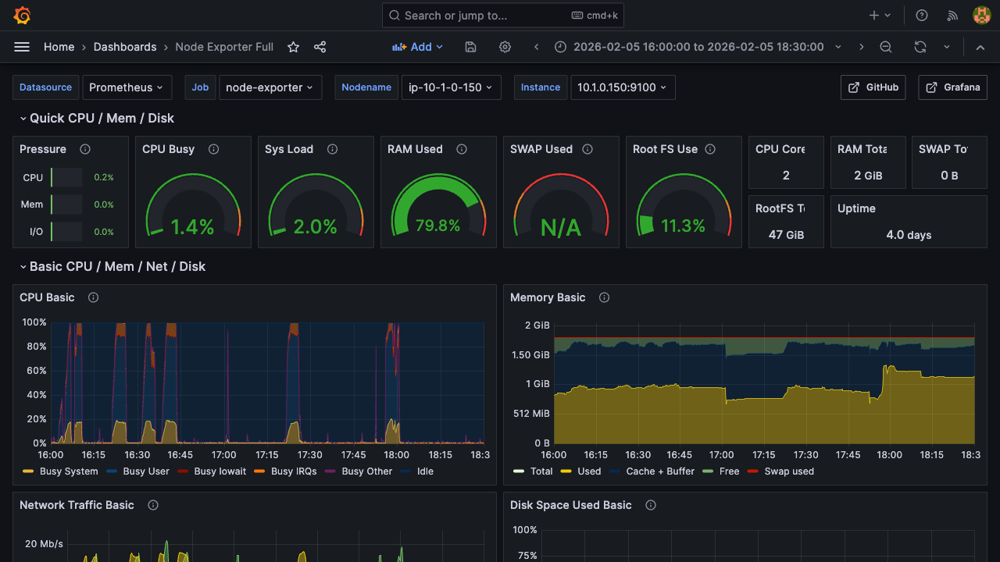
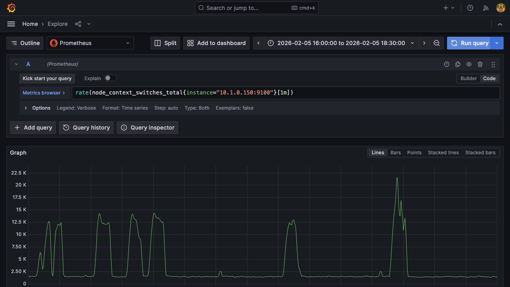
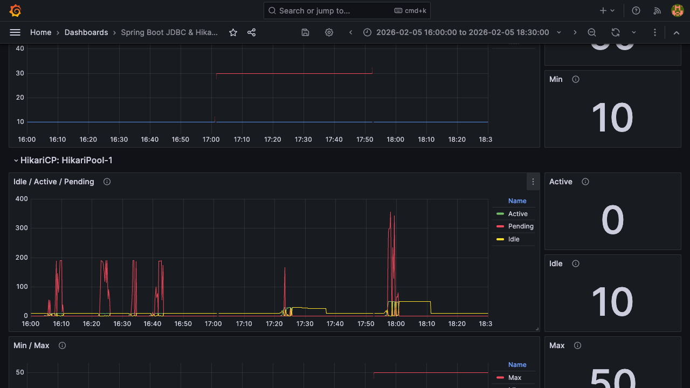
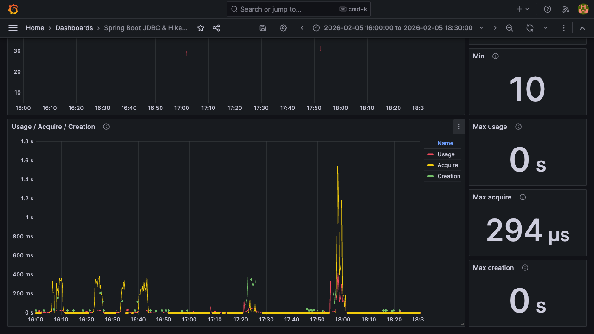
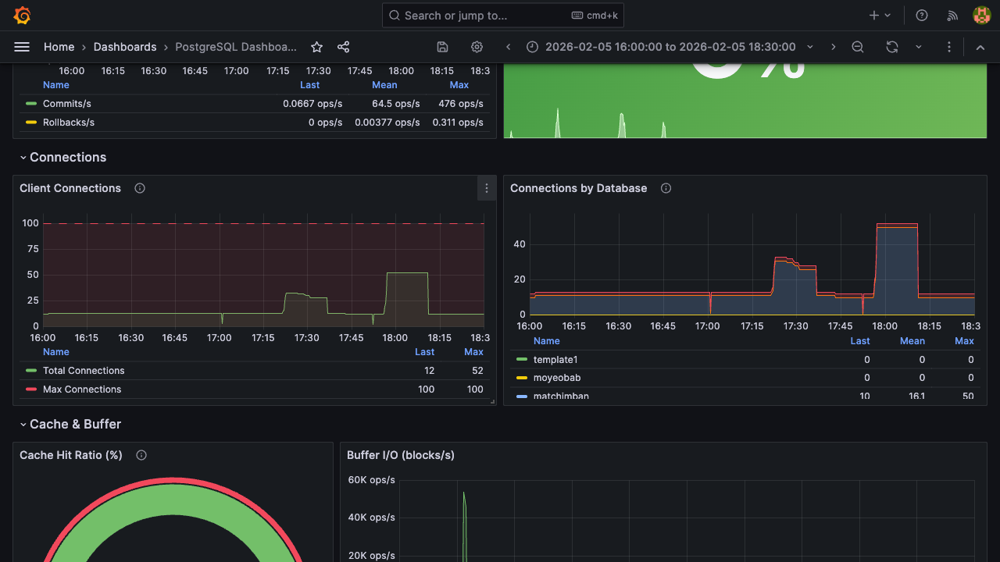

# OPS-003: DB Connection Pool 부하 테스트 및 분석

| 항목 | 내용 |
|------|------|
| 날짜 | 2026-02-05 |
| 적용 단계 | v1 (Big Bang) |
| 관련 문서 | [SEC-002 상세 분석 — 4.3절 DB Connection Pool 최적화](../incidents/SEC-002-dos-analysis.md) |
| 테스트 도구 | k6 (Grafana Labs) |
| 모니터링 | Prometheus + Grafana (Node Exporter, Spring Boot Actuator, PostgreSQL Exporter) |
| 주요 목표 | HikariCP 커넥션 풀 증설이 2 vCPU 단일 인스턴스에서 실효성이 있는지 검증 |

---

## 1) 배경

[SEC-002 상세 분석](../incidents/SEC-002-dos-analysis.md)에서 DoS 공격 시 DB 커넥션 풀(Max 10)이 즉시 고갈되어 Pending Connection이 188개까지 치솟는 병목이 확인되었다. 이에 대한 개선안으로 "HikariCP maximum-pool-size를 10 → 30으로 상향"을 제안했다.

본 테스트는 이 제안이 현재 인프라(2 vCPU, Nginx + Spring Boot + PostgreSQL 단일 인스턴스)에서 실제로 효과가 있는지를 검증한다.

---

## 2) 테스트 설계

### 환경

| 항목 | 사양 |
|------|------|
| 서버 | EC2 (2 vCPU, 2 GiB RAM) |
| 구성 | Nginx + Spring Boot + PostgreSQL (단일 인스턴스) |
| PostgreSQL | max_connections: 100 (기본값) |
| Nginx | worker_connections: 768, Rate Limit 미적용 |
| 타겟 엔드포인트 | `POST /api/v1/meetings` (SEC-002에서 집중 타격받은 엔드포인트) |

### 비교 조건

| 구분 | HikariCP 설정 | 의미 |
|------|--------------|------|
| 베이스라인 | maximum-pool-size: 10 | 기존 설정 |
| 튜닝 | minimum-idle: 10, maximum-pool-size: 30 | SEC-002 제안안 |

### 부하 시나리오

k6를 사용하여 VUser를 5분간 0 → 3,000까지 점진적으로 증가시키며 서버 한계까지 부하를 주입했다.

| 항목 | 설정 |
|------|------|
| Ramp-up | 5분간 0 → 3,000 VUser |
| 요청 | `POST /api/v1/meetings` (모임 생성) |
| Payload | 모임 제목, 일정, 위치(위/경도), 투표 마감일, 인원 등 포함 |
| Think Time | 1~3초 랜덤 (`sleep(Math.random() * 2 + 1)`) |
| 성공 기준 | HTTP 201, 응답시간 < 500ms |

각 VUser는 요청 → 응답 대기 → Think Time → 다음 요청 순서로 동작한다. Think Time이 있으므로 VUser 수 = 동시 커넥션 수가 아니며, 실제 동시 요청은 VUser 수보다 낮다.

---

## 3) 테스트 결과

### 3.1. k6 리포트 요약

| 지표 | 베이스라인 (conn 10) | 튜닝 (conn max 30) | 변화 |
|------|---------------------|-------------------|------|
| 총 요청 수 | 123.4k | 102k | -17% |
| 처리량 (req/s) | 373.7 | 309.0 | -17% |
| 에러율 (http_req_failed) | 6.3% | 5.4% | 소폭 개선 |
| checks 통과율 | 86.7% | 88.6% | 소폭 개선 |
| 응답시간 avg | 346ms | 1s | 2.9배 악화 |
| 응답시간 median | 138ms | 247ms | 1.8배 악화 |
| 응답시간 p95 | 1s | 2s | 2배 악화 |
| 응답시간 p99 | 2s | 34s | 17배 악화 |
| iteration p99 | 20s | 1m | 3배 악화 |

상세 리포트: [베이스라인 (conn 10)](assets/OPS-003-k6-baseline-conn10.html) | [튜닝 (conn max 30)](assets/OPS-003-k6-tuned-conn30.html)

### 3.2. 서버 메트릭 비교 (Grafana/Prometheus)

#### CPU Usage



- 베이스라인 (16:10~16:45): CPU 60~80% 수준, 간헐적 100% 도달
- 튜닝 (17:15~17:50): CPU 80~100% 지속, iowait(빨간색) 스파이크 빈번

#### System Load (load1)


- 베이스라인: load1 = 10~18 (CPU 2개 대비 5~9배 오버로드)
- 튜닝: load1 = 22~45 (CPU 2개 대비 11~22배 오버로드)

load1이 45라는 것은 45개 프로세스가 동시에 CPU를 기다리고 있다는 뜻이다. 2 vCPU에서 이 수치는 시스템이 정상 작동할 수 없는 상태를 의미한다.

#### Context Switches



- 베이스라인: 10K~14K switches/sec
- 튜닝: 피크 22.5K switches/sec (약 1.6~2배 증가)

Context Switch가 증가한다는 것은 OS가 더 많은 프로세스 간 전환을 수행하고 있다는 의미이며, CPU가 실제 작업보다 프로세스 전환에 더 많은 시간을 소비하고 있음을 보여준다.

### 3.3. HikariCP 메트릭 비교

#### Idle / Active (JDBC dataSource)


- 베이스라인 (16:00~16:50): Active(초록) 10 이하, Idle(노랑)과 교대로 움직임. 풀 10개가 정상적으로 순환.
- 튜닝 (17:20~18:00): Active가 30~50까지 치솟고 Idle이 0으로 떨어짐. 풀 사이즈를 넘어 동적 확장까지 발생.

#### Pending Connections (HikariPool-1)



- 베이스라인: Pending(빨간색) 100~200 수준 스파이크 — HikariCP 큐에서 대기하는 스레드
- 튜닝: 초반에는 Pending이 낮지만, 17:50 이후 350~400까지 폭증

conn 10에서는 커넥션 획득 대기(Pending)가 발생하지만 각 커넥션이 빠르게 반환되어 스파이크 후 즉시 해소된다. conn 30에서는 커넥션은 넉넉하지만 CPU 경합으로 쿼리가 느려지면서 결국 Pending이 더 높게 쌓인다.

#### Connection Acquire Time



- 베이스라인: Acquire(노랑) ~400ms 이하
- 튜닝: 17:50 구간에서 Acquire가 1.0~1.8s까지 폭증

커넥션 풀을 늘렸는데 커넥션 획득 시간이 오히려 늘어난 것은, 모든 커넥션이 느린 쿼리에 점유되어 반환이 지연되기 때문이다.

### 3.4. PostgreSQL 메트릭 비교

#### Client Connections



- 베이스라인: Total Connections ~10 (HikariCP max 10에 맞게 안정)
- 튜닝: Total Connections 30 → 52까지 단계적 증가 (Max Connections 100 중 절반 이상 사용)
- Connections by Database (matchimban): 베이스라인 ~10, 튜닝 최대 50

PostgreSQL에 동시 접속하는 커넥션이 10개에서 50개로 5배 증가했다. 각 커넥션은 PostgreSQL 워커 프로세스 1개를 점유하므로, 2 vCPU에서 50개 프로세스가 CPU를 경합하는 상황이 된다.

추가 확인 사항:
- Cache Hit Ratio: 100% — 쿼리는 모두 메모리에서 처리됨. 디스크 I/O는 병목이 아님.
- Deadlocks: 0, Conflicts: 0 — DB 레벨 잠금 충돌은 없었음. 순수하게 CPU 경합이 원인.

---

## 4) 분석: 왜 커넥션 풀을 늘렸는데 오히려 나빠졌는가

### 4.1. 대기 위치의 변화

핵심은 "병목이 사라진 게 아니라 대기 위치만 바뀐 것"이다.

```
[conn 10] 요청 → HikariCP 큐에서 대기 (JVM 내부, 가벼움)
                → PostgreSQL은 10개만 처리 → 각 쿼리 빠르게 완료

[conn 30] 요청 → HikariCP 통과 → PostgreSQL에 30개 동시 도달
                → 2 vCPU에서 30개 프로세스 경합 (OS 레벨, 무거움)
                → 각 쿼리 느려짐 → 커넥션 점유 시간 증가 → 연쇄 지연
```

conn 10일 때는 HikariCP가 "게이트키퍼" 역할을 하며 PostgreSQL에 동시에 10개만 보낸다. PostgreSQL은 10개를 빠르게 처리하고, 나머지는 JVM 메모리 안에서 가볍게 대기한다.

conn 30일 때는 HikariCP가 30개를 한꺼번에 PostgreSQL에 보낸다. PostgreSQL은 각 커넥션마다 별도의 워커 프로세스를 띄워 처리하는데, CPU가 2개뿐이므로 30개 프로세스가 CPU를 두고 경합한다. 이때 OS는 프로세스 간 context switching을 반복하게 되고, 각 쿼리의 실행 시간이 늘어난다.

### 4.2. p99가 2s → 34s로 뛴 이유

p99는 "가장 운이 나쁜 1% 요청"의 응답시간이다.

- conn 10: 최대 9개 요청이 앞에 있음 → 대기 상한이 낮음
- conn 30: 최대 29개 요청이 PostgreSQL에서 CPU를 경합 중 → "제일 마지막에 스케줄링되는 요청"은 나머지 29개가 CPU 타임슬라이스를 받는 동안 계속 밀림

System Load 45는 CPU 큐에 45개 프로세스가 쌓여있다는 뜻이므로, 마지막 프로세스가 실행되기까지 앞의 44개가 각각 타임슬라이스를 소비해야 한다. 이것이 tail latency 폭증의 직접 원인이다.

### 4.3. 에러율만 소폭 개선된 이유

에러율이 6.3% → 5.4%로 약간 줄어든 것은, HikariCP 대기 타임아웃으로 인한 실패가 줄었기 때문이다. 커넥션 풀이 넉넉해져서 "커넥션 획득 실패"는 줄었지만, 대신 "커넥션은 얻었는데 쿼리가 안 끝나는" 상태가 된 것이다.

즉, "빠른 실패"가 "느린 성공"으로 바뀐 것이지 성능이 개선된 것이 아니다.

### 4.4. 처리량이 -17% 떨어진 이유

k6는 VUser 수가 고정이다. 각 VUser는 요청 → 응답 대기 → 다음 요청 순서로 동작한다.

- conn 10: 응답 avg 346ms → VUser가 빠르게 응답을 받고 다음 요청을 전송 → 같은 시간에 더 많은 요청 처리
- conn 30: 응답 avg 1s → VUser가 느린 응답에 묶여 다음 요청도 지연 → 총 요청 수 감소

처리량이 줄어든 것은 서버가 요청을 거부한 것이 아니라, 각 요청의 응답이 느려져서 같은 시간 내에 보낼 수 있는 요청 자체가 줄어든 것이다.

---

## 5) 결론

### PostgreSQL 권장 커넥션 수 공식

```
optimal_connections = (CPU 코어 수 × 2) + 1
```

2 vCPU 기준으로 5개가 이론적 최적값이다. 현재 기본값 10개는 이미 넉넉한 수준이며, 30으로 늘리는 것은 이 환경에서 역효과를 낸다.

### SEC-002 제안에 대한 결론

SEC-002 분석에서 제안한 "HikariCP 10 → 30 상향"은 현재 인프라(2 vCPU 단일 인스턴스)에서 유효하지 않다. 커넥션 풀 증설이 효과를 내려면 다음 중 하나가 전제되어야 한다:

- CPU 코어 수 확장 (스케일업)
- PostgreSQL을 별도 인스턴스로 분리 (DB 분리)

현재 환경에서는 HikariCP max 10을 유지하되, Rate Limiting(SEC-002에서 적용 완료)으로 비정상 트래픽을 게이트웨이에서 차단하는 것이 가장 효과적인 방어 전략이다.

### 테스트 성공 기준 평가

SEC-002 5.3절에서 설정한 기준: "풀 포화 상태에서도 System Load 3.0 이하를 유지하는 Sweet Spot 도출"

- conn 10: System Load 최대 18 → 기준 미달 (Rate Limit 없는 극한 부하 상황)
- conn 30: System Load 최대 45 → 기준 대폭 초과

Rate Limit이 적용된 정상 트래픽 환경에서는 conn 10으로도 System Load 3.0 이하 유지가 가능하므로, 커넥션 풀 변경 없이 현행 설정을 유지한다.
