# OPS-005: Prod PostgreSQL v1→v2 마이그레이션 실행

| 항목 | 내용 |
|------|------|
| 날짜 | 2026-02-23 |
| 적용 단계 | v1 → v2 전환 |
| 테스트 도구 | k6 (db-migration-load-test.js) |
| 모니터링 | Prometheus + Grafana (PostgreSQL Exporter, Node Exporter) |
| 주요 목표 | Logical Replication + PgBouncer로 prod PostgreSQL 무중단 전환, k6 10,000건 부하테스트로 유실 0건 검증 |

---

## 1) 배경

v1은 EC2(10.0.0.161)에 PostgreSQL을 호스트 직설치로 운영 중이었다. v2 아키텍처에서는 별도 EC2-DB(10.0.2.10)에 Docker 컨테이너로 PostgreSQL을 분리한다. 메인 DB이므로 **데이터 유실 절대 불가**, 무중단 전환이 필수.

### 전환 전 아키텍처

```
[v1]  ALB → Spring Boot → PostgreSQL (10.0.0.161, 호스트 직설치)
[v2]  ALB → Spring Boot(Docker) → PostgreSQL (10.0.2.10, Docker)
```

### 전환 구성 요소

| 구성 요소 | 역할 |
|-----------|------|
| Logical Replication (`v2_sub` on v2) | v1→v2 실시간 데이터 동기화 |
| PgBouncer | PAUSE로 커넥션 일시 중단, 전환 후 RESUME |
| 시퀀스 오프셋 (+100,000) | v2 PK 충돌 방지 + 전환 증거 |
| k6 부하테스트 | 전환 중 모임 10,000건 생성, 유실 검증 |

### 검증 공식

```
전환 전 COUNT + k6 성공 수 = 전환 후 COUNT → 유실 0건
```

---

## 2) 사전 준비 — Logical Replication 동기화 확인

### 2.1. v2 Subscription 테이블 상태

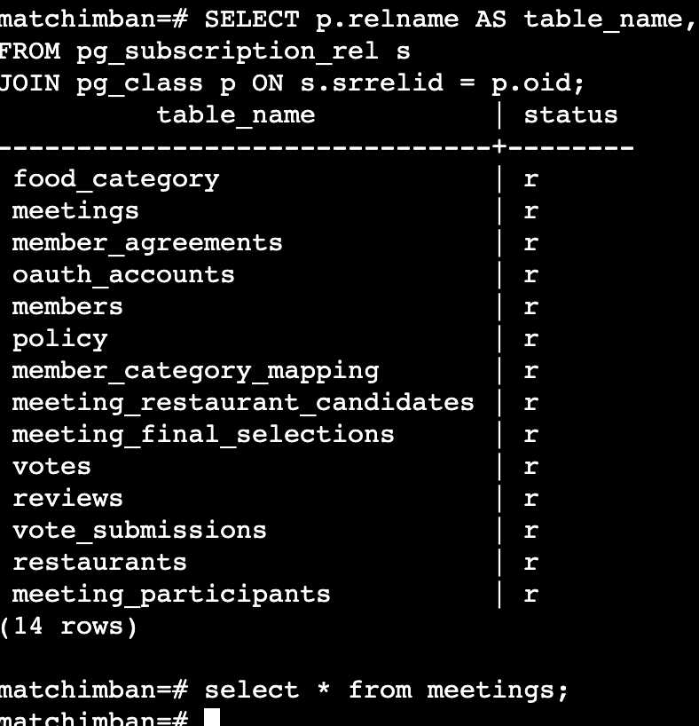

v2(`matchimban=#`)에서 `pg_subscription_rel` 조회. 14개 테이블 모두 status = `r` (ready). Logical Replication 초기 동기화 완료.

### 2.2. v1 Publisher 스트리밍 상태

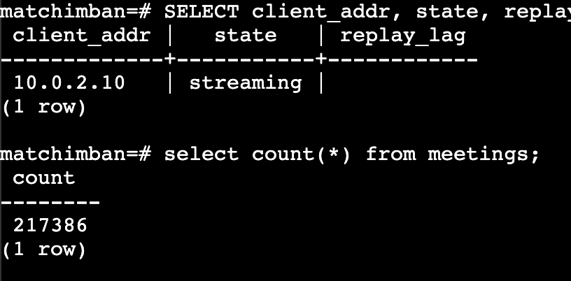

v1에서 `pg_stat_replication` 조회: `client_addr=10.0.2.10`, `state=streaming`, `replay_lag` 없음. meetings count = **217,386**.

### 2.3. v2 Subscriber 지연 확인

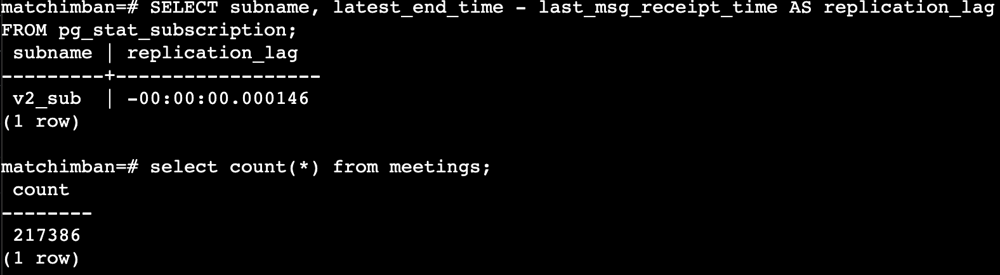

v2에서 `pg_stat_subscription` 조회: `v2_sub`, `replication_lag = -00:00:00.000146` (실질 0). meetings count = **217,386**. v1과 동일 → 동기화 정상.

---

## 3) 전환 직전 카운트 스냅샷

시퀀스 오프셋 적용 및 데이터 재동기화 후 최종 확인. v1/v2 카운트가 정확히 일치하는 상태에서 전환 실행.

### v1 (moyeoBab-prod-app-v1, 10.0.0.161)

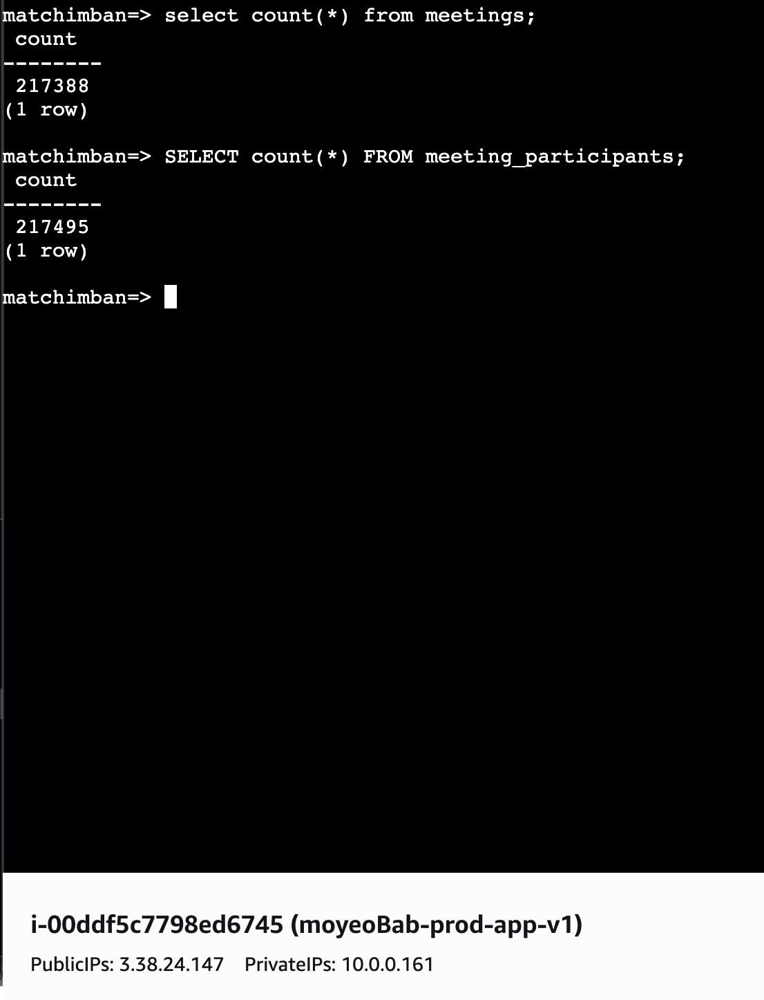

### v2 (matchimban=#, 시퀀스 오프셋 적용 직후)

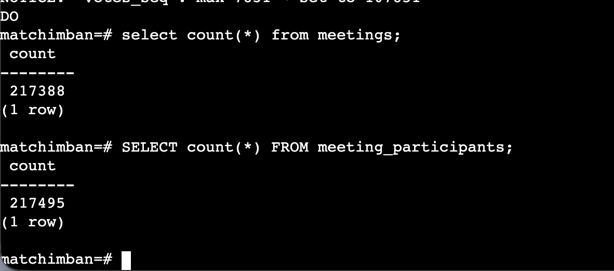

| 테이블 | v1 | v2 | 일치 |
|--------|-----|-----|------|
| meetings | 217,388 | 217,388 | O |
| meeting_participants | 217,495 | 217,495 | O |

### AWS SSM Session Manager를 통한 v1 확인

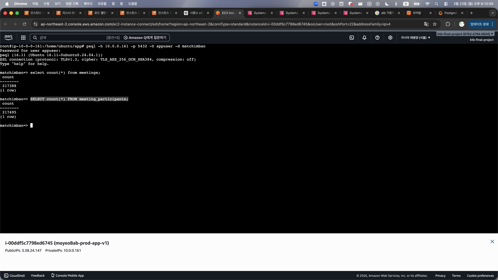

---

## 4) 실행 타임라인

```
[사전 준비]
  PgBouncer 설치 및 설정 (v1/v2 양쪽, pool_mode = session)
  Logical Replication v1→v2 동기화 확인 (14테이블 all ready)
  시퀀스 오프셋 +100,000 적용 (13개 시퀀스)
  v1/v2 카운트 일치 확인 (meetings: 217,388건)

[마이그레이션 실행]
21:15  PgBouncer PAUSE → 엔드포인트 전환 → RESUME
       → v1에서 v2로 트래픽 전환 완료

[검증]
21:15~ k6 부하테스트 실행 (모임 10,000건 생성)
21:30  Grafana 메트릭 확인 → 전환 성공 검증
       217,388 + 10,000 = 227,388 → 유실 0건
```

---

## 5) 트러블슈팅

### 5.1. PgBouncer pool_mode = transaction → Hibernate 호환 실패

**증상**: GET 요청은 정상, POST 요청에서 500 에러.

```
HikariPool-1 - Connection is not available
This connection has been closed
```

**원인**: `pool_mode = transaction`에서 Hibernate prepared statement가 트랜잭션 경계를 넘어 유지되면서 커넥션 상태 불일치.

**해결**: `pool_mode = session`으로 변경 (pgbouncer.ini, pgbouncer_v2.ini 모두).

### 5.2. HikariCP Stale Connection

**증상**: PgBouncer 재시작 후 기존 커넥션 validation 실패.

```
Failed to validate connection... This connection has been closed.
```

**해결**: 백엔드 앱 컨테이너 재시작으로 HikariCP 커넥션 풀 리셋.

### 5.3. 시퀀스 충돌 (duplicate key constraint violation)

**증상**: 모임 참가자 생성 시 PK 중복.

```
duplicate key value violates unique constraint "meeting_participants_pkey"
Key (id)=(134) already exists
```

**원인**: Logical Replication은 데이터만 복제하고 **시퀀스는 복제하지 않음**. v2 시퀀스가 1부터 시작하여 기존 데이터 PK와 충돌.

**해결**: v2의 전체 13개 시퀀스에 +100,000 오프셋 적용.

```sql
DO $
DECLARE
  max_val BIGINT;
  seqs TEXT[][] := ARRAY[
    ['meetings_seq', 'meetings', 'id'],
    ['meeting_participants_seq', 'meeting_participants', 'id'],
    ['meeting_final_selections_seq', 'meeting_final_selections', 'id'],
    ['meeting_restaurant_candidates_seq', 'meeting_restaurant_candidates', 'id'],
    ['members_seq', 'members', 'id'],
    ['member_agreements_seq', 'member_agreements', 'id'],
    ['member_category_mapping_seq', 'member_category_mapping', 'id'],
    ['oauth_accounts_seq', 'oauth_accounts', 'id'],
    ['food_category_seq', 'food_category', 'id'],
    ['policy_seq', 'policy', 'id'],
    ['reviews_seq', 'reviews', 'id'],
    ['vote_submissions_seq', 'vote_submissions', 'id'],
    ['votes_seq', 'votes', 'id']
  ];
  s TEXT[];
BEGIN
  FOREACH s SLICE 1 IN ARRAY seqs LOOP
    EXECUTE format('SELECT COALESCE(MAX(%I), 0) FROM %I', s[3], s[2]) INTO max_val;
    EXECUTE format('SELECT setval(%L, %s)', s[1], max_val + 100000);
    RAISE NOTICE '% : max=% → set to %', s[1], max_val, max_val + 100000;
  END LOOP;
END$;
```

참고: `pg_get_serial_sequence`로는 커스텀 시퀀스(`meetings_seq` 등)를 찾지 못함. `information_schema.columns`에서 `column_default LIKE 'nextval%'`로 14개 시퀀스를 수동 확인.

### 5.4. v1/v2 데이터 불일치 (테스트 데이터 잔존)

**증상**: v2에 직접 생성된 테스트 데이터로 v1/v2 카운트 58건 차이.

**원인**: v2에서 직접 생성한 데이터가 v1으로 역복제되지 않음 (역방향 replication `v1_sub` dead 상태).

**해결**: v2 Subscription DROP → 전체 TRUNCATE CASCADE → `copy_data = true`로 재동기화.

```sql
DROP SUBSCRIPTION v2_sub;
TRUNCATE meetings, meeting_participants, members, oauth_accounts,
         member_agreements, member_category_mapping, food_category,
         policy, restaurants, reviews, votes, vote_submissions,
         meeting_restaurant_candidates, meeting_final_selections CASCADE;
CREATE SUBSCRIPTION v2_sub
  CONNECTION 'host=10.0.0.161 port=5432 dbname=matchimban user=appuser password=...'
  PUBLICATION v1_pub WITH (copy_data = true);
```

---

## 6) Grafana 모니터링 결과

### 6.1. V1 (prod-postgresql) — 21:15 전환 시점

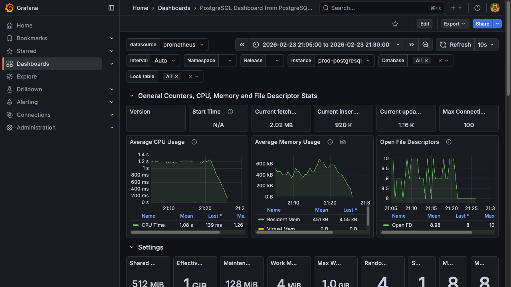

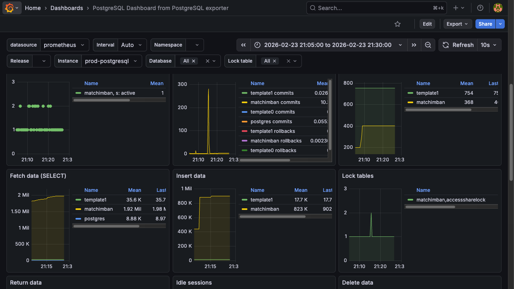

| 메트릭 | 전환 전 | 전환 후 |
|--------|---------|---------|
| Rows Fetched | 활발 | 급감 |
| Rows Inserted | 활발 | 0 |
| Rows Returned | 활발 | 급감 |
| Conflicts/Deadlocks | 0 | 0 |
| Rollbacks | 0 | 0 |

v1 트래픽이 21:15 기점으로 명확하게 감소. INSERT가 0으로 떨어지며 write 트래픽이 v2로 완전 전환.

### 6.2. V2 (postgresql-v2) — 21:15 전환 시점

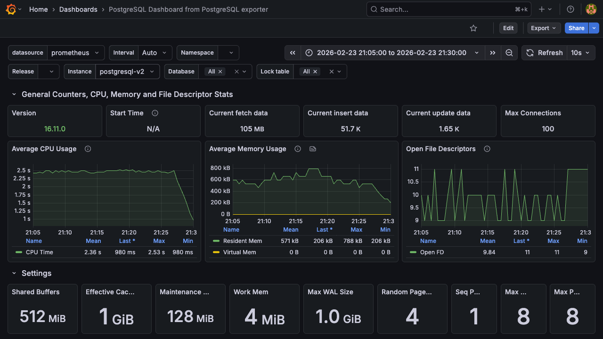

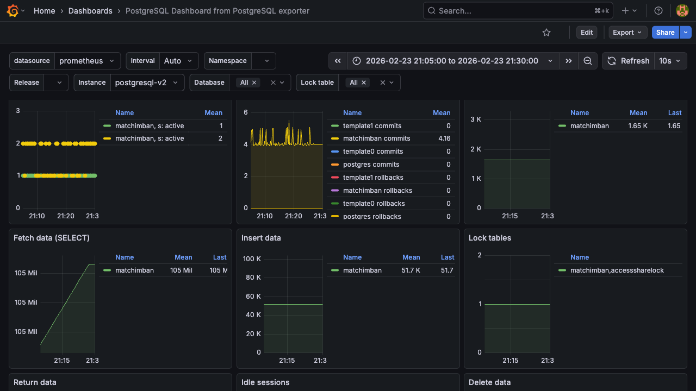

| 메트릭 | 전환 전 | 전환 후 |
|--------|---------|---------|
| Rows Fetched | 0 | 활발 |
| Rows Inserted | 0 (replication만) | 활발 (k6 부하) |
| Active Sessions | 0 | 증가 |
| Conflicts/Deadlocks | 0 | 0 |
| Rollbacks | 0 | 0 |

v2에서 21:15 이후 INSERT 시작. Conflicts/Rollbacks 모두 0으로 데이터 정합성 문제 없이 전환 완료.

---

## 7) k6 부하테스트 및 카운트 검증

### 7.1. 테스트 설정

| 항목 | 값 |
|------|-----|
| 스크립트 | `db-migration-load-test.js` |
| executor | shared-iterations |
| 목표 생성 수 | 10,000건 |
| 동시 VU | 10 |
| sleep 간격 | 0.1초 |
| 임계값 | error_rate < 1%, p95 < 2초 |

### 7.2. 전환 후 v2 카운트 변화

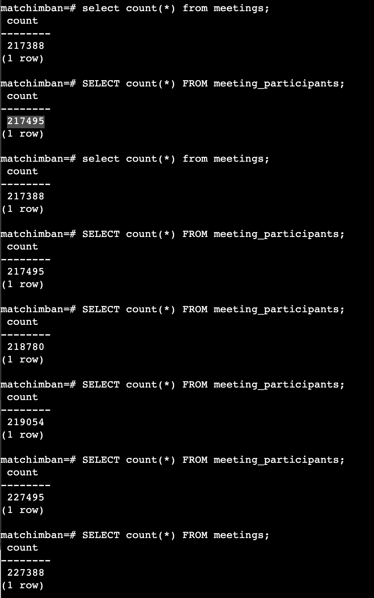

| 시점 | meetings | meeting_participants |
|------|----------|---------------------|
| 전환 직후 | 217,388 | 217,495 |
| k6 진행 중 | 218,780 | 218,780 |
| k6 진행 중 | — | 219,054 |
| **k6 완료 후** | **227,388** | **227,495** |

### 7.3. 검증 공식 대입

```
전환 전 meetings:  217,388
k6 생성 수:       + 10,000
전환 후 meetings:  227,388

217,388 + 10,000 = 227,388 ✓ → 유실 0건
```

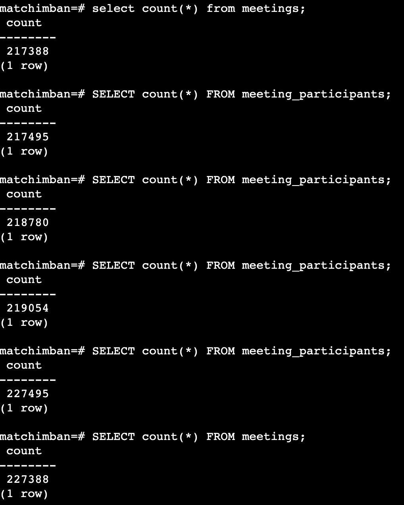

meetings 217,388 → 227,388, meeting_participants 217,495 → 227,495. 정확히 10,000건 증가 → **데이터 유실 0건**.

---

## 8) 결론

| 검증 항목 | 결과 |
|-----------|------|
| v1 INSERT 중단 | 21:15 이후 0 |
| v2 INSERT 시작 | 21:15 이후 활발 |
| Conflicts (양쪽) | 0 |
| Deadlocks (양쪽) | 0 |
| Rollbacks (양쪽) | 0 |
| 카운트 검증 | 217,388 + 10,000 = 227,388 ✓ |
| 다운타임 | 0 (PgBouncer PAUSE/RESUME) |

- PostgreSQL v1(10.0.0.161, 호스트 직설치) → v2(10.0.2.10, Docker) 전환 완료
- Logical Replication + PgBouncer 기반 **무중단 전환**
- k6 10,000건 부하테스트로 **유실 0건 증명**
- 시퀀스 +100,000 오프셋으로 PK 충돌 방지 및 전환 증거 확보

---

## 9) 회고

| 항목 | 현재 | 개선 방향 |
|------|------|----------|
| pool_mode 호환성 | 현장에서 transaction→session 변경 | 사전 Hibernate 호환성 체크리스트 |
| 시퀀스 확인 | pg_get_serial_sequence 실패 후 수동 확인 | 커스텀 시퀀스 자동 탐지 스크립트 |
| 데이터 정합성 | 테스트 데이터로 불일치 → 재동기화 | 마이그레이션 전 v2 clean state 보장 절차 |
| PgBouncer | 마이그레이션용 임시 설치 | 전환 완료 후 제거 (HikariCP 직접 연결) |
