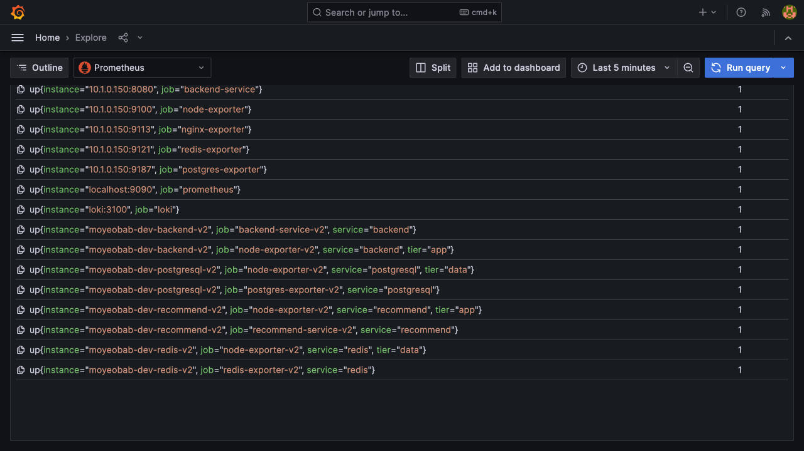
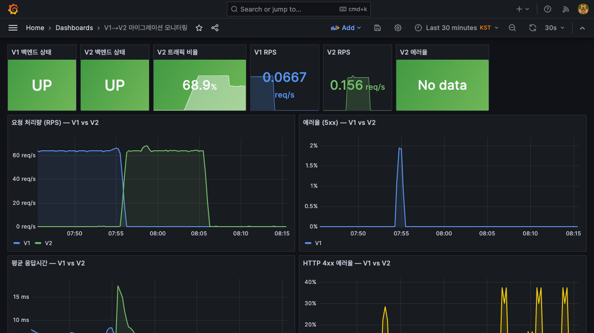
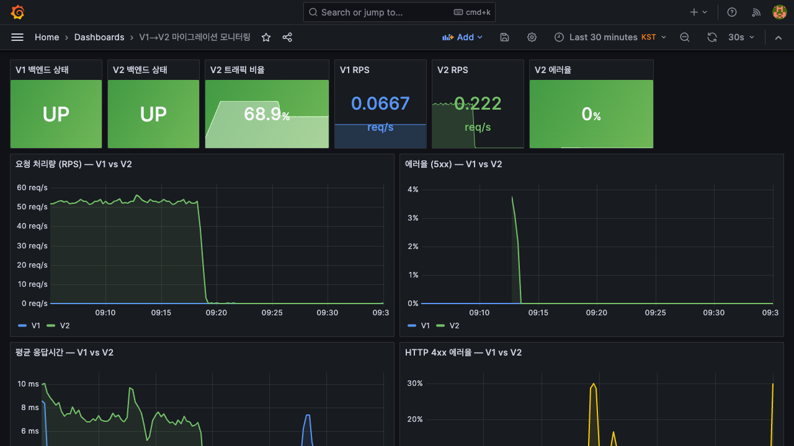
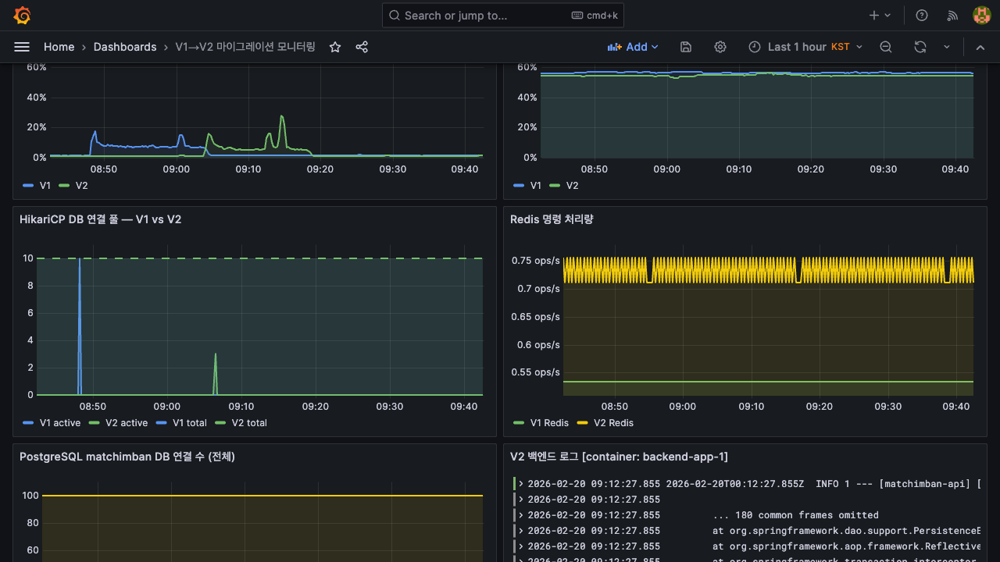
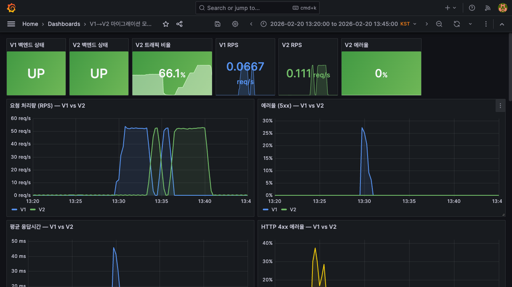
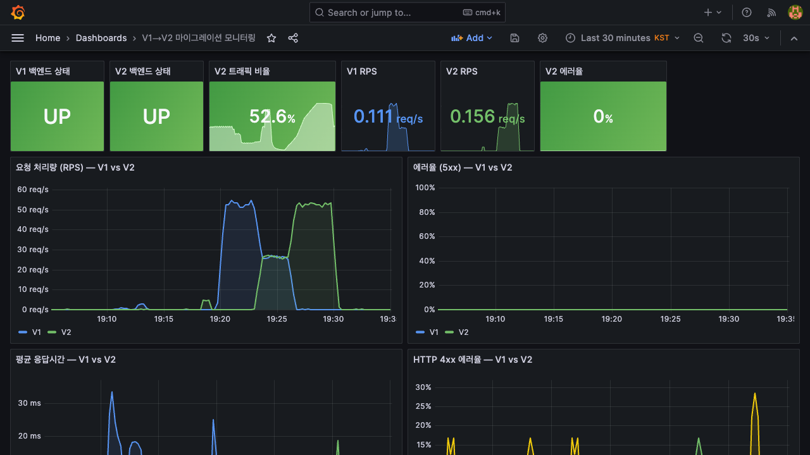
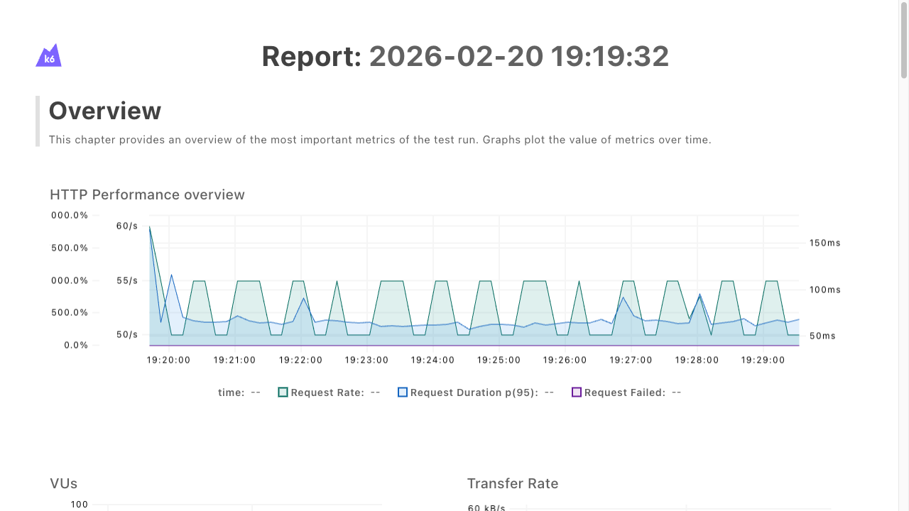
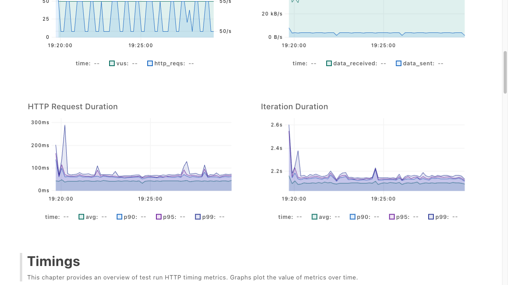

# OPS-006: V1→V2 카나리 마이그레이션 실행 (ALB Weighted Routing)

| 항목 | 내용 |
|------|------|
| 날짜 | 2026-02-20 |
| 적용 환경 | Dev (검증) → Prod 기준 수립 |
| 테스트 도구 | k6 (canary-migration.js, run-canary.sh) |
| 모니터링 | Prometheus + Grafana (V1/V2 동시 대시보드) |
| 주요 목표 | EC2 직설치(V1) → Docker 컨테이너(V2) 무중단 카나리 전환, k6 50VU 10분 부하 하에서 에러 0% 검증 |

---

## 1) 배경

**모여밥 V1**은 EC2에 Spring Boot JAR을 직접 배포하는 단일 서버 구조였다.
**V2**는 Docker 컨테이너 기반으로 ALB 뒤에서 Backend/DB/Redis 각각 분리하는 구조로 전환.

한 번에 전환하면 V2에서 예상치 못한 장애 발생 시 전체 서비스 중단. **점진적 카나리 전환**으로 V2 안정성을 실 트래픽으로 검증하며 이전하는 방식 채택.

### V1 vs V2 아키텍처

```
[V1]  Route53 → V1 EC2 (Spring Boot JAR, 직설치) → PostgreSQL (호스트 직설치) / Redis (호스트 직설치)

[V2]  Route53 → ALB → Backend EC2 (Docker) → PostgreSQL EC2 (Docker) / Redis EC2 (Docker)
```

### 카나리 전략 목표

| Phase | V1 가중치 | V2 가중치 | 목적 |
|-------|-----------|-----------|------|
| 1 | 100 | 0 | 기준선 확인 (V2 배포 후 V1 유지) |
| 2 | 50 | 50 | V2 안정성 검증 (에러율, 레이턴시) |
| 3 | 0 | 100 | 마이그레이션 완료 |

---

## 2) 모니터링 인프라 구축 (사전 준비, 2026-02-19)

마이그레이션 전 V1과 V2를 동시에 관찰할 수 있는 모니터링 환경을 먼저 구축했다.

### Prometheus ec2_sd_configs

V1은 Static Config, V2는 EC2 태그 기반 서비스 디스커버리(`ec2_sd_configs`)로 설정.
Terraform으로 모니터링 EC2에 IAM 역할(`ec2:DescribeInstances`)을 부여해 자동 타겟 탐지.

### V1/V2 동시 모니터링 대시보드

V1(파랑)과 V2(초록)을 동시에 표시하는 전용 Grafana 대시보드 구성:
- V1/V2 백엔드 UP/DOWN 상태
- RPS — V1 vs V2 시계열
- 에러율 5xx/4xx — V1 vs V2
- 평균 응답시간 — V1 vs V2
- V2 트래픽 비율 (%)



모니터링 EC2의 `ec2_sd_configs`가 V1/V2를 모두 타겟으로 잡고 전체 UP 확인.

---

## 3) 1차 시도 — Route53 Weighted Routing (실패)

### 설계

```
사용자 → Route53 (가중치 라우팅)
           ├── api_v1 record (weight=50) → V1 EC2 직접
           └── api_v2 record (weight=50) → V2 ALB
```

k6로 50 VU 부하를 발생시키며 Phase별 Route53 가중치를 수동으로 변경.

### 테스트 1 (07:42) — DNS 캐시로 분산 실패



DNS TTL 설정 없이 실행 → Phase 2에서 V2 0% (전혀 분산 안 됨).

**원인**: Route53은 DNS 질의마다 V1 or V2 IP를 반환하지만, OS 리졸버가 한 번 받은 IP를 TTL 동안 캐시. 같은 테스트 머신에서 계속 같은 IP로만 요청이 나간다.

### 테스트 2 (09:55) — dns.ttl=0s 추가 후 5xx 스파이크

k6의 `dns.ttl=0s` 및 `noConnectionReuse: true`를 추가하여 재시도.





Phase 2에서 V2 방향 요청에 5xx 스파이크 발생. HikariCP `StaleObjectStateException`이 원인으로, V2 백엔드의 race condition 문제였다(4단계에서 해결).

### 테스트 3 (13:29) — Route53 방식 근본 한계 확인




Phase 2에서 V1과 V2가 **동시에** 나타나지 않고 **교대로 스파이크** → 50:50 동시 분산 불가 최종 확인.
`http_req_failed` 0.7%로 임계값(0.5%) 초과 → Route53 방식 폐기.

### 근본 원인 정리

| 방식 | 분산 단위 | OS DNS 캐시 영향 |
|------|-----------|-----------------|
| Route53 Weighted | DNS 질의마다 V1 or V2 반환 | **직접 영향** — 캐시 IP로만 요청 |
| ALB Weighted TG | HTTP 요청마다 V1 or V2로 전달 | 무관 — ALB 내부 처리 |

---

## 4) 동시성 이슈 발견 및 해결

Route53 2차 테스트(09:55)에서 발생한 5xx의 실제 원인을 분석했다.

### 증상

50 VU가 동시에 `/api/dev/auth/access/new`(테스트 계정 생성)를 호출하면서:

- 백엔드 계정 생성 로직: `SELECT MAX(nickname_number)` 후 `+1`로 닉네임 결정
- 50 VU가 동시에 요청 → 모두 같은 `MAX` 값 읽음 → 동일 닉네임 INSERT 시도
- **원자성 위반**: 하나만 성공, 나머지는 유니크 제약 위반 or Hibernate `StaleObjectStateException`
- 실패 VU의 `vuToken = null` 유지 → 매 iteration 재시도 → `http_req_failed` 잡음 누적

**결과**: meeting/create 실패 82건, `http_req_failed` 0.86% (임계값 0.5% 초과)

### 해결

```javascript
// 변경 전: 동적 계정 생성 → 동시성 충돌
http.get(`${BASE_URL}/api/dev/auth/access/new`)

// 변경 후: 고정 개발 계정 조회 → 충돌 없음
const memberId = MEMBER_ID_START + ((__VU - 1) % MEMBER_ID_COUNT);
http.get(`${BASE_URL}/api/dev/auth/access/member/${memberId}`)
// memberId 범위: 1000850~1000950 (101개), 50 VU에 순환 할당
```

VU별로 서로 다른 `memberId`를 할당해 계정 생성 없이 기존 계정 토큰을 발급 → race condition 원천 제거.

이 문제는 부하 테스트 중 발견한 **실제 백엔드 버그**이기도 했다. 카나리 테스트가 사전 품질 게이트 역할을 한 사례.

---

## 5) 2차 시도 — ALB Weighted Target Group (성공)

### 설계 전환

```
변경 전: Route53(V1 record) + Route53(V2 record) — DNS 레벨 가중치
변경 후: Route53(V2 ALB alias, 단일) → ALB → TG-V1(weight) + TG-V2(weight)
```

**핵심**: 가중치 분산을 DNS 레벨에서 **ALB HTTP 요청 레벨**로 내림.
DNS는 항상 ALB IP 하나를 반환하고, ALB가 V1/V2 Target Group으로 요청을 분배.

### Terraform IaC

```hcl
# alb.tf — 초기 상태: V1=100, V2=0 (카나리 시작 전 기준점)
default_action {
  type = "forward"
  forward {
    target_group { arn = aws_lb_target_group.backend.arn    weight = 0   }  # V2
    target_group { arn = aws_lb_target_group.backend_v1.arn weight = 100 }  # V1
  }
}
```

`terraform apply` 후 기존 V1 서비스 정상 유지 상태에서 카나리 테스트 시작.

### run-canary.sh 자동화

```bash
# Phase 전환을 AWS CLI modify-listener로 자동화
Phase 1 (0~3분):  V1=100, V2=0   → 기준선 확인
Phase 2 (3~6분):  V1=50,  V2=50  → 카나리 검증
Phase 3 (6~10분): V1=0,   V2=100 → 마이그레이션 완료
```

---

## 6) 최종 검증 — 1919 테스트

race condition 해결 후 ALB Weighted TG 방식으로 최종 테스트 실행.

### Grafana — Phase별 RPS



**핵심 증거**: Phase 2 구간에서 **V1(파랑)과 V2(초록)이 동시에 ~25 req/s씩** 나타남.
Route53 방식의 "교대 스파이크"와 달리, ALB는 HTTP 요청 단위 분산으로 진정한 50:50 달성.

### k6 최종 결과





| 메트릭 | 결과 | 이전(1811 테스트) |
|--------|------|-----------------|
| canary_errors | **0.00%** ✓ | 0.26% |
| http_req_failed | **0.00%** ✓ | 0.86% |
| checks | **100.00%** ✓ | 99.86% |
| http_req_duration avg | 42ms | — |
| http_req_duration p(95) | 65ms | — |
| http_req_duration p(99) | 83ms | — |
| 5xx 에러율 | **0%** (전 Phase) | — |

---

## 7) 무중단 달성 근거

| 전환 단계 | 중단 여부 | 근거 |
|-----------|-----------|------|
| terraform apply (V2 ALB 배포) | **없음** | V1 서비스 그대로, ALB만 앞에 추가 |
| ALB listener V2=0/V1=100 초기 설정 | **없음** | V1 100% 유지 상태 |
| Phase 2: V1=50/V2=50 전환 | **없음** | ALB 원자적 업데이트, 요청 단위 즉시 반영 |
| Phase 3: V1=0/V2=100 완료 | **없음** | 동일. 기존 in-flight 요청은 정상 완료 |
| 전체 검증 | **확인** | k6 checks 100%, 5xx 0%, Grafana 동시 이중 검증 |

---

## 8) 결론

| 검증 항목 | 결과 |
|-----------|------|
| 무중단 전환 | 전 Phase 서비스 중단 없음 |
| canary_errors | 0% |
| http_req_failed | 0% |
| checks | 100% |
| V2 50VU p95 레이턴시 | 65ms |
| 동시성 버그 사전 발견 | 계정 생성 race condition → 수정 완료 |

- Route53 Weighted → ALB Weighted TG로 전략 전환 (DNS 캐싱 문제 근본 해결)
- **HTTP 요청 레벨 분산**으로 단일 테스트 머신에서도 진정한 50:50 달성
- k6 50VU 10분 부하 하에서 에러 0%, 레이턴시 안정 검증 완료
- `run-canary.sh` Prod 마이그레이션에도 동일 스크립트 사용 가능 (검증 완료)

---

## 9) 회고

| 항목 | 현재 | 개선 방향 |
|------|------|----------|
| 카나리 전략 | Route53 → ALB로 2회 시도 | 처음부터 ALB 선택 (DNS 캐시 문제는 사전 조사로 예방 가능) |
| 동시성 테스트 | 부하 테스트 중 우연히 발견 | `/access/new` 같은 SELECT+INSERT 패턴 사전 코드 리뷰 |
| 롤백 절차 | `set_weights 100 0` 즉시 실행 가능 | Prod 실행 전 rollback 드릴 추가 권장 |
| 테스트 시간 | 30분 → 10분으로 축소 | Phase 당 3분은 충분. 단, Prod에서는 5분 이상 권장 |

---

## 10) 관련 이슈

| 이슈 | 상태 | 내용 |
|------|------|------|
| [#166 ALB 기반 카나리 배포를 통한 prod 트래픽 이관](https://github.com/100-hours-a-week/13-team-project-cloud/issues/166) | CLOSED | 본 문서의 핵심 작업 — ALB Weighted TG 최종 실행 |
| [#157 Route53 Weighted Routing 50:50 분산 실패 분석](https://github.com/100-hours-a-week/13-team-project-cloud/issues/157) | CLOSED | DNS 캐시 원인 분석 및 ALB 전환 근거 |
| [#155 Route53 카나리 스크립트 결함 수정](https://github.com/100-hours-a-week/13-team-project-cloud/issues/155) | CLOSED | ZoneID 혼동 / AWS CLI pager / Restore 로직 수정 |
| [#158 Route53 카나리 스크립트 표준화](https://github.com/100-hours-a-week/13-team-project-cloud/issues/158) | CLOSED | run-canary.sh, verify-dns-cache.sh 정리 |
| [#156 k6 토큰/계정 생성 동시성 이슈](https://github.com/100-hours-a-week/13-team-project-cloud/issues/156) | OPEN | token_init race condition — 고정 memberId로 해결 |
| [#145 Route53 카나리 검증 — v1↔v2 트래픽 전환 테스트](https://github.com/100-hours-a-week/13-team-project-cloud/issues/145) | OPEN | 초기 Route53 방식 설계 및 검증 계획 |
