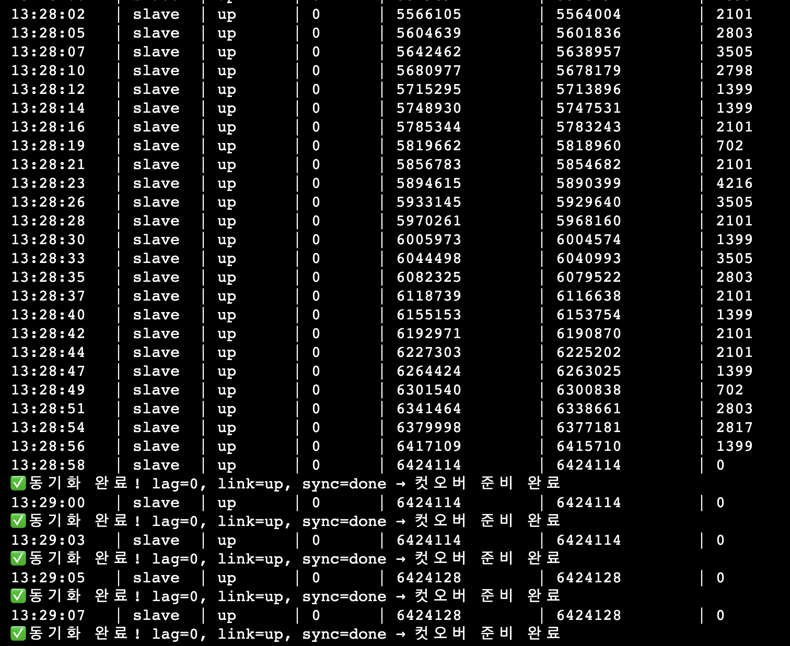
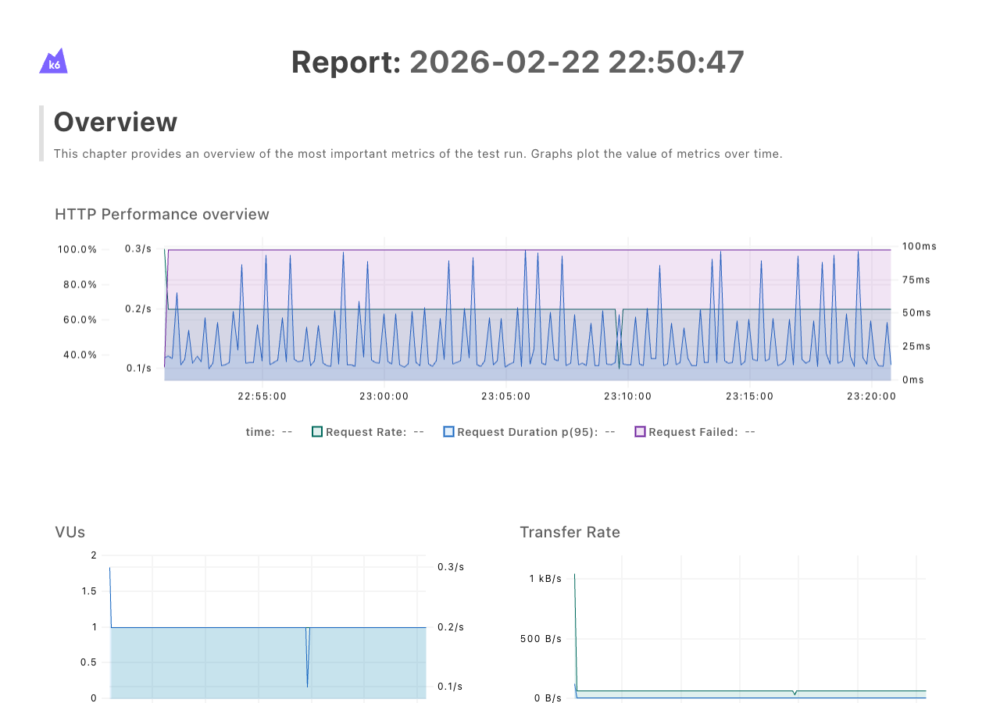
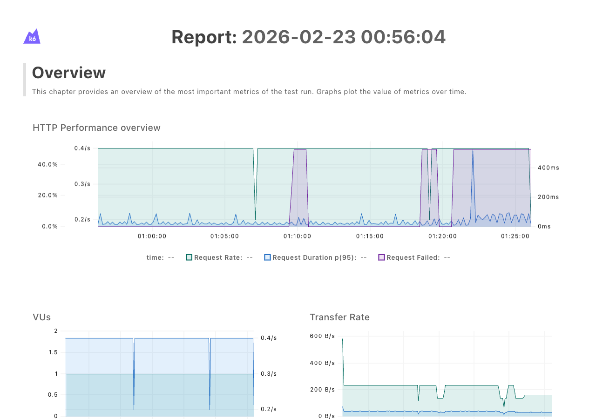

# OPS-007: Redis v1→v2 마이그레이션 실행

| 항목 | 내용 |
|------|------|
| 날짜 | 2026-02-22 ~ 2026-02-23 |
| 적용 환경 | Prod |
| 전환 방식 | Cold Cutover (REPLICAOF + ALB /refresh 일시 차단) |
| 모니터링 | k6 (`redis-migration-test.js`) — refresh_401_rate 0 기준 |
| 주요 목표 | v1(호스트 직설치) → v2(Docker 컨테이너) Redis 전환, refresh_token 세션 유실 없이 완료 |

---

## 1) 배경

PostgreSQL 마이그레이션(OPS-005)과 ALB 카나리 전환(OPS-006)이 완료된 이후에도 백엔드는 v1 EC2에 설치된 Redis를 계속 바라보고 있었다. 운영 아키텍처 정렬을 위해 v2 인프라의 Redis(Docker 컨테이너, `10.0.2.20`)로 이전이 필요하다.

### 아키텍처 전환

```
[Before]  ALB → Backend (Docker, v2) → Redis (v1 EC2 직설치, 10.0.0.x)

[After]   ALB → Backend (Docker, v2) → Redis (v2 EC2 Docker, 10.0.2.20)
```

### Redis에 저장되는 데이터

| 키 패턴 | 타입 | 용도 | TTL |
|---------|------|------|-----|
| `refresh:{memberId}:{sid}` | Hash | Refresh 토큰 세션 | 7일 |
| `refresh_idx:{refreshHash}` | String | refreshHash → memberId:sid 역인덱스 | 7일 |
| `refresh_map:{memberId}` | Hash | 세션 맵 | 7일 |
| `oauth_state:{provider}:{state}` | String | CSRF 방지용 OAuth state | 5분 |

데이터 유실 시 영향은 사용자 재로그인. OAuth 재인증까지 요구되므로 **401 0건이 목표**.

---

## 2) 전환 전략 선택

### 검토한 대안

| 방식 | 다운타임 | 앱 코드 수정 | 구현 복잡도 | 채택 |
|------|----------|------------|------------|------|
| **Cold Cutover + REPLICAOF** | ~60초 (503 구간) | 없음 | 낮음 | **채택** |
| Dual Write (앱 레벨) | 0 | RedisTemplate 2개 + 분기 로직 | 높음 | 미채택 |
| Redis Replication + Failover | ~수초 | 없음 | 중간 | 미채택 |
| TTL 자연 소멸 | 0 | 없음 | 없음 | 미채택 (7일간 랜덤 로그아웃) |

**Dual Write 미채택 근거**: `rotate()` 메서드가 Lua 스크립트 원자 연산(HGET → 비교 → HSET/DEL/SET)으로 구현되어 있어 두 Redis 인스턴스에 걸치면 원자성이 깨진다. 앱 코드 수정 + 배포 3회(시작/전환/정리) + 임시 분기 테스트까지 고려하면 비용 대비 효과가 맞지 않는다.

**TTL 자연 소멸 미채택 근거**: 7일간 카나리 비율만큼 사용자가 랜덤으로 로그아웃. 사용자 인지 범위와 시간을 통제할 수 없어 기각.

**채택 근거**: 짧은 503 구간(~60초)이 7일간 랜덤 로그아웃보다 낫다. 범위·시간이 명확하고 통제 가능하다.

---

## 3) 사전 준비 — 인프라 및 스크립트

### 3.1 Terraform — redis_migration.tf

마이그레이션 전용 임시 리소스를 별도 파일로 분리. 완료 후 파일 삭제 시 전체 자동 제거.

**① REPLICAOF용 SG 인바운드 룰**

```hcl
resource "aws_vpc_security_group_ingress_rule" "v1_redis_from_v2" {
  count             = var.v1_redis_sg_id != "" ? 1 : 0
  security_group_id = var.v1_redis_sg_id
  from_port         = 6379
  to_port           = 6379
  ip_protocol       = "tcp"
  cidr_ipv4         = "${aws_instance.redis.private_ip}/32"
}
```

`count = 0` 기본값 → `v1_redis_sg_id` 변수 설정 시만 생성.

**② ALB /refresh 일시 503 차단 룰**

```hcl
resource "aws_lb_listener_rule" "block_refresh" {
  count    = var.enable_refresh_block ? 1 : 0
  priority = 3   # actuator=1, swagger=2 다음
  # 응답: 503 고정
}
```

컷오버 직전 `enable_refresh_block = true`로 적용, 완료 후 `false`로 제거.

**③ v2 EC2 IAM 권한 — ALB Modify 임시 정책**

`03-cutover.sh`가 v2 Redis EC2에서 `aws elbv2 modify-listener`를 호출하므로, v2 EC2 IAM Role에 ALB 관련 권한을 추가해야 했다. 실행 직전 권한 부재를 발견해 Terraform으로 즉시 추가:

```hcl
resource "aws_iam_role_policy" "v2_ec2_alb_migration" {
  role   = aws_iam_role.v2_ec2.id
  policy = jsonencode({
    Statement = [{
      Action   = ["elasticloadbalancing:DescribeLoadBalancers",
                  "elasticloadbalancing:DescribeListeners",
                  "elasticloadbalancing:DescribeTargetGroups",
                  "elasticloadbalancing:DescribeRules",
                  "elasticloadbalancing:ModifyListener"]
      Resource = "*"
    }]
  })
}
```

`redis_migration.tf`에 함께 배치 → 파일 삭제 시 IAM 정책도 자동 제거 (임시 권한임을 명확히).

### 3.2 스크립트 구성

| 스크립트 | 역할 |
|---------|------|
| `00-seed-v1-redis.sh` | v1 Redis에 테스트 세션 seed (10개 병렬, `--pipe` 배치) |
| `01-setup-replication.sh` | REPLICAOF 설정 + lag=0/link=up/sync=done 폴링 |
| `03-cutover.sh` | 사전 확인 → REPLICAOF NO ONE → 앱 재시작 → ALB 전환 |
| `restart-backend.sh` | Backend EC2 app 컨테이너 `--force-recreate` 재시작 |
| `redis-migration-test.js` | k6 모니터링 (cookie jar 자동 갱신, 401 즉시 abort) |

**`docker exec` 래핑**: v2 Redis EC2에는 host에 redis-cli 미설치. 스크립트 전체를 `docker exec redis-redis-1 redis-cli ...`로 래핑.

### 3.3 REPLICAOF 동기화 확인



`01-setup-replication.sh` 실행 결과. `lag=0, master_link_status=up, master_sync_in_progress=0` 확인 후 컷오버 준비 완료.

---

## 4) 컷오버 실행 흐름

```
[컷오버 시작]
  terraform apply -var='enable_refresh_block=true'
    → ALB: /refresh → 503 고정 응답 시작

  03-cutover.sh (v2 Redis EC2에서 실행)
    Step 1: 사전 확인 — role=slave, link=up, lag≈0, .env REDIS_HOST=10.0.2.20
    Step 2: REPLICAOF NO ONE — v2 Redis를 독립 마스터로 승격
    Step 3: [수동] Backend EC2 SSM 접속 → restart-backend.sh --force-recreate
            → 환경변수 REDIS_HOST=10.0.2.20 반영, v2 Redis 연결
    Step 4: /api/ping 헬스체크 폴링 (최대 60초)
    Step 5: ALB modify-listener → v2 TG 100%

  terraform apply -var='enable_refresh_block=false'
    → ALB: /refresh 차단 해제
```

---

## 5) 트러블슈팅: AUTH 토큰 미반영 (500 에러)

### 증상

컷오버 직후 `/api/v1/auth/refresh` 호출 시 500 에러. Spring Boot 로그:

```
LettuceConnectionFactory$SharedConnection.getConnection
  → RefreshTokenService.resolveSession
  → AuthController.refresh
```

### 원인

v2 Redis의 `requirepass` 값을 앱의 `.env`(`REDIS_PASSWORD`)에 반영하지 않은 상태로 컷오버 진행. Lettuce가 AUTH 없이 연결을 시도하여 거부됨.

### 해결

`.env`에 v2 Redis 비밀번호를 올바르게 설정 후 app 컨테이너 재시작.

### 시도 이력

| 시각 | 상태 | http_req_failed | 비고 |
|------|------|----------------|------|
| 22:50 | AUTH 오류 | 99.4% | 1차 컷오버 시도 |
| 00:34 | 수정 시도 중 | 94.3% | 비밀번호 추적 중 |
| 00:37 | 수정 시도 중 | 92.0% | |
| 00:43 | 수정 시도 중 | 94.7% | |
| **00:56** | **성공** | **12.8%** | AUTH 반영 후 재시작 |

### 문제점 — 롤백 미실행

500 발생 시 **v1 Redis로 즉시 롤백 후 원인 파악**이 정석. 현장에서 비밀번호 수정 → 재시작으로 직접 대응했다. 사전에 준비한 k6의 401 기준 rollback 트리거는 있었지만, 500 상황에 대한 롤백 절차는 실행하지 않았다.

---

## 6) k6 모니터링 결과

### 실패 시점 (22:50 — AUTH 오류)



| 메트릭 | 값 |
|--------|-----|
| http_req_failed | **99.4%** |
| refresh_200_rate | 0.3% |
| refresh_401_rate | 0.0% |
| iterations | 359 |

401이 아닌 500이므로 데이터 유실이 아닌 연결 자체의 문제.

### 성공 시점 (00:56 — AUTH 수정 후)



| 메트릭 | 값 |
|--------|-----|
| http_req_failed | 12.8% |
| refresh_200_rate | **74.3%** |
| refresh_401_rate | **0.0%** |
| refresh_503_rate | 11.7% (컷오버 차단 구간) |
| checks | **100%** |
| http_req_duration avg | 19ms |
| http_req_duration p(95) | 49ms |

- **401 = 0%**: refresh_token 세션 유실 없음
- **503 = 11.7%**: 컷오버 중 의도적 차단 구간 (정상)
- **checks 100%**: 전체 판정 기준 통과

---

## 7) 결론

| 검증 항목 | 결과 |
|-----------|------|
| refresh_token 세션 유실 (401) | **0%** |
| 컷오버 다운타임 | ~60초 (503 구간) |
| checks | **100%** |
| 최종 p(95) 레이턴시 | 49ms |

- Redis v1(호스트 직설치) → v2(Docker 컨테이너) 전환 완료
- AUTH 토큰 미반영 500 발생 → 현장 수정 복구 (롤백 미실행)
- `refresh_401_rate = 0%`로 세션 데이터 유실 없음 검증

---

## 8) 503 차단의 실제 사용자 영향 분석

### k6 테스트의 관점 차이

k6는 `/refresh`를 능동적으로 반복 호출해 401 여부를 모니터링했다. 이는 **서버 관점**의 데이터 유실 검증이다. 하지만 실제 사용자는 `/refresh`를 능동적으로 호출하지 않는다.

### 프론트엔드 인터셉터 동작 (`src/shared/lib/api.ts`)

```typescript
// 401/403 응답 시에만 /refresh 시도
if ((response.status === 401 || response.status === 403) && !options.skipRefresh) {
  const refreshed = await refreshSession()
  if (refreshed) return request<T>(...)  // 성공 시 원래 요청 재시도
  // refreshSession()이 false(503 포함) → 원래 에러 throw
}
```

```typescript
// AuthProvider: 401/403 전파 시 → 로그아웃
if (error instanceof ApiError && (error.status === 401 || error.status === 403)) {
  setMember(null)
}
```

`/refresh`가 503을 반환해도 인터셉터는 이를 **에러로 처리하고 종료**한다. 503 자체가 로그아웃 트리거가 되지는 않는다.

### 실제 로그아웃 발생 조건

503 차단 60초 구간 동안 사용자가 로그아웃되려면 **세 조건이 동시에** 충족되어야 한다:

```
1. 사용자의 access token이 60초 차단 구간 내에 만료
       ↓
2. 만료된 상태로 API 호출 → 서버가 401 반환
       ↓
3. 인터셉터가 /refresh 시도 → ALB 503 (차단 중)
       ↓
4. refreshSession() → false → setMember(null) → 로그아웃
```

### 결론: 영향 범위는 제한적

access token TTL이 충분히 길면 대부분의 사용자는 60초 구간 동안 토큰이 만료되지 않아 영향을 받지 않는다. `/refresh` 503 차단은 **사용자 가시적 다운타임이 아니라 특정 조건 하의 로그아웃 리스크**였다.

| k6가 측정한 것 | 실제 사용자 영향 |
|--------------|----------------|
| `/refresh` 직접 호출 → 503 (차단 정상) | access token 만료 + API 호출 타이밍 겹친 사용자만 로그아웃 |
| `refresh_401_rate = 0%` → 데이터 유실 없음 ✓ | 세션 데이터는 무사, 단 위 조건 해당 사용자는 재로그인 필요 |

---

## 9) 회고


| 항목 | 현재 | 개선 방향 |
|------|------|----------|
| 롤백 절차 | 미실행 (현장 수정) | 500/401 모두 즉시 롤백 정책 수립, rollback 스크립트 사전 실행 테스트 |
| 사전 검증 | AUTH 설정 미확인 | 컷오버 전 `redis-cli PING` 자동 검증 스텝 추가 |
| 다운타임 | ~60초 | 이미지 사전 pull, health check 간격 축소로 30초 이내 목표 |
| 모니터링 | 401 기준 abort | 500도 rollback 트리거에 포함 |
| IAM 권한 | 실행 직전 발견 | 마이그레이션 계획 단계에서 IAM 권한 체크리스트 포함 |

---

## 10) 관련 이슈

| 이슈 | 상태 | 내용 |
|------|------|------|
| [#167 prod Redis 데이터 이관](https://github.com/100-hours-a-week/13-team-project-cloud/issues/167) | CLOSED | 본 문서의 핵심 실행 이슈 |
| [#147 Redis v1→v2 데이터 마이그레이션](https://github.com/100-hours-a-week/13-team-project-cloud/issues/147) | OPEN | 초기 마이그레이션 계획 및 전략 설계 |
