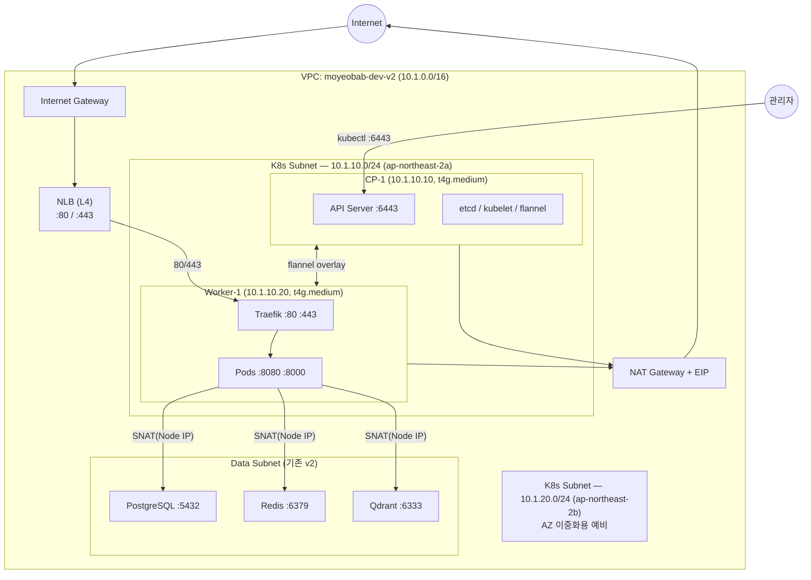
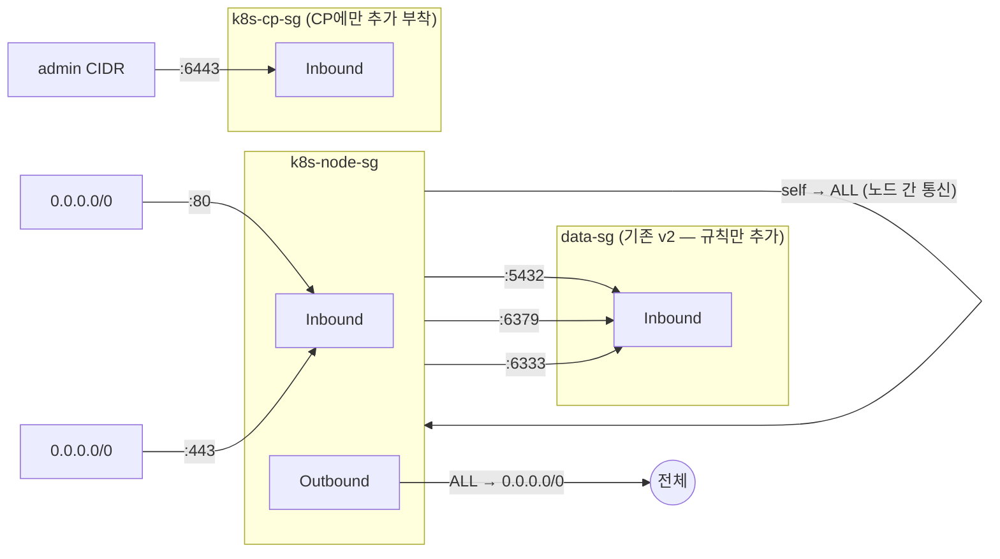
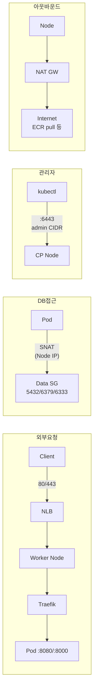
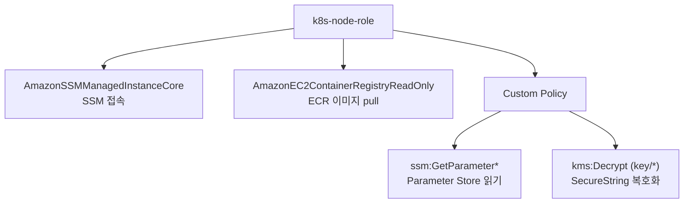

# Dev 환경 인프라 다이어그램

## 전체 구조

```mermaid
graph TB
    Internet((Internet))

    subgraph VPC["VPC: moyeobab-dev-v2 (10.1.0.0/16)"]

        IGW[Internet Gateway]
        NLB["NLB (L4)<br/>:80 / :443"]
        NAT["NAT Gateway + EIP"]

        subgraph K8S_SUB1["K8s Subnet — 10.1.10.0/24 (ap-northeast-2a)"]
            subgraph CP1["CP-1 (10.1.10.10, t4g.medium)"]
                API_SERVER["API Server :6443"]
                ETCD["etcd / kubelet / flannel"]
            end
            subgraph W1["Worker-1 (10.1.10.20, t4g.medium)"]
                TRAEFIK["Traefik :80 :443"]
                PODS["Pods :8080 :8000"]
            end
        end

        K8S_SUB2["K8s Subnet — 10.1.20.0/24 (ap-northeast-2b)<br/>AZ 이중화용 예비"]

        subgraph DATA_SUB["Data Subnet (기존 v2)"]
            PG["PostgreSQL :5432"]
            REDIS["Redis :6379"]
            QDRANT["Qdrant :6333"]
        end
    end

    Internet --> IGW --> NLB
    NLB -->|"80/443"| TRAEFIK
    TRAEFIK --> PODS
    PODS -->|"SNAT(Node IP)"| PG
    PODS -->|"SNAT(Node IP)"| REDIS
    PODS -->|"SNAT(Node IP)"| QDRANT
    CP1 <-->|"flannel overlay"| W1
    CP1 --> NAT --> Internet
    W1 --> NAT

    ADMIN((관리자)) -->|"kubectl :6443"| API_SERVER
```

## Security Group

```mermaid
graph LR
    subgraph NODE_SG["k8s-node-sg"]
        direction TB
        N_IN["Inbound"]
        N_OUT["Outbound"]
    end

    subgraph CP_SG["k8s-cp-sg (CP에만 추가 부착)"]
        C_IN["Inbound"]
    end

    subgraph DATA_SG["data-sg (기존 v2 — 규칙만 추가)"]
        D_IN["Inbound"]
    end

    NODE_SG -->|"self → ALL (노드 간 통신)"| NODE_SG
    EXT1["0.0.0.0/0"] -->|":80"| N_IN
    EXT2["0.0.0.0/0"] -->|":443"| N_IN
    N_OUT -->|"ALL → 0.0.0.0/0"| ANY((전체))

    ADMIN2["admin CIDR"] -->|":6443"| C_IN

    NODE_SG -->|":5432"| D_IN
    NODE_SG -->|":6379"| D_IN
    NODE_SG -->|":6333"| D_IN
```

## 트래픽 경로

```mermaid
flowchart LR
    subgraph 외부요청
        C[Client] -->|"80/443"| NLB2[NLB]
        NLB2 --> WN[Worker Node]
        WN --> TF[Traefik]
        TF --> POD[Pod :8080/:8000]
    end

    subgraph DB접근
        POD2[Pod] -->|"SNAT<br/>(Node IP)"| DSG[Data SG<br/>5432/6379/6333]
    end

    subgraph 관리자
        KC[kubectl] -->|":6443<br/>admin CIDR"| CPN[CP Node]
    end

    subgraph 아웃바운드
        NODE[Node] --> NATG[NAT GW] --> EXT[Internet<br/>ECR pull 등]
    end
```

## IAM

```mermaid
graph TD
    ROLE["k8s-node-role"]

    ROLE --> SSM["AmazonSSMManagedInstanceCore<br/>SSM 접속"]
    ROLE --> ECR["AmazonEC2ContainerRegistryReadOnly<br/>ECR 이미지 pull"]
    ROLE --> CUSTOM["Custom Policy"]
    CUSTOM --> PARAM["ssm:GetParameter*<br/>Parameter Store 읽기"]
    CUSTOM --> KMS["kms:Decrypt (key/*)<br/>SecureString 복호화"]
```
